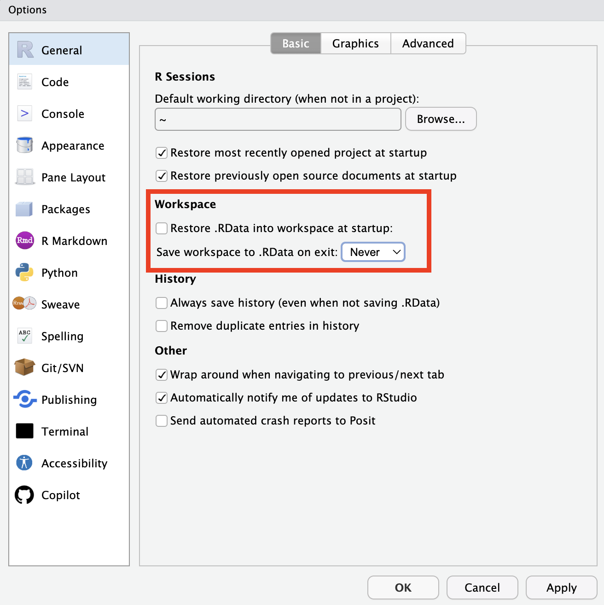

# Getting Started with R {#basics}

Much of this lesson draws from The Carpentries' [Data Analysis and Visualization in R for Ecologists](https://datacarpentry.github.io/R-ecology-lesson/index.html) workshop, which is published under a [CC-BY 4.0](https://datacarpentry.github.io/R-ecology-lesson/LICENSE.html) license.

## Objectives

* Understand R and RStudio and how they relate to one another
* Understand the basic organization of RStudio panes
* Organize files using folders and R projects
* Define functions, objects, arguments, and the working directory
* Use R to create new objects and get basic information about object types and structures

## Install R and RStudio

R is the primary coding language used by those in ecology and natural resources. RStudio is an integrated development environment (IDE) that makes using R easier. It provides some point-and-click options and a way of organizing inputs and outputs, making R easier to use.

<span style="color:red">**Install R and RStudio**</span>: To get started, [install R from the CRAN website](https://cran.r-project.org/). Then, [install RStudio](https://posit.co/download/rstudio-desktop/#download). 

## Familiarize yourself with RStudio

<span style="color:red">**Open RStudio**</span> and you will see four windows on one screen:

* Source: this is a *text editor,* where you can write and save your code.
* Environment/History/Connections: this panel tells you what *objects* are available (we will define these later, but for now think of them like files or spreadsheets)
* Console: this is where R does its work and provides outputs to the code you run.
* Files/Plots/Packages: plots you create will appear here, and you can browse files or load packages by clicking (though I don't recommend it).

You can customize properties like the organization of the windows and the color scheme using Tools --> Global Options. We will change one setting today: <span style="color:red">**Under the "General" tab**</span>, make sure "Restore .RData into workspace at startup" is unchecked and set "Save workspace to .Rdata on exit" to "Never." We don’t want RStudio reload everything in our current session the next time we start R. This sounds convenient, but for the sake of reproducibility, we want to start with a clean, empty R session every time we work - because anyone following behind us would do so, too. Instead, we will record all steps scripts, save any data we need into files, and store outputs like images as files. 



## Installing packages; also, functions and objects

R comes with many built-in *functions* (we will define this later), but relies heavily on *packages,* which increase the amount you can do with R. For example, there are packages specifically built for making plots, animating graphics, running machine learning models, etc. In this lesson, we will use two packages: `tidyverse` and `here`. `tidyverse` provides a _lot_ of functions for reading, manipulating, and writing data, which we will focus on at the beginning of this course. `here` provides a way of locating files on your computer.

<span style="color:red">**Install these packages**</span>: First create a new R script in RStudio by clicking on File --> New File --> R script. Your "Source" window will expand with an empty text file. Copy the following code into your R script, then run each line by copying it to the console and pressing Enter/Return.

```{r, eval = F, echo = T}
install.packages("tidyverse")
install.packages("here")
```

Now, what is this code doing? As we know, it is intalling the packages `tidyverse` and `here`. The code `install.packages` is called a *function.* You can think of this as a verb or a command. It tells R what to. Functions take *arguments*; you can think of these as grammatical objects (the thing the verb is acting on). In R, arguments are included in parentheses after the function. Other programming languages use different syntax (for example, spaces or dots). Here `"tidyverse"` is an argument, which allows us to tell `install.packages` which package to install.

You only need to run `install.packages` once for each package. Like a program/application, they are now stored on your machine. Now, to use each package, you need to <span style="color:red">**run**</span> the `library` function. This time, use RStudio's feature to automatically send your code to the console by moving your blinking cursor to each line, then clicking "Run" (top left) or Ctrl+Enter (Cmd+Return on Mac). 

```{r, eval = F, echo = T}
library(tidyverse)
library(here)
```

You now have more functions available to you!

Programming differs from using other types of applications because there is no menu of functions. At first, this is challenging - how can you know what is possible? - but just like any other language, you will learn the names of functions and how to find new ones.

## Folders and files

Before we keep moving, it is important to remember that coding on its own is not reproducible. Scripts are rarely self-contained: they read and write data, create intermediate files, and need to be found and stored for future use. This practice requires using file systems -- a fancy way of talking about the folders on your computer. 

<span style="color:red">**Create a directory for this course**</span>. If you already have a folder for this course, create a subfolder called "scripts" (or similar); if you don't, create a folder for the course and a sub-folder for scripts. Now, save the script you have just created in this folder. This might seem basic, but we will build on this organizational system throughout the course.

Many programming languages do not tolerate spaces well, so it is good practice to name your files and folders without spaces in the names. For example, you might want to call this script "lesson1.R" instead of "lesson 1.R." Even though your scripts are just text files, they will be saved with the ".R" extension, which tells your computer that R or RStudio should be the default program used to open them.

You can name your folders as you like, but a useful file structure might look something like this:

```
FANR_8950_Fall2025
│
└── scripts
│
└── data
│    └── cleaned
│    └── raw
│
└─── outputs
│
└─── documents
```

## R projects

In addition to having this folder structure, RStudio can keep track of our folders and files in a **Project**. To create a new project that includes your existing folders, click on File --> New Project. You will see a window that asks how to initiate the project. In this case, we have already created a directory (i.e., a folder), so choose "Existing Directory" and browse to find your course folder.

Next time you open RStudio, your project might automatically open. If not, you can use the dropdown menu in the top-right corner of your screen (in the Console window) to open the project.

Projects are not necessary for using R and RStudio, but they are helpful. One benefit is that they automatically set your *working directory* to the home folder for the project. Your working directory is the place where R starts when looking for files or when saving files; having this directory already set helps make your workflow more reproducible because anyone can pick up your project and start using it.

## Data structures in R

R's *functions* take *arguments*, but they can also create *objects.* Objects are stored in the *environment,* which allows you to come back to them. 

In the following code, we create an object called `my_number`, which is just a number with a value of 4. If you run this first line, you will see that nothing seems to happen.

```{r, eval = F, echo = T}
my_number <- 4
```

To get R to output anything, we need to ask it to do so:

```{r, eval = F, echo = T}
print(my_number)
print(my_number + 2)
my_number2 <- my_number + 2
```

Objects can come in a number of forms:

* Numbers (R differentiates between decimals or integers)
* Characters
* Factors (ordered values)

They can also be combined into more complex forms:

* Data frames, which consist of rows and columns. Columns must have the same data type (character, integer, etc.)
* Lists, which can contain multiple data types. We will get to lists later.

## A note: tidyverse vs. base R

As we begin to delve more deeply into the `tidyverse`, we should briefly pause to mention some of the reasons for focusing on the `tidyverse` set of tools. In R, there are often many ways to get a job done, and there are other approaches that can accomplish tasks similar to the `tidyverse.`

The phrase *base R* is used to refer to functions contained in R’s default packages. We have already used the base R function `print()`, and we will be using more scattered throughout this lesson (for example, `mean()`). The `tidyverse` refers to a set of packages that have a consisent *syntax* (a way of writing code) that is generally more intuitive and readable than base R. `tidyverse` packages also generally come with clearer help pages and error messages. 

We will focus on `tidyverse` packages throughout this course, but will also note ways to perform the same actions in base R. If you want to collaborate with people who write code differently than you do, it is helpful to be familiar with base R - or at least to recognize that that is what you're seeing.

## Exercise 1

<span style="color:red">**Save the following script as a new file and fill in the blanks**</span>

```{r, eval = F, echo = T}
library(tidyverse)
library(here)

##############  Section 1: Working with Directories and Projects ##############  
# What is your current working directory?
getwd()
# Pull up the help page for this function
?getwd #Note the absence of parentheses when pulling up the help page

# Set your working directory (if needed)
# setwd("___")  # Uncomment and fill in if you want to manually set your working directory
# If working in an R project, you should not need to use getwd() and setwd()

# Instead, use here to check your project's root directory
here()

# Identify files in your working directory
dir()

# Create a new folder called "data" within this directory (if it doesn't exist)
dir.create("___") #add folder name "data" here
# Check that this worked: do you see a new entry with your chosen folder name?
dir()

# BONUS: list files in one directory above and one directory below this one
dir("../") #../navigates up
dir("___") #directory name

##############  Section 2: Simple vectors ############## 
# Assign a value to a variable
my_name <- ___  # your name as a character string

# Print your name
print(___)

# What is the class of the variable you just created?
class(___)

# What else do you want to know about this variable?
length(___)
nchar(___)

# Create a numeric vector
my_vector <- c(___, ___, ___)

# Get the length of the vector
length(___)

# Get the mean of the vector
mean(___)

# Add another number to the numeric vector
my_vector <- c(my_vector, ___)

# Get the length of the vector
length(___)

##############  Section 3: data frames in R ############## 
# Create a data frame with two columns: species and count
my_data <- data.frame(
  species = c("oak", "pine", "maple"),
  count = c(___, ___, ___)
)

# View the structure of the data frame
str(___)

# Access the "species" column
pull(my_data, ___)
# Alternatively, access the "species" column using base R
my_data$___

# Access the count of pines
pines <- filter(my_data, species == "___")
pine_count <- pull(pines, ___)
print(pine_count)

# Or, do this using base R
pine_row <- which(my_data$species == "___")
# base R uses square brackets to access rows and columns: 
# data[1,2] accesses the first row and second column.
# You can also use row names and column names
pine_count <- my_data[___, "count"]
print(pine_count)

##############  Section 4: Bigger data frames ############## 
# Load some data that is built into R

# What datasets are built into R?
library(help = "datasets") 
# These can be useful to know about for testing code or plotting functions

# Today, we will use the PlantGrowth dataset
?PlantGrowth

# View the first few rows
head(___)

# Check the column names
names(___)

# Summarize the dataset
summary(___)

# We will get into plotting later, but here's an example:
boxplot(weight ~ group, data = PlantGrowth, main = "PlantGrowth data",
        ylab = "Dried weight of plants", col = "lightgray")
# What does this plot suggest about the results of the study?

##############  Practice on your own ############## 

# Pick another dataset from the datasets help page

# What type of object is this data set?
___

# If it is a data frame or matrix:
## What are the column names?
___
## What is the mean of the first numeric column?
___

# If it is a numeric or integer vector:
## What is the mean value?
___
## How many elements does it have?
___

```

