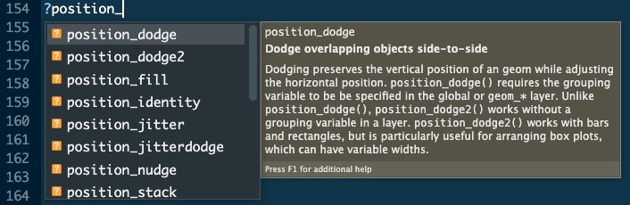

# Customizing Graphics with `ggplot2` {#data-presentation}

```{r, fig.cap="At least it's colorful! (https://xkcd.com/2864/)", fig.align='center', out.width='80%', echo = FALSE, eval = TRUE}
knitr::include_graphics("https://imgs.xkcd.com/comics/compact_graphs.png")
```

## Objectives

* Customize plots in `ggplot`, including axes, symbology, and legends
* Use themes to change plot design
* Save plots in a variety of formats for future use

## Additional reading

Hadley Wickham, Mine Çetinkaya-Rundel, and Garrett Grolemund. R for Data Science (2e). Chapter 9: Layers. Available: https://r4ds.hadley.nz/data-visualize.html

## Data presentation

In the previous lesson, we learned the basics of `ggplot2` syntax and graphics and used graphs for data visualization. Now we will learn how to make them pretty and practice effective ways to communicate with data.

## Axes

### Axis titles

As usual in coding, there are multiple ways to change axis labels. Going back to our `urban_data` boxplot:

```{r}
library(tidyverse)
urban_data <- read_csv("data/raw/Murray-Sanchez_urban-wildlife.csv")
ggplot(data = urban_data, aes(x = host.class, y = r)) +
  geom_boxplot() +
  geom_hline(yintercept = 0) +
  labs(x = "Host taxon", y = "Effect size (r)")
```

You can achieve the same result with:

```{r}
ggplot(data = urban_data, aes(x = host.class, y = r)) +
  geom_boxplot() +
  geom_hline(yintercept = 0) +
  xlab("Host taxon") + ylab("Effect size (r)")
```

### Axis labels

Sometimes, our axes aren't labeled the way we want them to be. For example, the way a variable is coded in our data frame might not be ideal for presentation. Let's say we wanted to capitalize our host taxon variable:

```{r}
ggplot(data = urban_data, aes(x = host.class, y = r)) +
  geom_boxplot() +
  geom_hline(yintercept = 0) +
  scale_x_discrete("Host taxon", 
                   breaks = unique(urban_data$host.class), 
                   labels = str_to_sentence(unique(urban_data$host.class))) + 
  ylab("Effect size (r)")
```

Here, `breaks` and `labels` must be vectors of the same length, and in the same order. `breaks` indicates the values in the data where the labels should appear, and `labels` indicates the corresponding label for each break.

This code chunk also introduces **scales**, which are `ggplot`'s way of representing data. Here, we have a discrete x-axis, so we have to use `scale_x_discrete()`. If we wanted to edit a continuous axis, we would use `scale_*_continuous()`:

```{r}
ggplot(data = urban_data, aes(x = host.class, y = r)) +
  geom_boxplot() +
  geom_hline(yintercept = 0) +
  scale_x_discrete("Host taxon", 
                   breaks = unique(urban_data$host.class), 
                   labels = str_to_sentence(unique(urban_data$host.class))) + 
  scale_y_continuous("Effect size (r)", 
                     breaks = seq(from = -1, to = 1, by = 0.2))
```

## Editing legends

Legends automatically appear when the plot contains symbology like color, shape, linetype, etc. that are connected to a variable (i.e., enclosed in `aes()`). 

```{r}
ggplot(urban_data, aes(x = host.class, y = r, color = health)) +
  geom_boxplot() +
  geom_hline(yintercept = 0) +
  scale_x_discrete("Host taxon", 
                   breaks = unique(urban_data$host.class), 
                   labels = str_to_sentence(unique(urban_data$host.class))) + 
  scale_y_continuous("Effect size (r)", 
                     breaks = seq(from = -1, to = 1, by = 0.2))
```

We might want to change the title of the legend, capitalize the labels, and arrange them in alphabetical order:

```{r}
ggplot(urban_data, aes(x = host.class, y = r, fill = health)) +
  geom_boxplot() +
  geom_hline(yintercept = 0) +
  scale_x_discrete("Host taxon", 
                   breaks = unique(urban_data$host.class), 
                   labels = str_to_sentence(unique(urban_data$host.class))) + 
  scale_y_continuous("Effect size (r)", 
                     breaks = seq(from = -1, to = 1, by = 0.2)) +
  scale_fill_discrete("Health metric",
                      breaks = sort(unique(urban_data$health)),
                      labels = str_to_sentence(sort(unique(urban_data$health))))
```

As for our x-axis, we use `scale_fill_discrete()` because the color maps to a discrete variable. 

## Placing plot elements

Our plot is getting better, but there's something difficult to see about the boxplots. The different host taxa are kind of close together. We can fix these within `geom_boxplot()` by specifying the `width` of the boxes:

```{r}
ggplot(urban_data, aes(x = host.class, y = r, fill = health)) +
  geom_boxplot(width = 0.5) +
  geom_hline(yintercept = 0) +
  scale_x_discrete("Host taxon", 
                   breaks = unique(urban_data$host.class), 
                   labels = str_to_sentence(unique(urban_data$host.class))) + 
  scale_y_continuous("Effect size (r)", 
                     breaks = seq(from = -1, to = 1, by = 0.2)) +
  scale_fill_discrete("Health metric",
                      breaks = unique(urban_data$health),
                      labels = str_to_sentence(unique(urban_data$health)))
```

By default, `ggplot2` places boxplots next to one another, but this isn't the default for all geometries. For example, if we instead plot the mean and standard error in each group:

```{r}
ggplot(urban_data, aes(x = host.class, y = r, color = health)) +
  stat_summary() +
  geom_hline(yintercept = 0) +
  scale_x_discrete("Host taxon", 
                   breaks = unique(urban_data$host.class), 
                   labels = str_to_sentence(unique(urban_data$host.class))) + 
  scale_y_continuous("Effect size (r)", 
                     breaks = seq(from = -1, to = 1, by = 0.2)) +
  scale_color_discrete("Health metric",
                       breaks = unique(urban_data$health),
                       labels = str_to_sentence(unique(urban_data$health)))
```

Here, we can use the `position` argument to offset the points and error bars.

```{r}
ggplot(urban_data, aes(x = host.class, y = r, color = health)) +
  stat_summary(position = position_dodge(width = 0.2)) +
  geom_hline(yintercept = 0) +
  scale_x_discrete("Host taxon", 
                   breaks = unique(urban_data$host.class), 
                   labels = str_to_sentence(unique(urban_data$host.class))) + 
  scale_y_continuous("Effect size (r)", 
                     breaks = seq(from = -1, to = 1, by = 0.2)) +
  scale_color_discrete("Health metric",
                       breaks = unique(urban_data$health),
                       labels = str_to_sentence(unique(urban_data$health)))
```

Not all `position` options are available for all geometries, but some others are: 

* `"identity"`: the default for points, ranges, and lines. Places the geometry at exactly its x-coordinate.
* `"dodge"`: offsets points based on their group aesthetic (implicitly their color, shape, etc.), with a specified width. `"dodge2"` is similar, but adds some padding in between geometries (e.g., so that boxplot edges do not touch).
* `"jitter"`: adds random noise to the x- and/or y-coordinates.
* `"stack"`: for bar/column charts, places bars on top of one another instead of next to one another (`"dodge"`).

You can get a full list of position options by typing `?position_` and seeing what autofills.

```{r, fig.cap="RStudio's autofill feature is here to help", fig.align='center', out.width='80%', echo = FALSE, eval = TRUE}

```

## Labeling data and plots

### Text variables

We have dealt with a few `geom_`s to date. One more is `geom_text()`, which can be very useful for labeling data points (but can also be dangerous - too much text on a plot is impossible to read). `geom_text()` works just like other `geom`s, with specifications for `x`, `y`, and `label` (the text itself):

```{r}
urban_data %>%
  filter(YEAR == 2009) %>%
  ggplot(aes(x = udiff_1000, y = r)) +
  geom_point() +
  labs(x = "Urban gradient (1 km)", y = "Effect size (r)") +
  geom_text(aes(label = AUTHORS)) 
```

This is okay, but the text is plotted on top of the points. Some arguments within `geom_text()` can help here. 

Justification: `hjust` (horizontal justification) and `vjust` (vertical justification) are defined between 0 and 1. 0 means left- and bottom-justified, 0.5 is centered, and 1 means right- or top-justified. By default, both are 0.5, so we can move the text by changing these values:

```{r}
urban_data %>%
  filter(YEAR == 2009) %>%
  ggplot(aes(x = udiff_1000, y = r)) +
  geom_point() +
  labs(x = "Urban gradient (1 km)", y = "Effect size (r)") +
  geom_text(aes(label = AUTHORS), hjust = 0, vjust = 1) 
```

You can also specify these using characters ("left", "middle", "right"/"top", "bottom", "center"). There are two special alignments: "inward" and "outward". Inward always aligns text towards the center of the plot, and outward aligns it away from the center.

```{r}
urban_data %>%
  filter(YEAR == 2009) %>%
  ggplot(aes(x = udiff_1000, y = r)) +
  geom_point() +
  labs(x = "Urban gradient (1 km)", y = "Effect size (r)") +
  geom_text(aes(label = AUTHORS), hjust = "inward", vjust = 1) 
```

We can also move the text using `nudge_x` and `nudge_y` (in the same units as the axes):

```{r}
urban_data %>%
  filter(YEAR == 2009) %>%
  ggplot(aes(x = udiff_1000, y = r)) +
  geom_point() +
  labs(x = "Urban gradient (1 km)", y = "Effect size (r)") +
  geom_text(aes(label = AUTHORS), hjust = 0, vjust = 1, nudge_x = 1) 
```

We can use the same position arguments as we did above :

```{r}
urban_data %>%
  filter(YEAR == 2009) %>%
  ggplot(aes(x = udiff_1000, y = r)) +
  geom_point() +
  labs(x = "Urban gradient (1 km)", y = "Effect size (r)") +
  geom_text(aes(label = AUTHORS), position = position_jitter(width = 1, height = .1))
```

And `ggplot` provides the `check_overlap` argument, which will plot only one text in cases where labels overlap:

```{r}
urban_data %>%
  filter(YEAR == 2009) %>%
  ggplot(aes(x = udiff_1000, y = r)) +
  geom_point() +
  labs(x = "Urban gradient (1 km)", y = "Effect size (r)") +
  geom_text(aes(label = AUTHORS), hjust = "inward", nudge_y = -0.01, check_overlap = T)
```

### Annotation

Sometimes, we want to add annotation that is unrelated to the data, for example labeling a trendline or other plot elements. We can do this with the `annotate()` element.

```{r}
ggplot(urban_data, aes(x = host.class, y = r, fill = health)) +
  geom_boxplot(width = 0.5) +
  geom_hline(yintercept = 0) +
  scale_x_discrete("Host taxon", 
                   breaks = unique(urban_data$host.class), 
                   labels = str_to_sentence(unique(urban_data$host.class))) + 
  scale_y_continuous("Effect size (r)", 
                     breaks = seq(from = -1, to = 1, by = 0.2)) +
  scale_fill_discrete("Health metric",
                      breaks = unique(urban_data$health),
                      labels = str_to_sentence(unique(urban_data$health))) +
  annotate("text", x = 0.1, y = 0, label = "No effect\n(r=0)",
           hjust = 0, vjust = 0.5) 
```

You can see that this works pretty similarly to `geom_text()`, although we first have to specify that we want text. You could also add a point, polygon, and so on by specifying that in the first argument to the `annotate()` function. Note that nudges do not work for annotations.

## Arranging multiple plots

Often, we want to display data across multiple plots. Multipanel figures come in two main flavors: those using the same data and variables, with panels to separate groups, and those using different data and/or variables, which we want to display next to each other. We will call these *facets* and *grids*, respectively.

### Facets

You can think of facets almost like another level of symbology. We might have exhausted how much we can show on one plot with symbology alone. The plot is getting busy, and we can't really see everything any more. For example, if we wanted to show effect size as a function of health metric, host group, and year of publication all on one plot, we could in theory show those with a combination of axes, color, and shape:

```{r}
ggplot(urban_data, aes(x = YEAR, y = r)) +
  geom_point(aes(color = host.class, shape = health)) +
  scale_shape_discrete("Health metric") +
  scale_color_discrete("Host group")
```

It's really hard to find any patterns on this plot. Maybe the blue points (invertebrates) start showing up more in 2012? Maybe There's a positive trend in pink points (mammals)? There were tons of toxicant studies in 2015 - what's up with that? We might get more clarity by using multiple panels.

```{r}
ggplot(urban_data, aes(x = YEAR, y = r)) +
  geom_point(aes(color = host.class)) +
  scale_color_discrete("Host group") +
  facet_wrap(~health)
```

Here, `facet_wrap(~health)` means that we want panels to be created as a function of the `health` variable. The other common faceting function is `facet_grid()`, which explicitly uses x and y axes, which can allow us to display even more data:

```{r}
ggplot(urban_data, aes(x = YEAR, y = r)) +
  geom_point(aes(color = host.class)) +
  scale_shape_discrete("Health metric") +
  scale_color_discrete("Host group") +
  facet_grid(aqterr~health)
```

Of course, adding more data isn't always a good thing: eight panels is a lot!

### Grids

Especially for reports and manuscripts, we sometimes want to make multi-panel figures that don't share axes. This isn't possible using `ggplot2`'s facets. To do this, we have to call on other packages. There are multiple packages that interface with `ggplot2` to create multipanel figures. Here, we will use `cowplot`.

```{r}
# install.packages("cowplot")
library(cowplot)

p_year <- ggplot(urban_data, aes(x = YEAR, y = r)) +
  geom_point() +
  xlab("Year") + ylab("Effect size (r)")
p_host <- ggplot(urban_data, aes(x = host.class, y = r)) +
  geom_boxplot() +
  geom_hline(yintercept = 0) +
  scale_x_discrete("Host taxon", 
                   breaks = unique(urban_data$host.class), 
                   labels = str_to_sentence(unique(urban_data$host.class))) + 
  scale_y_continuous("Effect size (r)", 
                     breaks = seq(from = -1, to = 1, by = 0.2))

cowplot::plot_grid(p_year, p_host,
                   nrow = 1, ncol = 2)
```

`cowplot` allows much more than this functionality. Take a look at the many options in the `plot_grid()` function: we can align plot axes, change the relative widths of each plot, and so on.

## Design

### Themes

The `theme` function allows us to control the overarching design across a plot. If you look at the help page for `?theme`, you will see an overwhelming number of arguments! This is basically to say that you can customize the design of many plot elements. `ggplot2` also provides some default themes, which generally control plot backgrounds and axes. The default theme is `theme_gray()`. Let's explore some others:

```{r}
cowplot::plot_grid(p_year + labs(title = "Gray"), 
                   p_year + theme_classic() + labs(title = "Classic"),
                   p_year + theme_bw() + labs(title = "B/W"), 
                   p_year + theme_dark() + labs(title = "Dark"))
```

Notice here that I also added themes and titles to the object `p_year` I created in the code chunk above. This is one nice aspect of ggplots: you can add new layers even after creating the object. 

These themes are convenient but there's much more we could do. For example, `theme` allows us to control the size of text across multiple plot elements, move around the legend, and change the titles of facts (called "strips").

```{r}
ggplot(urban_data, aes(x = YEAR, y = r)) +
  geom_point(aes(color = host.class)) +
  scale_shape_discrete("Health metric") +
  scale_color_discrete("Host group") +
  scale_x_continuous("Year") + scale_y_continuous("Effect size (r)") +
  facet_grid(aqterr~health) +
  theme_bw() +
  theme(legend.position = "bottom", 
        legend.title = element_text(size = 13),
        legend.text = element_text(size = 11),
        axis.text = element_text(size = 11),
        axis.title = element_text(size = 13),
        strip.text = element_text(size = 14))
```

Any many more options...

### Color schemes

When we add color to a ggplot, by default we get the colors you see above for discrete variables and a blue color scheme for continuous variables:

```{r}
ggplot(urban_data, aes(x = udiff_1000, y = r, color = YEAR)) +
  theme_bw() +
  geom_point() +
  xlab("Difference in urban gradient (1 km)") +
  ylab("Effect size (r)") +
  scale_color_continuous("Year")
```

The warning message here tells us that 61 of our data points are not showing on this plot. Can you tell why?

Both of these are okay, but neither is great, and sometimes you will want to specify your own color scheme. The `viridis` package provides a few nice default color schemes, and these are now built into `ggplot2`.

```{r}
ggplot(urban_data, aes(x = udiff_1000, y = r, color = YEAR)) +
  theme_bw() +
  geom_point() +
  xlab("Difference in urban gradient (1 km)") +
  ylab("Effect size (r)") +
  scale_color_viridis_c("Year")
```

To change the color, I used `scale_color_viridis_c()` instead of `scale_color_continuous()`. `viridis` also provides other color schemes, and you can change the range of the color (for example, I often find the lightest colors hard to see on a white background):

```{r}
cowplot::plot_grid(
  ggplot(urban_data, aes(x = udiff_1000, y = r, color = YEAR)) +
    theme_bw() +
    geom_point() +
    xlab("Difference in urban gradient (1 km)") +
    ylab("Effect size (r)") +
    scale_color_viridis_c("Year", option = "magma") +
    ggtitle("Full color range"),
  ggplot(urban_data, aes(x = udiff_1000, y = r, color = YEAR)) +
    theme_bw() +
    geom_point() +
    xlab("Difference in urban gradient (1 km)") +
    ylab("Effect size (r)") +
    scale_color_viridis_c("Year", option = "magma", begin = 0, end = 0.7) +
    ggtitle("Top of range removed"),
  nrow = 2
)
```

You can also specify your own color gradients with the functions `scale_color_gradient()`, `scale_color_gradient2()`, and `scale_color_gradientn()`:

```{r}
ggplot(urban_data, aes(x = udiff_1000, y = r, color = YEAR)) +
  theme_bw() +
  geom_point() +
  xlab("Difference in urban gradient (1 km)") +
  ylab("Effect size (r)") +
  scale_color_gradient("Year", low = "red", high = "blue") 
```

For discrete variables, the `viridis` package is also useful:

```{r}
ggplot(urban_data, aes(x = host.class, y = r, fill = health)) +
  geom_boxplot(width = 0.5) +
  geom_hline(yintercept = 0) +
  scale_x_discrete("Host taxon", 
                   breaks = unique(urban_data$host.class), 
                   labels = str_to_sentence(unique(urban_data$host.class))) + 
  scale_y_continuous("Effect size (r)", 
                     breaks = seq(from = -1, to = 1, by = 0.2)) +
  scale_fill_viridis_d("Health metric",
                       breaks = unique(urban_data$health),
                       labels = str_to_sentence(unique(urban_data$health)))
```

The `RColorBrewer` also provides a number of useful discrete color palettes, including ones that are specified to be color blind friendly:

```{r}
RColorBrewer::display.brewer.all(colorblindFriendly = T)

ggplot(urban_data, aes(x = host.class, y = r, fill = health)) +
  geom_boxplot(width = 0.5) +
  geom_hline(yintercept = 0) +
  scale_x_discrete("Host taxon", 
                   breaks = unique(urban_data$host.class), 
                   labels = str_to_sentence(unique(urban_data$host.class))) + 
  scale_y_continuous("Effect size (r)", 
                     breaks = seq(from = -1, to = 1, by = 0.2)) +
  scale_fill_brewer("Health metric",
                    breaks = unique(urban_data$health),
                    labels = str_to_sentence(unique(urban_data$health)),
                    palette = "Set2")
```

## Exporting and saving plots

Let's say we made a beautiful plot:

```{r}
ggplot(urban_data, aes(x = health, y = r)) +
  geom_point(aes(color = host.class), position = position_dodge(width = 0.2), alpha = 0.5) +
  stat_summary(shape = "square") +
  geom_hline(yintercept = 0) +
  annotate("text", x = 0.1, y = 0, label = "No effect\n(r=0)",
           hjust = 0, vjust = 0.5) +
  theme_bw() +
  labs(x = "Health metric", y = "Effect size (r)",
       title = "Mean +/- SE by health metric") +
  scale_color_brewer("Host taxon", palette = "Dark2") +
  theme(text = element_text(size = 12), legend.position = "bottom") 
```

It outputs in the Plots panel of RStudio, but what if we want to export it elsewhere. The Export button above the plot might be tempting, but it doesn't work very well - resolution is limited and it's not all that reproducible. Instead, use `ggsave()`:

```{r}
ggsave(filename = "figures/taxon_effect_plot.png", 
       width = 7, height = 6, units = "in")
```

You can output a plot as a pdf, png, jpeg, etc., which will depend on the file extension you supply. By default, `ggsave` will save the last plot you rendered, but you can also provide a plot object to the `plot` argument. If you use Windows, remember to close the file before trying to write to it, or you will get an error.
