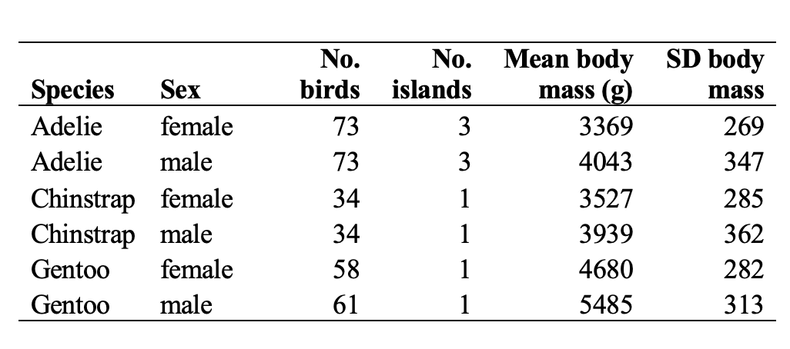
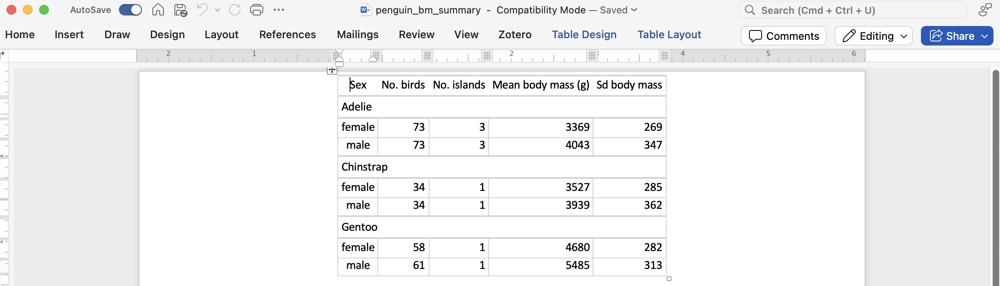

# Creating and Designing Data Tables {#tables}

## Objectives

* Summarize and output data in tabular format
* Format tables to include necessary information for interpretation
* Output data from R in tabular form that can be used in reports and other documents

## Additional reading

Remshard, M., & Queenborough, S. A. (2023). Design of tables for the presentation and communication of data in ecological and evolutionary biology. *Ecology and Evolution, 13*(7), e10062. https://doi.org/10.1002/ece3.10062

## Tables as outputs

Data visualization in figures and other graphics is usually the most effective way of communicating information. Consider, for example, the same data displayed in a figure and in a table:

```{r}
library(tidyverse)
library(palmerpenguins)

dat_summ <- penguins %>%
  filter(!is.na(sex)) %>%
  group_by(species, sex) %>%
  summarize(n = n(),
            body_mass_mean = mean(body_mass_g, na.rm = T),
            body_mass_sd = sd(body_mass_g, na.rm = T))
dat_summ %>%
  ggplot(aes(x = species, y = body_mass_mean, 
             ymin = body_mass_mean - body_mass_sd, 
             ymax = body_mass_mean + body_mass_sd,
             color = sex, size = n)) +
  geom_pointrange() +
  theme_bw() + theme(text = element_text(size = 14)) +
  scale_size("Number of pengins", range = c(0.5,2),
             breaks = c(35,55,73)) +
  scale_color_manual("Sex", breaks = c("male","female"), 
                     values = c("darkgreen", "orange")) +
  labs(x = "Species", y = "Body mass (mean +/- SD)")

dat_summ
```

From the figure, I clearly see that Gentoo penguins are heavier than the other two species, that males are heavier than females in all species, and that fewer chinstrap penguins were sampled than the other two species. It would take me a minute to get all this information from the table. However, tables are better than figures when exact values are important, or when you have a lot of information to convey. For example, I can't quite tell from the figure whether the exact same number of males and females were sampled in each species. Overall, some key applications for tables are:

* Providing exact values
* Reporting statistical outputs
* Reporting large data sets (often in an appendix)

In scientific publications, tables are often formatted in a specific way - for example, with borders and margins in a particular format. In the publishing world, most of this formatting is usually completed by the journal editorial team at the time of publication. However, if you are creating reports or other documents that will be shared without professional editing, you will need to know how to format tables in and out of R. The most typical scientific format of a table looks like this:

```{r, fig.cap="A common data table format", fig.align='center', out.width='80%', echo = FALSE, eval = TRUE}

```

Notice that the table includes border lines above and below the header row and a border line below the table, but no vertical borders or horizontal borders within the data area. The header row is in **bold** but nothing else is. This formatting is relatively straightforward to achieve in word processing programs but can also be achieved (with a little more of a learning curve) directly in R.

## Writing tables to files

Although the final formatting of a table might be done in a word processor, we first need to get the data out of R. We covered some of this in our lesson on [reading and writing data](#importexport). Since a CSV file will open easily in a spreadsheet program like Excel, you can simply:

1. save your table as a CSV, 
2. open it in Excel,
3. copy that table to Word, and 
4. add borders and alignment. 

However, since one benefit of using a scripting language like R is that you can easily update your analyses, it is helpful to pre-format the table as much as possible before outputting. If we outputted `data_summ` as it is now, our fourth step would also require rounding or truncating numbers and renaming columns. Every time we updated the analysis we would need to update these as well, making this process more time-consuming and, to some degree, less reproducible; for example, there would be no record of the translation between column names in our data.frame and column names in the data presented. Ideally, you would do all of this rounding and renaming before writing your data to a CSV:

```{r}
dat_summ_out <- dat_summ %>%
  rename(`No. birds` = n, 
         `Mean body mass (g)` = body_mass_mean,
         `SD body mass` = body_mass_sd) %>%
  rename_all(str_to_sentence) %>%
  mutate(across(is.numeric, round)) #Let's talk about this one! What is this doing?

write_csv(dat_summ_out, "outputs/penguin_summary.csv")
```

*What other formatting details might you want to consider before writing data to a file?*

## An R package for table design: `gt`

The method above is useful if you have a table or two to place in a report. What if you have a lot? The amount of extra time it takes to reformat each (and update every time something changes) might make it worth investing in a more automated solution. The [`gt`](https://gt.rstudio.com/articles/gt.html) package provides just that. It is very flexible, allowing you to create complex, nested tables. Although there is a bit of a learning curve to using the package, the time investment pays off if you produce a lot of tables.

Here's an example of our penguin data in `gt` format:

```{r}
library(gt)
gt(dat_summ_out)
```

The formatting might be a little unexpected, because it's different than what we saw before. Now, instead of repeating species across sex, the table is nested by species. `gt` knew to do this because our tibble/data frame was grouped by species:

```{r}
class(dat_summ_out)
groups(dat_summ_out)
```

By default `dplyr` maintains the groups in `group_by()` even after the summary is done. We could ungroup the table, in which case, our output would change:

```{r}
dat_summ_out %>%
  ungroup() %>%
  gt()
```

This output is an image. You could copy it into a document, but that it wouldn't be embedded in the same way a table is. Instead, we can use the `gtsave()` function with a given file ending to save our output in a format for a word processor.

```{r}
dat_summ_out %>%
  gt() %>%
  gtsave("outputs/penguin_bm_summary.docx")
```

```{r, fig.cap="The default gtable format in Word", fig.align='center', out.width='80%', echo = FALSE, eval = TRUE}

```

Now this format is readable by Word; if you click in the table, the usual formatting options will appear. Next, let's work on formatting the table to look exactly like the manually created one. To start off, we'll create an object for our table so we can modify it:

```{r}
gt_penguins <- gt(ungroup(dat_summ_out))
```

I usually write my documents in Times New Roman, so first I'll change the font using the `opt_table_font()` function, which defines fonts for the entire table:

```{r}
gt_penguins <- opt_table_font(gt_penguins, font = "Times")
gt_penguins
```

Now I will change the header row to bold font. This time I use the `tab_style()` function, since I only want to change properties for specific cells, not the entire table:

```{r}
gt_penguins <- tab_style(gt_penguins, 
                         style = cell_text(weight = "bold"), 
                         location = cells_column_labels())
gt_penguins
```

Looking in the help funciton for `tab_style()`, I learned that to the `style` argument I need to specify a function like `cell_text()` or `cell_fill()`, then the options within that function. The `location` argument indicates which cells to edit. Again, this should be a function starting with `cells_*`, which is essentially a selection argument. The help functions will be useful to you here to find the cells you are looking for.

Now I will work on the borders. This workflow is similar to the one I used above. First, I remove all the borders using an `opt_*` function, then I add borders back where I want them using `tab_style()`:

```{r}
gt_penguins <- gt_penguins %>%
  opt_table_lines(extent = "none") %>%
  tab_style(style = cell_borders(sides = c("top", "bottom")),
            location = cells_column_labels()) %>%
  tab_style(style = cell_borders(sides = "bottom"),
            location = cells_body(rows = nrow(dat_summ_out))) #add bottom border to the last row
gt_penguins
```

All that's left is the alignment. I want to left-align my character columns and right-align my numeric columns.

```{r}
gt_penguins <- gt_penguins %>%
  tab_style(style = cell_text(align = "left"),
            location = list(cells_column_labels(columns = c("Species","Sex")),
                            cells_body(columns = c("Species","Sex"))))
gt_penguins
```

Notice that because I wanted to do this to both the body cells and the column labels, I had to specify both of those and combine them as a `list`.

Finally, let's do the same thing, but for the grouped data. Now, we need to deal with design choices related to the groups, but first I will change the font:

```{r}
gt_penguins <- dat_summ_out %>%
  gt() %>%
  opt_table_font(font = "Times") %>%
  tab_style(style = cell_text(weight = "bold"), 
                         location = cells_column_labels()) 
gt_penguins 
```

Now, notice that the species are on their own line. I typically would include them as another column, so I'll do that using the strategy I found on [this Stack Overflow page](https://stackoverflow.com/questions/76260847/how-can-i-put-the-groups-in-an-extra-column-in-a-gt-table):

```{r}
gt_penguins <- gt_penguins %>%
  tab_options(row_group.as_column = TRUE)
gt_penguins 
```

Now I can use the same lines and alignment as I did before:

```{r}
gt_penguins %>%
  tab_style(style = cell_text(align = "left"),
            location = list(cells_column_labels(columns = "Sex"),
                            cells_body(columns = "Sex"))) %>%
  opt_table_lines(extent = "none") %>%
  tab_style(style = cell_borders(sides = c("top", "bottom")),
            location = cells_column_labels()) %>%
  tab_style(style = cell_borders(sides = "bottom"),
            location = cells_body(rows = nrow(dat_summ_out))) 
```

Oops, that's not what I wanted. I guess `cells_column_labels()` only gives me named columns, whereas the species column no longer has a name. Trying again:

```{r}
gt_penguins <- gt_penguins %>%
  tab_style(style = cell_text(align = "left"),
            location = list(cells_column_labels(columns = "Sex"),
                            cells_body(columns = "Sex"))) %>%
  opt_table_lines(extent = "none") %>%
  tab_style(style = cell_borders(sides = c("top", "bottom")),
            location = list(cells_column_labels(), 
                            cells_stubhead())) %>%
  tab_style(style = cell_borders(sides = "bottom"),
            location = list(cells_body(rows = nrow(dat_summ_out)),
                            cells_row_groups(groups = n_distinct(dat_summ_out$Species)))) 
gt_penguins
```

The **stub** is the area to the left in a table that contains row labels, row group labels, and/or summary labels; in this case it is the species group. The `cells_stubhead()` function finds the header of these cells, so in this case the top-leftmost cell of the table. Similarly, `cells_row_groups()` finds all the grouping rows; I just want the last one, so I use the number of species groups present (`n_distinct(dat_summ_out$Species`)).

This last example highlights one of the challenges of `gt`: there are so many options that they can be hard to find. The [documentation](https://gt.rstudio.com/reference/index.html) is very helpful. Also, once you understand the basic structure of the functions, you can try using autofill to suggest other options. For example, if you know you want to select a cell type but don't know what it's called, try typing in `?cell_` and checking out your options.

Additional features of `gt` include:

* Footnotes
* Embedded title and subtitle
* Grouped columns
* ...

A note: at the time of writing, formatting is not preserved perfectly across output formats in `gt` (e.g., what you see in the Viewer is not exactly what Word shows). [This fix is in progress](https://github.com/rstudio/gt/issues/1098).
