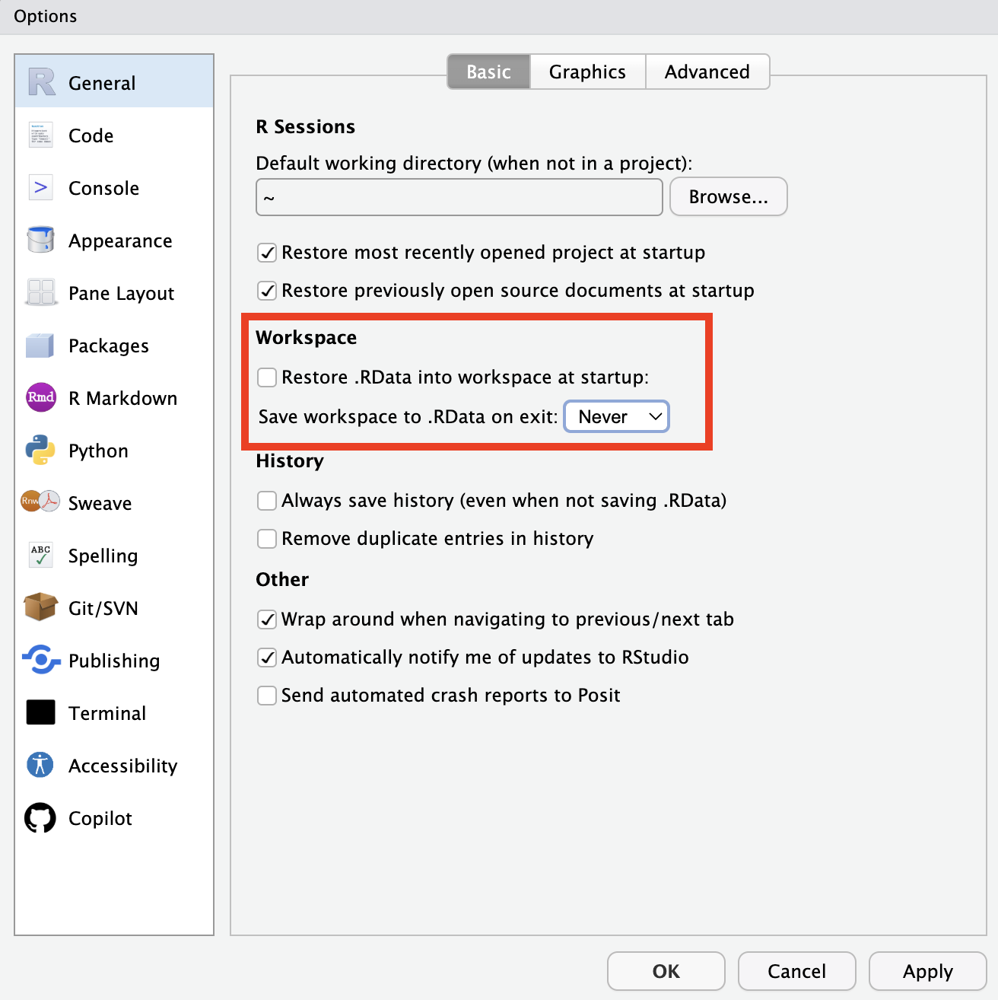

# Getting Started with R {#basics}

Much of this lesson draws from The Carpentries' [Data Analysis and Visualization in R for Ecologists](https://datacarpentry.github.io/R-ecology-lesson/index.html) workshop, which is published under a [CC-BY 4.0](https://datacarpentry.github.io/R-ecology-lesson/LICENSE.html) license.

## Objectives

* Understand R and RStudio and how they relate to one another
* Understand the basic organization of RStudio panes
* Organize files using folders and R projects
* Define functions, objects, arguments, and the working directory
* Use R to create new objects and get basic information about object types and structures

## Additional reading

Hadley Wickham, Mine Çetinkaya-Rundel, and Garrett Grolemund. R for Data Science (2e). Chapter 2: Workflow: basics. Available: https://r4ds.hadley.nz/workflow-basics.html

## Some general guidance about coding and data management

* There is rarely one right way to write code. One way might be faster, and/or easier to read, and/or simpler, but there are always a *lot* of roads to get to the same destination.
* All programming languages are there to do what you tell them to do. They do that very well. What they do not do is what you want them to do! If your code is throwing errors or producing unexpected results, it's probably because it didn't understand what you wanted it to do. 
* To take the previous two points together: when in doubt, try taking another road and seeing if it leads you to the same place.
* Your system or code may be different than your collaborator's or friend's. That is usually not a problem, as long as they can understand how to find what they need and what to do with it when they do.

## Install R and RStudio

R is the primary coding language used by those in ecology and natural resources. RStudio is an integrated development environment (IDE) that makes using R easier. It provides some point-and-click options and a way of organizing inputs and outputs, making R easier to use.

**Install R and RStudio**: To get started, [install R from the CRAN website](https://cran.r-project.org/). Then, [install RStudio](https://posit.co/download/rstudio-desktop/#download). 

## Familiarize yourself with RStudio

**Open RStudio** and you will see four windows on one screen:

* Source: this is a *text editor,* where you can write and save your code.
* Environment/History/Connections: this panel tells you what *objects* are available (we will define these later, but for now think of them like files or spreadsheets)
* Console: this is where R does its work and provides outputs to the code you run.
* Files/Plots/Packages: plots you create will appear here, and you can browse files or load packages by clicking (though I don't recommend it).

You can customize properties like the organization of the windows and the color scheme using Tools --> Global Options. We will change one setting today: **Under the "General" tab**, make sure "Restore .RData into workspace at startup" is unchecked and set "Save workspace to .Rdata on exit" to "Never." We don’t want RStudio reload everything in our current session the next time we start R. This sounds convenient, but for the sake of reproducibility, we want to start with a clean, empty R session every time we work - because anyone following behind us would do so, too. Instead, we will record all steps scripts, save any data we need into files, and store outputs like images as files. 

<div class="figure" style="text-align: center">

<p class="caption">(\#fig:unnamed-chunk-1)Setting up defaults in R for maximum reproducibility</p>
</div>

## Installing packages; also, functions and objects

R comes with many built-in *functions* (we will define this later), but relies heavily on *packages,* which increase the amount you can do with R. For example, there are packages specifically built for making plots, animating graphics, running machine learning models, etc. In this lesson, we will use two packages: `tidyverse` and `here`. `tidyverse` provides a _lot_ of functions for reading, manipulating, and writing data, which we will focus on at the beginning of this course. `here` provides a way of locating files on your computer.

The so-called *core* tidyverse includes the following packages:

* `dplyr` for data manipulation;
* `tidyr` for tidying data;
* `ggplot2` for plotting;
* `readr` for reading in data files of various formats;
* `stringr` for manipulating character strings;
* `tibble` for extensions of data frames;
* `purrr` for functional programming;
* `forcats` for better handling categorical variables. 

**Install these packages**: First create a new R script in RStudio by clicking on File --> New File --> R script. Your "Source" window will expand with an empty text file. Copy the following code into your R script, then run each line by copying it to the console and pressing Enter/Return.


``` r
install.packages("tidyverse")
install.packages("here")
```

Now, what is this code doing? As we know, it is intalling the packages `tidyverse` and `here`. The code `install.packages` is called a *function.* You can think of this as a verb or a command. It tells R what to. Functions take *arguments*; you can think of these as grammatical objects (the thing the verb is acting on). In R, arguments are included in parentheses after the function. Other programming languages use different syntax (for example, spaces or dots). Here `"tidyverse"` is an argument, which allows us to tell `install.packages` which package to install. (We'll get into why it is in quotes later.)

You only need to run `install.packages` once for each package. Like a program/application, they are now stored on your machine. Now, to use each package, you need to run the `library` function. This time, use RStudio's feature to automatically send your code to the console by moving your blinking cursor to each line, then clicking "Run" (top left) or Ctrl+Enter (Cmd+Return on Mac). 


``` r
library(tidyverse)
library(here)
```

You now have more functions available to you!

Programming differs from using other types of applications because there is no menu of functions. At first, this is challenging - how can you know what is possible? - but just like any other language, you will learn the names of functions and how to find new ones.

## Folders and files

Before we keep moving, it is important to remember that coding on its own is not reproducible. Scripts are rarely self-contained: they read and write data, create intermediate files, and need to be found and stored for future use. This practice requires using file systems -- a fancy way of talking about the folders on your computer. 

**Create a directory for this course**. If you already have a folder for this course, create a subfolder called "scripts" (or similar); if you don't, create a folder for the course and a sub-folder for scripts. Now, save the script you have just created in this folder. This might seem basic, but we will build on this organizational system throughout the course.

Many programming languages do not tolerate spaces well, so it is good practice to name your files and folders without spaces in the names. For example, you might want to call this script "lesson1.R" instead of "lesson 1.R." Even though your scripts are just text files, they will be saved with the ".R" extension, which tells your computer that R or RStudio should be the default program used to open them.

You can name your folders as you like, but a useful file structure might look something like this:

```
FANR_8950_Fall2025
│
└── scripts
│
└── data
│    └── cleaned
│    └── raw
│
└─── outputs
│
└─── documents
```

## R projects

In addition to having this folder structure, RStudio can keep track of our folders and files in a **Project**. To create a new project that includes your existing folders, click on File --> New Project. You will see a window that asks how to initiate the project. In this case, we have already created a directory (i.e., a folder), so choose "Existing Directory" and browse to find your course folder.

Next time you open RStudio, your project might automatically open. If not, you can use the dropdown menu in the top-right corner of your screen (in the Console window) to open the project.

Projects are not necessary for using R and RStudio, but they are helpful. One benefit is that they automatically set your *working directory* to the home folder for the project. Your working directory is the place where R starts when looking for files or when saving files; having this directory already set helps make your workflow more reproducible because anyone can pick up your project and start using it.

## Data structures in R

R's *functions* take *arguments*, but they can also create *objects.* Objects are stored in the *environment,* which allows you to come back to them. 

In the following code, we will use the assignment arrow (`<-`) to create an object called `my_number`, which is just a number with a value of 4. If you run this first line, you will see that nothing seems to happen.


``` r
my_number <- 4
```

To get R to output anything, we need to ask it to do so:


``` r
print(my_number)
print(my_number + 2)
my_number2 <- my_number + 2
```

Vectors (a 1-dimensional sequence of values) can come in a number of forms:

* Numbers (R differentiates between decimals - called *double* and *integers*)
* *Characters*
* *Factors* (ordered values)
* *Logical* (True/False)

They can also be combined into more complex forms:

* *Data frames*, which consist of rows and columns. Columns must have the same data type (character, integer, etc.)
* *Lists*, which can contain multiple data types. For example, one element of a list might be a 2-column/100-row data frame, and the next element of the list might be a 21-element character vector. We will get to lists later.


``` r
# A numeric vector
vec_dbl <- c(1.2, 102, 104.11, 0.1)

# A character vector
vec_chr <- c("apple", "durian", "canteloupe", "banana")

# A logical vector
vec_lgl <- c(TRUE, FALSE, TRUE, TRUE)

# Combine these into a data frame
df_all <- data.frame(vec_dbl, vec_chr, vec_lgl)
print(df_all)
```

```
##   vec_dbl    vec_chr vec_lgl
## 1    1.20      apple    TRUE
## 2  102.00     durian   FALSE
## 3  104.11 canteloupe    TRUE
## 4    0.10     banana    TRUE
```

  In this code snippet, you can also see that R does not recognize text preceded by `#` as code. You can use this to leave yourself notes, or to "comment out" bits of code that you want to keep in your script, but don't want to run.

Vectors (and, by extension, columns of data frames) can only hold one data type. If you give it more than one data type, R will "coerce" the vector to one of those data types. For example:


``` r
vec_mixed <- c(1, 2, "three", "four", TRUE)
print(vec_mixed)
```

```
## [1] "1"     "2"     "three" "four"  "TRUE"
```

You can also coerce vectors yourself, using functions like `as.numeric()`, `as.character()`, `as.factor()`, etc. 


``` r
vec_mixed_num <- as.numeric(vec_mixed)
```

```
## Warning: NAs introduced by coercion
```

``` r
print(vec_mixed_num)
```

```
## [1]  1  2 NA NA NA
```

R didn't know how to create numbers from the character values "three", "four", and "TRUE", so those are now `NA`. If you would like to practice, try converting different types of vectors to one another. Can you figure out some of the rules governing these conversions?


``` r
as.integer(vec_lgl)
```

```
## [1] 1 0 1 1
```

``` r
as.character(vec_dbl)
```

```
## [1] "1.2"    "102"    "104.11" "0.1"
```

### Factors

Categorical data is represented in R using *factors*. A factor is stored as a 
vector of labels called *levels* but, under the hood, each level gets assigned 
an integer (or index value). R uses the integer component of a factor to do its 
job but it displays the level to you so that it's descriptive and meaningful. 
This weird nature of factors is often a source of confusion. For example, if we 
have the following factor,


``` r
years <- factor(c(2017, 2018, 2019, 2020, 2021))
```

and we want to convert the years back into numeric, we would maybe try:


``` r
as.numeric(years)
```

```
## [1] 1 2 3 4 5
```

The result is not what we expected. This is because R converted the index values 
into numbers, not the factor levels. To specify that we want to convert the 
factor levels into numbers, not the underlying vector of integers, we have to be
explicit about it:


``` r
as.numeric(levels(years))
```

```
## [1] 2017 2018 2019 2020 2021
```

## A note: tidyverse vs. base R

As we begin to delve more deeply into the `tidyverse`, we should briefly pause to mention some of the reasons for focusing on the `tidyverse` set of tools. In R, there are often many ways to get a job done, and there are other approaches that can accomplish tasks similar to the `tidyverse.`

The phrase *base R* is used to refer to functions contained in R’s default packages. We have already used the base R functions `print()`, `as.numeric()`, etc., and we will be using more scattered throughout this course and lesson (for example, `mean()`). The `tidyverse` refers to a set of packages that have a consisent *syntax* (a way of writing code) that is generally more intuitive and readable than base R. `tidyverse` packages also generally come with clearer help pages and more informative error messages. 

We will focus on `tidyverse` packages throughout this course, but will also note ways to perform the same actions in base R. If you want to collaborate with people who write code differently than you do, it is helpful to be familiar with base R - or at least to recognize that that is what you're seeing.
