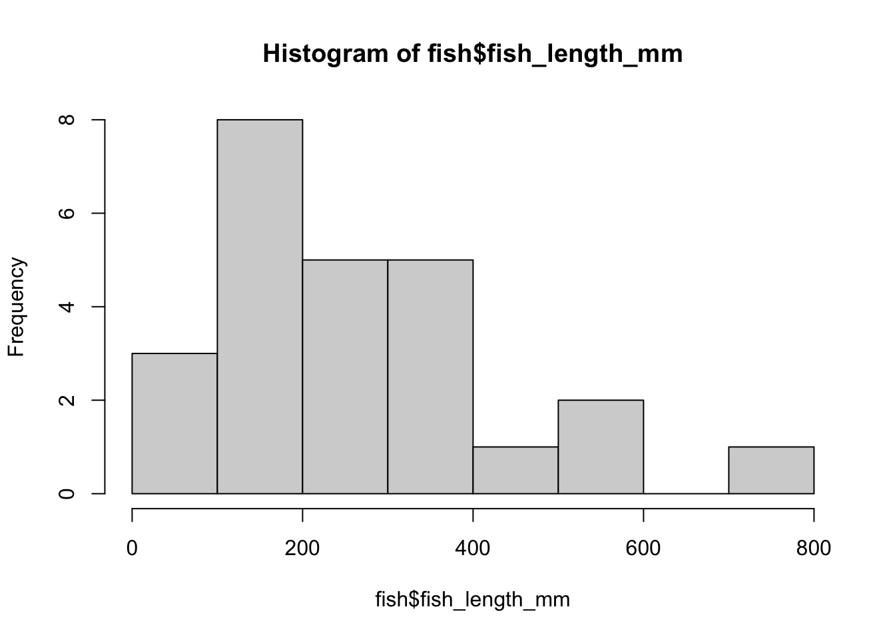

# Data Cleaning in R {#qaqc}

## Objectives

* Fix issues related to reading data and data formatting
* Summarize and visualize data to identify likely errors
* Resolve missing data using tools in R

## Principles of data cleaning

Many of the tools we will use to clean data in R are functions and approaches we have already covered. Learning how to use these approaches to identify, fix, and document errors in data is a key part of a reproducible workflow. Although you *could* fix many of these issues manually in Excel, doing so programatically provides a record of your methods and changes. It also allows you to use the same approaches over and over again, with less effort each time. I use these approaches a lot because I often use data collected by other people, so it's important that I have a clear record of what changes I have made, so that I can check back with the data collectors to see if these make sense.

## Fixing issues with data entry and reading data

Some errors in data come in through inconsistencies in data entry, or incompatibility of data entry with the way R reads data. One issue that you can encounter before even getting data into R deals with special characters (i.e., symbols). Some of these have to be ["encoded,"](https://kunststube.net/encoding/) meaning that they are replaced by a code rather than read in as the symbol itself. For the most part, this is for symbols that aren't on your keyboard, like Greek letters and (in this case) the degree sign. 


``` r
library(tidyverse)
```

```
## ── Attaching core tidyverse packages ──────────────────────── tidyverse 2.0.0 ──
## ✔ dplyr     1.1.4     ✔ readr     2.1.5
## ✔ forcats   1.0.0     ✔ stringr   1.5.1
## ✔ ggplot2   3.5.1     ✔ tibble    3.2.1
## ✔ lubridate 1.9.3     ✔ tidyr     1.3.1
## ✔ purrr     1.0.2     
## ── Conflicts ────────────────────────────────────────── tidyverse_conflicts() ──
## ✖ dplyr::filter() masks stats::filter()
## ✖ dplyr::lag()    masks stats::lag()
## ℹ Use the conflicted package (<http://conflicted.r-lib.org/>) to force all conflicts to become errors
```

``` r
fish <- read.csv("data/raw/messy_georgia_fish_data.csv") 
```

```
## Error in type.convert.default(data[[i]], as.is = as.is[i], dec = dec, : invalid multibyte string at '<a1>07'<35>9.2"N, 84<a1>37'27.8"W'
```

We can change the encoding that R expects with an additional argument:


``` r
fish <- read.csv("data/raw/messy_georgia_fish_data.csv", fileEncoding = "latin1") 
```

In this case, I usually find it easiest to play around with the encoding options until something works - it's more work to figure out the encoding in the original file, and that information is sometimes unavailable.

### Column names

R has a few rules for column names: they cannot contain spaces or symbols and cannot start with numbers. If you read in a data file with these characteristics, R will do its best to fix them - but not usually in the way you would like. In this case `read_csv` and `read.csv` act differently: `read_csv` creates a tibble, which can handle spaces, symbols, and numbers as long as they are referenced in tick marks (` `), but `read.csv` will rename your columns.


``` r
fish_base <- read.csv("data/raw/messy_georgia_fish_data.csv", fileEncoding = "latin1") 
names(fish_base)
```

```
##  [1] "Sample.ID"        "Common.Name"      "Scientific.Name"  "Fish.Length..mm."
##  [5] "Date.Collected"   "Sample.Location"  "Coordinates"      "X1st.Method.Used"
##  [9] "X2nd.Method.Used" "Notes"
```

``` r
fish_in <- read_csv("data/raw/messy_georgia_fish_data.csv")
```

```
## Rows: 52 Columns: 10
## ── Column specification ────────────────────────────────────────────────────────
## Delimiter: ","
## chr (8): Common Name, Scientific Name, Date Collected, Sample Location, Coor...
## dbl (2): Sample ID, Fish Length (mm)
## 
## ℹ Use `spec()` to retrieve the full column specification for this data.
## ℹ Specify the column types or set `show_col_types = FALSE` to quiet this message.
```

``` r
names(fish_in)
```

```
##  [1] "Sample ID"        "Common Name"      "Scientific Name"  "Fish Length (mm)"
##  [5] "Date Collected"   "Sample Location"  "Coordinates"      "1st Method Used" 
##  [9] "2nd Method Used"  "Notes"
```


``` r
head(fish_in$1st Method Used) #returns an error
```


``` r
head(fish_in$`1st Method Used`)
```

```
## [1] NA              "Seine"         "Trawl"         "Seine"        
## [5] NA              "Hook and line"
```

*Side note: Notice that I did not need to include the encoding in `read_csv()`. This is because it's a little more likely than `read.csv()` to figure out the encoding by default.*

Although `read_csv` works a little better here, it's still annoying to access columns with ticks, and they won't work in all functions. The `rename()` function in `dplyr` becomes useful here. The `rename_with()` function allows us to rename multiple columns using a rule:


``` r
fish <- rename(fish_in, Method1 = `1st Method Used`,
               Method2 = `2nd Method Used`)
names(fish)
```

```
##  [1] "Sample ID"        "Common Name"      "Scientific Name"  "Fish Length (mm)"
##  [5] "Date Collected"   "Sample Location"  "Coordinates"      "Method1"         
##  [9] "Method2"          "Notes"
```

``` r
fish <- rename_with(fish, ~str_replace_all(.x, " ", "_"))
fish <- rename_with(fish, ~str_remove_all(.x, "[)]|[(]"))
names(fish)
```

```
##  [1] "Sample_ID"       "Common_Name"     "Scientific_Name" "Fish_Length_mm" 
##  [5] "Date_Collected"  "Sample_Location" "Coordinates"     "Method1"        
##  [9] "Method2"         "Notes"
```

The syntax of the `rename_with()` function introduces a couple of new ways of working with `tidyverse` functions. Often, `summarize()`, `rename()`, and so on expect a function as their second argument. The function is preceded by a tilde (~) and using `.x` as an argument tells R to use column names.

Also note that I renamed my data from `fish_in` to `fish`. This can help you if you want to compare your clean and raw data later.

We might also want to follow general best practices and get rid of capital letters:


``` r
fish <- rename_with(fish, str_to_lower)
names(fish)
```

```
##  [1] "sample_id"       "common_name"     "scientific_name" "fish_length_mm" 
##  [5] "date_collected"  "sample_location" "coordinates"     "method1"        
##  [9] "method2"         "notes"
```

This is another way of using these functions. If they don't require any other arguments, we can just include the function name (without a ~). The code above is the same as:


``` r
fish <- rename_with(fish, ~str_to_lower(.x))
```

### Multi-format columns

Sometimes, data are entered in such a way that R cannot tell the appropriate format. In this case, you will most often end up with a character column because almost anything can be converted to a character without losing information. We can check the format of the columns using `str()` or `glimpse()` from tidyverse.


``` r
glimpse(fish)
```

```
## Rows: 52
## Columns: 10
## $ sample_id       <dbl> 1, 2, 3, 4, 5, 6, 7, 8, 9, 10, 11, 12, 13, 11, 14, 15,…
## $ common_name     <chr> "Bluegill", "Brown Bullhead", "Redbreast Sunfish", "Re…
## $ scientific_name <chr> "Lepomis macrochirus", "Ameiurus nebulosus", "Lepomis …
## $ fish_length_mm  <dbl> NA, 160, 9999, 9999, 201, 521, 9999, 9999, 750, 10000,…
## $ date_collected  <chr> "10/4/24", "10/4/24", "10/4/24", "10/4/24", "10/4/24",…
## $ sample_location <chr> "?", NA, "Lake Allatoona", NA, "Chattahoochee@CRNRA", …
## $ coordinates     <chr> NA, NA, "34\xa107'59.2\"N, 84\xa137'27.8\"W", NA, "33\…
## $ method1         <chr> NA, "Seine", "Trawl", "Seine", NA, "Hook and line", "H…
## $ method2         <chr> "Gill net", "Gill net", "Trawl", "Gill net", "Hook and…
## $ notes           <chr> "Unknown location", NA, NA, NA, NA, NA, NA, NA, NA, NA…
```

It looks like we have problems with two columns: **date_collected** should be a date and *coordinates* should really be two columns (latitude and longitude). Just looking at the first few elements of date_collected, it looks like it's all in a month/day/year format, so let's try that:


``` r
fish <- mutate(fish, date = mdy(date_collected))
```

```
## Warning: There was 1 warning in `mutate()`.
## ℹ In argument: `date = mdy(date_collected)`.
## Caused by warning:
## !  25 failed to parse.
```

``` r
sum(is.na(fish$date))
```

```
## [1] 30
```

The warning tells us that 25 of the elements were not in month/day/year format. Let's look at that in more detail:


``` r
unique(fish$date_collected)
```

```
##  [1] "10/4/24"    "7/5/24"     "19-Jun-24"  "6/4/24"     "6/17/24"   
##  [6] "25-Jun-24"  "4/27/24"    NA           "5/21/24"    "29/06/2024"
## [11] "6/29/24"    "4/29/24"    "24-Apr-24"  "6-May-24"   "4/5/24"    
## [16] "22/05/2024" "5/23/24"    "9/4/24"     "28/05/2024" "4-Apr-24"  
## [21] "8-May-24"   "10-Apr-24"  "22/06/2024" "2-Jun-24"   "30/05/2024"
## [26] "16/05/2024" "5/29/24"    "15-May-24"  "18-Jun-24"  "4/21/24"   
## [31] "28/04/2024" "26-Jun-24"  "12/6/24"    "5/28/24"    "19/06/2024"
## [36] "13-Apr-24"
```

It looks like we have a few formats. Luckily, `lubridate` treats names of months as the same as their numbers, so we don't have to worry about that. Here is where `if_else()` comes in. Since `mdy()` returns `NA` if it can't parse a date, we can take advantage of that:


``` r
fish <- mutate(fish, date = mdy(date_collected),
               date = if_else(is.na(date), dmy(date_collected), date),
               date = if_else(is.na(date), ymd(date_collected), date))
```

```
## Warning: There were 3 warnings in `mutate()`.
## The first warning was:
## ℹ In argument: `date = mdy(date_collected)`.
## Caused by warning:
## !  25 failed to parse.
## ℹ Run `dplyr::last_dplyr_warnings()` to see the 2 remaining warnings.
```

``` r
sum(is.na(fish$date))
```

```
## [1] 5
```

The logic here is that we first use one method to parse dates. If that doesn't work, we use another - but we only apply this to dates where the first method returned `NA`, and we source the date to parse from the original date column. We still get a lot of warnings because we have to go through the `NA`s. We also still have five `NA`s, but looking at those more closely, they all had missing dates in the original data:


``` r
filter(fish, is.na(date)) %>%
  select(date_collected)
```

```
## # A tibble: 5 × 1
##   date_collected
##   <chr>         
## 1 <NA>          
## 2 <NA>          
## 3 <NA>          
## 4 <NA>          
## 5 <NA>
```

### Strings and special characters

The coordinates column highlights another issue: while R read in the special character (degree symbol) eventually, it doesn't look right and doesn't provide us with information here; we don't usually include units within our data. 


``` r
head(fish$coordinates)
```

```
## [1] NA                                    
## [2] NA                                    
## [3] "34\xa107'59.2\"N, 84\xa137'27.8\"W"  
## [4] NA                                    
## [5] "33\xa159'12.48\"N, 84\xa119'25.32\"W"
## [6] "34\xa1 7'59.16\"N, 84\xa137'27.84\"W"
```

The coordinates also appear to be in a combination of degrees-minutes-seconds format rather than in decimal degrees. Here, we need to split latitude and longitude, split apart the components, and then use them to calculate decimal degrees:


``` r
fish <- fish %>%
  mutate(latitude = str_split_fixed(coordinates, pattern = ",", n = 2)[,1],
         longitude = str_split_fixed(coordinates, ",", 2)[,2])
select(fish, latitude, longitude) %>% head()
```

```
## # A tibble: 6 × 2
##   latitude            longitude           
##   <chr>               <chr>               
## 1  <NA>               ""                  
## 2  <NA>               ""                  
## 3 "34\xa107'59.2\"N"  " 84\xa137'27.8\"W" 
## 4  <NA>               ""                  
## 5 "33\xa159'12.48\"N" " 84\xa119'25.32\"W"
## 6 "34\xa1 7'59.16\"N" " 84\xa137'27.84\"W"
```


``` r
latitudes <- fish$latitude %>%
  #split by degree symbol and minutes symbol
  str_split_fixed(pattern = "\xa1|'|\"", n = 3) %>%
  #convert from matrix to tibble and rename
  as_tibble() %>%
  setNames(c("deg","min","sec"))
```

```
## Warning: The `x` argument of `as_tibble.matrix()` must have unique column names if
## `.name_repair` is omitted as of tibble 2.0.0.
## ℹ Using compatibility `.name_repair`.
## This warning is displayed once every 8 hours.
## Call `lifecycle::last_lifecycle_warnings()` to see where this warning was
## generated.
```

``` r
latitudes <- latitudes %>%
  #remove north designation and seconds symbol
  mutate(across(everything(), ~str_remove_all(.x, "N|\""))) %>%
  #convert strings to numeric
  mutate(across(everything(), as.numeric)) %>%
  #convert to decimal degrees
  mutate(dd = deg + min/60 + sec/(60*60))

longitudes <- str_split_fixed(fish$longitude, pattern = "\xa1|'|\"", n = 3) %>%
  as_tibble() %>%
  setNames(c("deg","min","sec"))
longitudes <- mutate(longitudes, across(everything(), ~str_remove_all(.x, "W|\""))) %>%
  mutate(across(everything(), as.numeric)) %>%
  mutate(dd = deg + min/60 + sec/(60*60))

fish <- bind_cols(fish, lat = latitudes$dd, long = longitudes$dd)
head(fish %>% select(coordinates, lat, long))
```

```
## # A tibble: 6 × 3
##   coordinates                              lat  long
##   <chr>                                  <dbl> <dbl>
## 1  <NA>                                   NA    NA  
## 2  <NA>                                   NA    NA  
## 3 "34\xa107'59.2\"N, 84\xa137'27.8\"W"    34.1  84.6
## 4  <NA>                                   NA    NA  
## 5 "33\xa159'12.48\"N, 84\xa119'25.32\"W"  34.0  84.3
## 6 "34\xa1 7'59.16\"N, 84\xa137'27.84\"W"  34.1  84.6
```

That was a *lot* of steps. There's probably a package out there that would do it for you, but if you know the basics it can be faster to use them than to figure out the syntax of new functions.

## Identifying likely errors

Now that the data are formatted correctly, we still need to make sure the data points themselves are valid. Two main flavors of incorrect data are duplicates and incorrect entries (sometimes called outliers).

### Duplicates

A duplicate is just that: a piece of data that has been entered twice. *True duplicates* are data points that share all the same information. They make our lives easy because they are the same - we just need to identify them and remove one. Other duplicates are more ambiguous; for example, I sometimes come across GPS locations from a single animal that have the same timestamp with different coordinates. In this case, we can look at the values to see which is more likely (see "outliers" below) or randomly choose one.

To check for duplicates, we can use `group_by()` and `summarize()`:


``` r
fish %>%
  group_by(across(everything())) %>% #use all columns as groups
  summarize(n = n()) %>% #count the number in each group
  filter(n > 1) #filter to groups with more than one entry
```

```
## `summarise()` has grouped output by 'sample_id', 'common_name',
## 'scientific_name', 'fish_length_mm', 'date_collected', 'sample_location',
## 'coordinates', 'method1', 'method2', 'notes', 'date', 'latitude', 'longitude',
## 'lat'. You can override using the `.groups` argument.
```

```
## # A tibble: 1 × 16
## # Groups:   sample_id, common_name, scientific_name, fish_length_mm,
## #   date_collected, sample_location, coordinates, method1, method2, notes,
## #   date, latitude, longitude, lat [1]
##   sample_id common_name scientific_name     fish_length_mm date_collected
##       <dbl> <chr>       <chr>                        <dbl> <chr>         
## 1        11 Bluegill    Lepomis macrochirus            108 4/27/24       
## # ℹ 11 more variables: sample_location <chr>, coordinates <chr>, method1 <chr>,
## #   method2 <chr>, notes <chr>, date <date>, latitude <chr>, longitude <chr>,
## #   lat <dbl>, long <dbl>, n <int>
```

Here, we know that the data are identical, so we can just take the first of these rows:


``` r
fish <- fish %>%
  group_by(across(everything())) %>% #use all columns as groups
  slice(1) #take the first item in each group
nrow(fish_in) - nrow(fish)
```

```
## [1] 1
```

I have removed one row.

If there are any other columns that should be unique identifiers, I can use them here. For example, I think there should only be one row per sample ID.


``` r
fish %>%
  group_by(sample_id) %>% #use only sample ID as group
  summarize(n = n()) %>% #count the number in each group
  filter(n > 1) #filter to groups with more than one entry
```

```
## # A tibble: 1 × 2
##   sample_id     n
##       <dbl> <int>
## 1        21     2
```

Let's look at that sample:


``` r
filter(fish, sample_id == 21)
```

```
## # A tibble: 2 × 15
## # Groups:   sample_id, common_name, scientific_name, fish_length_mm,
## #   date_collected, sample_location, coordinates, method1, method2, notes,
## #   date, latitude, longitude, lat, long [2]
##   sample_id common_name scientific_name fish_length_mm date_collected
##       <dbl> <chr>       <chr>                    <dbl> <chr>         
## 1        21 Warmouth    Lepomis gulosus            174 22/05/2024    
## 2        21 Warmouth    Lepomis gulosus            174 22/05/2024    
## # ℹ 10 more variables: sample_location <chr>, coordinates <chr>, method1 <chr>,
## #   method2 <chr>, notes <chr>, date <date>, latitude <chr>, longitude <chr>,
## #   lat <dbl>, long <dbl>
```

We can look at which columns differ:


``` r
filter(fish, sample_id == 21) %>%
  group_by(sample_id) %>% #group by sample ID
  summarize(across(everything(), n_distinct)) %>% #get the number of unique values in each column
  pivot_longer(cols = -sample_id) #pivot_longer just turns this into columns for visualization
```

```
## # A tibble: 14 × 3
##    sample_id name            value
##        <dbl> <chr>           <int>
##  1        21 common_name         1
##  2        21 scientific_name     1
##  3        21 fish_length_mm      1
##  4        21 date_collected      1
##  5        21 sample_location     1
##  6        21 coordinates         1
##  7        21 method1             2
##  8        21 method2             1
##  9        21 notes               1
## 10        21 date                1
## 11        21 latitude            1
## 12        21 longitude           1
## 13        21 lat                 1
## 14        21 long                1
```

It looks like method1 is our problem:


``` r
filter(fish, sample_id == 21) %>%
  pull(method1)
```

```
## [1] "Electrofishing" "electrofishing"
```

We have a capitalization problem! While we're at it, why don't we make sure that is fixed for all character columns:


``` r
fish <- fish %>%
  mutate(common_name = str_to_title(common_name),
         scientific_name = str_to_sentence(scientific_name),
         sample_location = str_to_title(sample_location),
         method1 = str_to_lower(method1),
         method2 = str_to_lower(method2))
```

Now we can remove that final duplicate:


``` r
fish <- fish %>%
  group_by(sample_id) %>% #use all columns as groups
  slice(1) %>% #take the first item in each group
  ungroup()
nrow(fish_in) - nrow(fish)
```

```
## [1] 2
```

### Outliers

For quantitative variables, outliers are values outside the expected range of the data. Some outliers are true data - for example, an organism that is very large or very small for its species - but some are due to errors in data entry, instrumentation, or sampling. For example, a juvenile might have been measured in a sample that was supposed to only be adults. To identify outliers, we can look at the range and distributions of our numeric variables. In the fish dataset, we only have one numeric variable: fish length.


``` r
range(fish$fish_length_mm, na.rm=T)
```

```
## [1]    27 10000
```

``` r
hist(fish$fish_length_mm)
```


It looks like we have a bunch of lengths that are way too long to be reasonable. Let's look at those values:


``` r
fish %>%
  filter(fish_length_mm > 6000) %>%
  pull(fish_length_mm) %>%
  unique()
```

```
## [1]  9999 10000
```

We see there are two outliers here: 9,999 and 10,000. 9999 is a common code for missing data, so we probably want to replace those with NAs. 10,000 is probably an error in data entry. Let's convert those all to NAs:


``` r
fish <- fish %>%
  mutate(fish_length_mm = if_else(fish_length_mm > 6000, NA, fish_length_mm))
hist(fish$fish_length_mm)
```



That looks better.

Sometimes these errors can be corrected. For example, if we were sure that the 10000 was supposed to be entered as 100.00, we could replace that value:


``` r
fish <- fish %>%
  mutate(fish_length_mm = if_else(fish_length_mm == 10000, 100, fish_length_mm))
```

In non-numeric data, the equivalent of an outlier is an unexpected value. The easiest way to look at this can be by listing the unique values of a vector/column:


``` r
unique(fish$sample_location)
```

```
## [1] "?"                   NA                    "Lake Allatoona"     
## [4] "Chattahoochee@Crnra" "Satilla River"       "Flint River"        
## [7] "Lake Lanier"         "Chattahoochee River" "Ocmulgee River"
```

Here, we probably want to replace "?" with `NA`.


``` r
fish <- fish %>%
  mutate(sample_location = if_else(sample_location == "?", NA, sample_location))
```

## Dealing with missing data

Most ecological data sets contain some missing data. There are three main ways to deal with this.

### Filtering

The most obvious way to deal with missing data is to ignore data points that are missing. When doing so, a key question to ask yourself is which missing data matter. For example, if we are not using spatial data, missing coordinates will not matter. The `filter()` function combined with `if_any()` or `if_all()` is your friend here. For example, we might only want to filter data if length is missing:


``` r
fish_len_complete <- filter(fish, !is.na(fish_length_mm))
```

Or if all the location columns are complete:


``` r
fish_loc_complete <- filter(fish, if_all(c(sample_location, long, lat), ~!is.na(.x)))
# Equivalent to:
fish_loc_complete <- filter(fish, !if_any(c(sample_location, long, lat), ~is.na(.x)))
```

The code above can be a little confusing. In the first option, we are asking for the case in which *all* of the location columns are *not NA*. In the second option, we are asking for the case in which it is *not* true that *any* of hte location columns are NA. Take a close look and see if you can figure out the logic. Sometimes this kind of backwards thinking is necessary for filtering.

An easier, but less streamlined alternative is:


``` r
fish_loc_complete <- filter(fish, !is.na(sample_location) &
                              !is.na(long) &
                              !is.na(lat))
```

### Imputing

Like in our example of `fish_length_mm == 10000` above, you might know the reason for some missing values, allowing you to impute them (i.e., artificially add them to the dataset). You might also be able to use other data in the dataset to figure it out. For example, here we have some missing coordinates where we have location names:


``` r
filter(fish, is.na(long) & !is.na(sample_location)) %>%
  select(sample_location, coordinates, lat, long)
```

```
## # A tibble: 2 × 4
##   sample_location     coordinates   lat  long
##   <chr>               <chr>       <dbl> <dbl>
## 1 Chattahoochee@Crnra <NA>           NA    NA
## 2 Chattahoochee@Crnra <NA>           NA    NA
```

But since we have coordinates for that location name elsewhere, we can impute it. First, we should make sure this location name has only one lat/long associated:


``` r
crnra_coords <- fish %>%
  filter(sample_location == "Chattahoochee@Crnra" &
           !is.na(long)) %>%
  distinct(long, lat)
nrow(crnra_coords)
```

```
## [1] 1
```


``` r
fish <- fish %>%
  mutate(lat = if_else(sample_location == "Chattahoochee@Crnra" & is.na(lat), crnra_coords$lat, lat),
         long = if_else(sample_location == "Chattahoochee@Crnra" & is.na(long), crnra_coords$long, long))
```

Depending on why the data are missing and how they will be used, other methods for imputing data include:

* Predictions from a model
* Averages from the rest of the data set
* Proxies based on other measurements

## Saving clean data

Finally, after our data is clean, we save a new version of it in the "clean" data folder.


``` r
write_csv(fish, "data/clean/georgia_fish_data_clean.csv")
```
