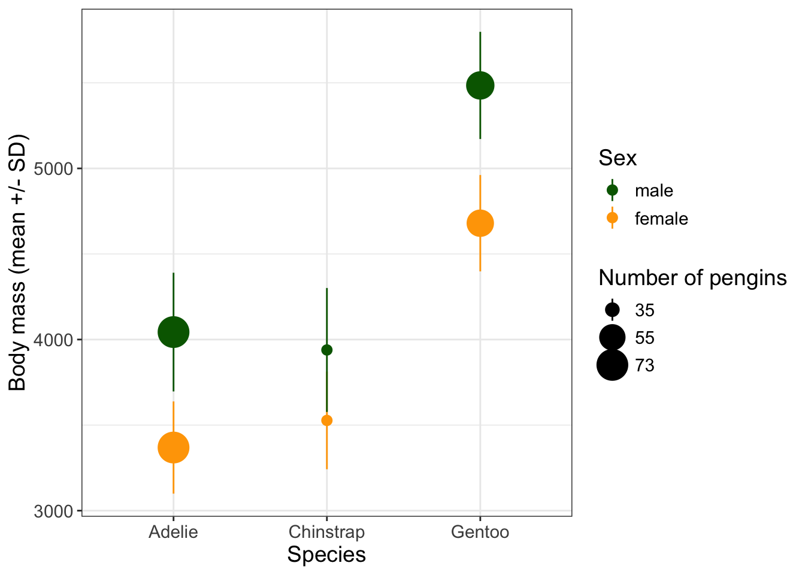
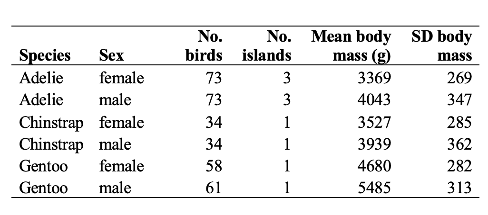
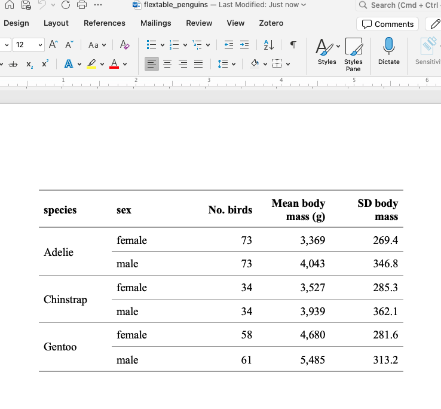
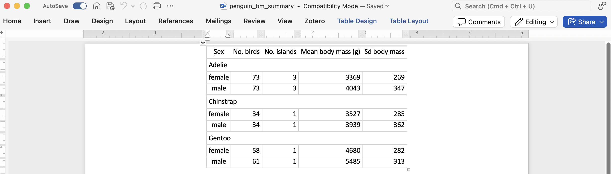

# Creating and Designing Data Tables {#tables}

## Objectives

* Summarize and output data in tabular format
* Format tables to include necessary information for interpretation
* Output data from R in tabular form that can be used in reports and other documents

## Additional reading

Remshard, M., & Queenborough, S. A. (2023). Design of tables for the presentation and communication of data in ecological and evolutionary biology. *Ecology and Evolution, 13*(7), e10062. https://doi.org/10.1002/ece3.10062

## Tables as outputs

Data visualization in figures and other graphics is usually the most effective way of communicating information. Consider, for example, the same data displayed in a figure and in a table:


``` r
library(tidyverse)
```

```
## ── Attaching core tidyverse packages ──────────────────────── tidyverse 2.0.0 ──
## ✔ dplyr     1.2.1     ✔ readr     2.2.0
## ✔ forcats   1.0.1     ✔ stringr   1.6.0
## ✔ ggplot2   4.0.3     ✔ tibble    3.3.1
## ✔ lubridate 1.9.5     ✔ tidyr     1.3.2
## ✔ purrr     1.2.2     
## ── Conflicts ────────────────────────────────────────── tidyverse_conflicts() ──
## ✖ dplyr::filter() masks stats::filter()
## ✖ dplyr::lag()    masks stats::lag()
## ℹ Use the conflicted package (<http://conflicted.r-lib.org/>) to force all conflicts to become errors
```

``` r
library(palmerpenguins)
```

```
## 
## Attaching package: 'palmerpenguins'
## 
## The following objects are masked from 'package:datasets':
## 
##     penguins, penguins_raw
```

``` r
dat_summ <- penguins %>%
  filter(!is.na(sex)) %>%
  group_by(species, sex) %>%
  summarize(n = n(),
            body_mass_mean = mean(body_mass_g, na.rm = T),
            body_mass_sd = sd(body_mass_g, na.rm = T))
```

```
## `summarise()` has regrouped the output.
## ℹ Summaries were computed grouped by species and sex.
## ℹ Output is grouped by species.
## ℹ Use `summarise(.groups = "drop_last")` to silence this message.
## ℹ Use `summarise(.by = c(species, sex))` for per-operation grouping
##   (`?dplyr::dplyr_by`) instead.
```

``` r
dat_summ %>%
  ggplot(aes(x = species, y = body_mass_mean, 
             ymin = body_mass_mean - body_mass_sd, 
             ymax = body_mass_mean + body_mass_sd,
             color = sex, size = n)) +
  geom_pointrange() +
  theme_bw() + theme(text = element_text(size = 14)) +
  scale_size("Number of pengins", range = c(0.5,2),
             breaks = c(35,55,73)) +
  scale_color_manual("Sex", breaks = c("male","female"), 
                     values = c("darkgreen", "orange")) +
  labs(x = "Species", y = "Body mass (mean +/- SD)")
```



``` r
dat_summ
```

```
## # A tibble: 6 × 5
## # Groups:   species [3]
##   species   sex        n body_mass_mean body_mass_sd
##   <fct>     <fct>  <int>          <dbl>        <dbl>
## 1 Adelie    female    73          3369.         269.
## 2 Adelie    male      73          4043.         347.
## 3 Chinstrap female    34          3527.         285.
## 4 Chinstrap male      34          3939.         362.
## 5 Gentoo    female    58          4680.         282.
## 6 Gentoo    male      61          5485.         313.
```

From the figure, I clearly see that Gentoo penguins are heavier than the other two species, that males are heavier than females in all species, and that fewer chinstrap penguins were sampled than the other two species. It would take me a minute to get all this information from the table. However, tables are better than figures when exact values are important, or when you have a lot of information to convey. For example, I can't quite tell from the figure whether the exact same number of males and females were sampled in each species. Overall, some key applications for tables are:

* Providing exact values
* Reporting statistical outputs
* Reporting large data sets (often in an appendix)

In scientific publications, tables are often formatted in a specific way - for example, with borders and margins in a particular format. In the publishing world, most of this formatting is usually completed by the journal editorial team at the time of publication. However, if you are creating reports or other documents that will be shared without professional editing, you will need to know how to format tables in and out of R. The most typical scientific format of a table looks like this:

<div class="figure" style="text-align: center">

<p class="caption">(\#fig:unnamed-chunk-2)A common data table format</p>
</div>

Notice that the table includes border lines above and below the header row and a border line below the table, but no vertical borders or horizontal borders within the data area. The header row is in **bold** but nothing else is. This formatting is relatively straightforward to achieve in word processing programs but can also be achieved (with a little more of a learning curve) directly in R.

## Writing tables to files

Although the final formatting of a table might be done in a word processor, we first need to get the data out of R. We covered some of this in our lesson on [reading and writing data](#importexport). Since a CSV file will open easily in a spreadsheet program like Excel, you can simply:

1. save your table as a CSV, 
2. open it in Excel,
3. copy that table to Word, and 
4. add borders and alignment. 

However, since one benefit of using a scripting language like R is that you can easily update your analyses, it is helpful to pre-format the table as much as possible before outputting. If we outputted `data_summ` as it is now, our fourth step would also require rounding or truncating numbers and renaming columns. Every time we updated the analysis we would need to update these as well, making this process more time-consuming and, to some degree, less reproducible; for example, there would be no record of the translation between column names in our data.frame and column names in the data presented. Ideally, you would do all of this rounding and renaming before writing your data to a CSV:


``` r
dat_summ_out <- dat_summ %>%
  rename(`No. birds` = n, 
         `Mean body mass (g)` = body_mass_mean,
         `SD body mass` = body_mass_sd) %>%
  mutate(across(where(is.numeric), round))
dat_summ_out
```

```
## # A tibble: 6 × 5
## # Groups:   species [3]
##   species   sex    `No. birds` `Mean body mass (g)` `SD body mass`
##   <fct>     <fct>        <dbl>                <dbl>          <dbl>
## 1 Adelie    female          73                 3369            269
## 2 Adelie    male            73                 4043            347
## 3 Chinstrap female          34                 3527            285
## 4 Chinstrap male            34                 3939            362
## 5 Gentoo    female          58                 4680            282
## 6 Gentoo    male            61                 5485            313
```

``` r
write_csv(dat_summ_out, "outputs/penguin_summary.csv")
```

You may have noticed in other exercises that column names with spaces can be specified inside tick marks (```). 

*What other formatting details might you want to consider before writing data to a file?*

## An R package for exporting to Word: `flextable`

The method above is useful if you have a table or two to place in a report. What if you have a lot? The amount of extra time it takes to reformat each (and update every time something changes) might make it worth investing in a more automated solution. The [`flextable`](https://ardata-fr.github.io/flextable-book/) package provides just that. Although there is a bit of a learning curve to using the package, the time investment pays off if you produce a lot of tables and want to be able to export them pre-formatted to Word (or HTML, or PowerPoint, or PDF). 

To export to Word or PowerPoint, you will also need the [`officer`](https://davidgohel.github.io/officer/) package, which provides functions to interface R with Microsoft Office.

There are plenty of other packages to help you with formatting tables; for example, the [`gt`](https://gt.rstudio.com/articles/gt.html) package supports creating beautiful, flexible, and complex tables (like those with nesting structures) and interfaces nicely with the tidyverse. It can't yet export all your formatting to Word though, which is likely something you will need to do, so for now we will focus on `flextable`. Also note that `flextable` is a really flexible package with a lot of options, and this reading covers only what are likely to be your most-used options. Check out the [excellent documentation](https://ardata-fr.github.io/flextable-book/) for more details.


``` r
install.packages("flextable")
install.packages("officer")
```


``` r
library(flextable)
```

```
## 
## Attaching package: 'flextable'
```

```
## The following object is masked from 'package:purrr':
## 
##     compose
```

``` r
library(officer)
```

### The structure of a flextable

A flextable has three parts: a *header*, *body*, and a *footer*. It's unusual to use a footer, but this is where you might put footnotes. The *header* is, by default, the column names, but could include multiple levels (for example, if column types are grouped and labeled - see below). 

### Formatting a flextable

Most of the functions in `flextable` are used for formatting your table; saving it to Office is just the last step. Formatting functions can change:

* text (font, face, justification, etc.)
* cells (colors, borders)
* table organization (shared headers)
* size and layout (column widths, row heights, etc.)

First, we have to convert our table into a `flextable` object:


``` r
ft <- flextable(dat_summ_out)
print(ft)
```

```
## a flextable object.
## col_keys: `species`, `sex`, `No. birds`, `Mean body mass (g)`, `SD body mass` 
## header has 1 row(s) 
## body has 6 row(s) 
## original dataset sample: 
## 'data.frame':	6 obs. of  5 variables:
##  $ species           : Factor w/ 3 levels "Adelie","Chinstrap",..: 1 1 2 2 3 3
##  $ sex               : Factor w/ 2 levels "female","male": 1 2 1 2 1 2
##  $ No. birds         : num  73 73 34 34 58 61
##  $ Mean body mass (g): num  3369 4043 3527 3939 4680 ...
##  $ SD body mass      : num  269 347 285 362 282 313
```

The table above shows you the default design of a flextable. Luckily, this pretty close to the format we want! It includes horizontal borders, left-aligns text columns, and right-aligns non-text columns. However, you can customize most of this. Like `ggplot2`, `flextable` comes with some built-in themes. For example `theme_zebra()` removes cell borders and adds alternating shading:


``` r
theme_zebra(ft)
```

```{=html}
<div class="tabwid"><style>.cl-63eb59ea{}.cl-63e74332{font-family:'Helvetica';font-size:11pt;font-weight:bold;font-style:normal;text-decoration:none;color:rgba(0, 0, 0, 1.00);background-color:transparent;}.cl-63e7433c{font-family:'Helvetica';font-size:11pt;font-weight:normal;font-style:normal;text-decoration:none;color:rgba(0, 0, 0, 1.00);background-color:transparent;}.cl-63e95b40{margin:0;text-align:left;border-bottom: 0 solid rgba(0, 0, 0, 1.00);border-top: 0 solid rgba(0, 0, 0, 1.00);border-left: 0 solid rgba(0, 0, 0, 1.00);border-right: 0 solid rgba(0, 0, 0, 1.00);padding-bottom:5pt;padding-top:5pt;padding-left:5pt;padding-right:5pt;line-height: 1;background-color:transparent;}.cl-63e95b4a{margin:0;text-align:right;border-bottom: 0 solid rgba(0, 0, 0, 1.00);border-top: 0 solid rgba(0, 0, 0, 1.00);border-left: 0 solid rgba(0, 0, 0, 1.00);border-right: 0 solid rgba(0, 0, 0, 1.00);padding-bottom:5pt;padding-top:5pt;padding-left:5pt;padding-right:5pt;line-height: 1;background-color:transparent;}.cl-63e96d38{width:0.75in;background-color:rgba(207, 207, 207, 1.00);vertical-align: middle;border-bottom: 0 solid rgba(0, 0, 0, 1.00);border-top: 0 solid rgba(0, 0, 0, 1.00);border-left: 0 solid rgba(0, 0, 0, 1.00);border-right: 0 solid rgba(0, 0, 0, 1.00);margin-bottom:0;margin-top:0;margin-left:0;margin-right:0;}.cl-63e96d39{width:0.75in;background-color:rgba(207, 207, 207, 1.00);vertical-align: middle;border-bottom: 0 solid rgba(0, 0, 0, 1.00);border-top: 0 solid rgba(0, 0, 0, 1.00);border-left: 0 solid rgba(0, 0, 0, 1.00);border-right: 0 solid rgba(0, 0, 0, 1.00);margin-bottom:0;margin-top:0;margin-left:0;margin-right:0;}.cl-63e96d3a{width:0.75in;background-color:rgba(239, 239, 239, 1.00);vertical-align: middle;border-bottom: 0 solid rgba(0, 0, 0, 1.00);border-top: 0 solid rgba(0, 0, 0, 1.00);border-left: 0 solid rgba(0, 0, 0, 1.00);border-right: 0 solid rgba(0, 0, 0, 1.00);margin-bottom:0;margin-top:0;margin-left:0;margin-right:0;}.cl-63e96d42{width:0.75in;background-color:rgba(239, 239, 239, 1.00);vertical-align: middle;border-bottom: 0 solid rgba(0, 0, 0, 1.00);border-top: 0 solid rgba(0, 0, 0, 1.00);border-left: 0 solid rgba(0, 0, 0, 1.00);border-right: 0 solid rgba(0, 0, 0, 1.00);margin-bottom:0;margin-top:0;margin-left:0;margin-right:0;}.cl-63e96d43{width:0.75in;background-color:transparent;vertical-align: middle;border-bottom: 0 solid rgba(0, 0, 0, 1.00);border-top: 0 solid rgba(0, 0, 0, 1.00);border-left: 0 solid rgba(0, 0, 0, 1.00);border-right: 0 solid rgba(0, 0, 0, 1.00);margin-bottom:0;margin-top:0;margin-left:0;margin-right:0;}.cl-63e96d4c{width:0.75in;background-color:transparent;vertical-align: middle;border-bottom: 0 solid rgba(0, 0, 0, 1.00);border-top: 0 solid rgba(0, 0, 0, 1.00);border-left: 0 solid rgba(0, 0, 0, 1.00);border-right: 0 solid rgba(0, 0, 0, 1.00);margin-bottom:0;margin-top:0;margin-left:0;margin-right:0;}</style><table data-quarto-disable-processing='true' class='cl-63eb59ea'><thead><tr style="overflow-wrap:break-word;"><th class="cl-63e96d38"><p class="cl-63e95b40"><span class="cl-63e74332">species</span></p></th><th class="cl-63e96d38"><p class="cl-63e95b40"><span class="cl-63e74332">sex</span></p></th><th class="cl-63e96d39"><p class="cl-63e95b4a"><span class="cl-63e74332">No. birds</span></p></th><th class="cl-63e96d39"><p class="cl-63e95b4a"><span class="cl-63e74332">Mean body mass (g)</span></p></th><th class="cl-63e96d39"><p class="cl-63e95b4a"><span class="cl-63e74332">SD body mass</span></p></th></tr></thead><tbody><tr style="overflow-wrap:break-word;"><td class="cl-63e96d3a"><p class="cl-63e95b40"><span class="cl-63e7433c">Adelie</span></p></td><td class="cl-63e96d3a"><p class="cl-63e95b40"><span class="cl-63e7433c">female</span></p></td><td class="cl-63e96d42"><p class="cl-63e95b4a"><span class="cl-63e7433c">73</span></p></td><td class="cl-63e96d42"><p class="cl-63e95b4a"><span class="cl-63e7433c">3,369</span></p></td><td class="cl-63e96d42"><p class="cl-63e95b4a"><span class="cl-63e7433c">269</span></p></td></tr><tr style="overflow-wrap:break-word;"><td class="cl-63e96d43"><p class="cl-63e95b40"><span class="cl-63e7433c">Adelie</span></p></td><td class="cl-63e96d43"><p class="cl-63e95b40"><span class="cl-63e7433c">male</span></p></td><td class="cl-63e96d4c"><p class="cl-63e95b4a"><span class="cl-63e7433c">73</span></p></td><td class="cl-63e96d4c"><p class="cl-63e95b4a"><span class="cl-63e7433c">4,043</span></p></td><td class="cl-63e96d4c"><p class="cl-63e95b4a"><span class="cl-63e7433c">347</span></p></td></tr><tr style="overflow-wrap:break-word;"><td class="cl-63e96d3a"><p class="cl-63e95b40"><span class="cl-63e7433c">Chinstrap</span></p></td><td class="cl-63e96d3a"><p class="cl-63e95b40"><span class="cl-63e7433c">female</span></p></td><td class="cl-63e96d42"><p class="cl-63e95b4a"><span class="cl-63e7433c">34</span></p></td><td class="cl-63e96d42"><p class="cl-63e95b4a"><span class="cl-63e7433c">3,527</span></p></td><td class="cl-63e96d42"><p class="cl-63e95b4a"><span class="cl-63e7433c">285</span></p></td></tr><tr style="overflow-wrap:break-word;"><td class="cl-63e96d43"><p class="cl-63e95b40"><span class="cl-63e7433c">Chinstrap</span></p></td><td class="cl-63e96d43"><p class="cl-63e95b40"><span class="cl-63e7433c">male</span></p></td><td class="cl-63e96d4c"><p class="cl-63e95b4a"><span class="cl-63e7433c">34</span></p></td><td class="cl-63e96d4c"><p class="cl-63e95b4a"><span class="cl-63e7433c">3,939</span></p></td><td class="cl-63e96d4c"><p class="cl-63e95b4a"><span class="cl-63e7433c">362</span></p></td></tr><tr style="overflow-wrap:break-word;"><td class="cl-63e96d3a"><p class="cl-63e95b40"><span class="cl-63e7433c">Gentoo</span></p></td><td class="cl-63e96d3a"><p class="cl-63e95b40"><span class="cl-63e7433c">female</span></p></td><td class="cl-63e96d42"><p class="cl-63e95b4a"><span class="cl-63e7433c">58</span></p></td><td class="cl-63e96d42"><p class="cl-63e95b4a"><span class="cl-63e7433c">4,680</span></p></td><td class="cl-63e96d42"><p class="cl-63e95b4a"><span class="cl-63e7433c">282</span></p></td></tr><tr style="overflow-wrap:break-word;"><td class="cl-63e96d43"><p class="cl-63e95b40"><span class="cl-63e7433c">Gentoo</span></p></td><td class="cl-63e96d43"><p class="cl-63e95b40"><span class="cl-63e7433c">male</span></p></td><td class="cl-63e96d4c"><p class="cl-63e95b4a"><span class="cl-63e7433c">61</span></p></td><td class="cl-63e96d4c"><p class="cl-63e95b4a"><span class="cl-63e7433c">5,485</span></p></td><td class="cl-63e96d4c"><p class="cl-63e95b4a"><span class="cl-63e7433c">313</span></p></td></tr></tbody></table></div>
```

You can see examples of available themes [on the `flextable` webpage](https://ardata-fr.github.io/flextable-book/define-visual-properties.html#available-themes).

To format tables beyond these default themes, you will need to use the `style()` function. Within `style()`, you specify:

* the rows (argument `i`) and columns (argument `j`) you want to format
* the part of the table you want to format (argument `part`): "header", "body", "footer", or "all"
* information about what formatting to apply (argument `pr_t` for text, `pr_p` for paragraph formatting, and `pr_c` for cells). 

Since `style()` is mainly used to specify the selection (where, what, and how do you want to modify your table?), it also needs the actual formatting to be enclosed in a function. This can feel unwieldy, but just takes a little practice. 

These are easier to understand in an example:


``` r
ft <- flextable(dat_summ_out)
print(ft)
```

```
## a flextable object.
## col_keys: `species`, `sex`, `No. birds`, `Mean body mass (g)`, `SD body mass` 
## header has 1 row(s) 
## body has 6 row(s) 
## original dataset sample: 
## 'data.frame':	6 obs. of  5 variables:
##  $ species           : Factor w/ 3 levels "Adelie","Chinstrap",..: 1 1 2 2 3 3
##  $ sex               : Factor w/ 2 levels "female","male": 1 2 1 2 1 2
##  $ No. birds         : num  73 73 34 34 58 61
##  $ Mean body mass (g): num  3369 4043 3527 3939 4680 ...
##  $ SD body mass      : num  269 347 285 362 282 313
```

``` r
# Change header text to bold
ft %>%
  style(part = "header", pr_t = fp_text(bold = TRUE))
```

```{=html}
<div class="tabwid"><style>.cl-64078ac0{}.cl-64047c2c{font-family:'Arial';font-size:10pt;font-weight:bold;font-style:normal;text-decoration:none;color:rgba(0, 0, 0, 1.00);background-color:transparent;}.cl-64047c36{font-family:'Helvetica';font-size:11pt;font-weight:normal;font-style:normal;text-decoration:none;color:rgba(0, 0, 0, 1.00);background-color:transparent;}.cl-6405b7ae{margin:0;text-align:left;border-bottom: 0 solid rgba(0, 0, 0, 1.00);border-top: 0 solid rgba(0, 0, 0, 1.00);border-left: 0 solid rgba(0, 0, 0, 1.00);border-right: 0 solid rgba(0, 0, 0, 1.00);padding-bottom:5pt;padding-top:5pt;padding-left:5pt;padding-right:5pt;line-height: 1;background-color:transparent;}.cl-6405b7b8{margin:0;text-align:right;border-bottom: 0 solid rgba(0, 0, 0, 1.00);border-top: 0 solid rgba(0, 0, 0, 1.00);border-left: 0 solid rgba(0, 0, 0, 1.00);border-right: 0 solid rgba(0, 0, 0, 1.00);padding-bottom:5pt;padding-top:5pt;padding-left:5pt;padding-right:5pt;line-height: 1;background-color:transparent;}.cl-6405c8ca{width:0.75in;background-color:transparent;vertical-align: middle;border-bottom: 1.5pt solid rgba(102, 102, 102, 1.00);border-top: 1.5pt solid rgba(102, 102, 102, 1.00);border-left: 0 solid rgba(0, 0, 0, 1.00);border-right: 0 solid rgba(0, 0, 0, 1.00);margin-bottom:0;margin-top:0;margin-left:0;margin-right:0;}.cl-6405c8cb{width:0.75in;background-color:transparent;vertical-align: middle;border-bottom: 1.5pt solid rgba(102, 102, 102, 1.00);border-top: 1.5pt solid rgba(102, 102, 102, 1.00);border-left: 0 solid rgba(0, 0, 0, 1.00);border-right: 0 solid rgba(0, 0, 0, 1.00);margin-bottom:0;margin-top:0;margin-left:0;margin-right:0;}.cl-6405c8cc{width:0.75in;background-color:transparent;vertical-align: middle;border-bottom: 0 solid rgba(0, 0, 0, 1.00);border-top: 0 solid rgba(0, 0, 0, 1.00);border-left: 0 solid rgba(0, 0, 0, 1.00);border-right: 0 solid rgba(0, 0, 0, 1.00);margin-bottom:0;margin-top:0;margin-left:0;margin-right:0;}.cl-6405c8d4{width:0.75in;background-color:transparent;vertical-align: middle;border-bottom: 0 solid rgba(0, 0, 0, 1.00);border-top: 0 solid rgba(0, 0, 0, 1.00);border-left: 0 solid rgba(0, 0, 0, 1.00);border-right: 0 solid rgba(0, 0, 0, 1.00);margin-bottom:0;margin-top:0;margin-left:0;margin-right:0;}.cl-6405c8d5{width:0.75in;background-color:transparent;vertical-align: middle;border-bottom: 1.5pt solid rgba(102, 102, 102, 1.00);border-top: 0 solid rgba(0, 0, 0, 1.00);border-left: 0 solid rgba(0, 0, 0, 1.00);border-right: 0 solid rgba(0, 0, 0, 1.00);margin-bottom:0;margin-top:0;margin-left:0;margin-right:0;}.cl-6405c8de{width:0.75in;background-color:transparent;vertical-align: middle;border-bottom: 1.5pt solid rgba(102, 102, 102, 1.00);border-top: 0 solid rgba(0, 0, 0, 1.00);border-left: 0 solid rgba(0, 0, 0, 1.00);border-right: 0 solid rgba(0, 0, 0, 1.00);margin-bottom:0;margin-top:0;margin-left:0;margin-right:0;}</style><table data-quarto-disable-processing='true' class='cl-64078ac0'><thead><tr style="overflow-wrap:break-word;"><th class="cl-6405c8ca"><p class="cl-6405b7ae"><span class="cl-64047c2c">species</span></p></th><th class="cl-6405c8ca"><p class="cl-6405b7ae"><span class="cl-64047c2c">sex</span></p></th><th class="cl-6405c8cb"><p class="cl-6405b7b8"><span class="cl-64047c2c">No. birds</span></p></th><th class="cl-6405c8cb"><p class="cl-6405b7b8"><span class="cl-64047c2c">Mean body mass (g)</span></p></th><th class="cl-6405c8cb"><p class="cl-6405b7b8"><span class="cl-64047c2c">SD body mass</span></p></th></tr></thead><tbody><tr style="overflow-wrap:break-word;"><td class="cl-6405c8cc"><p class="cl-6405b7ae"><span class="cl-64047c36">Adelie</span></p></td><td class="cl-6405c8cc"><p class="cl-6405b7ae"><span class="cl-64047c36">female</span></p></td><td class="cl-6405c8d4"><p class="cl-6405b7b8"><span class="cl-64047c36">73</span></p></td><td class="cl-6405c8d4"><p class="cl-6405b7b8"><span class="cl-64047c36">3,369</span></p></td><td class="cl-6405c8d4"><p class="cl-6405b7b8"><span class="cl-64047c36">269</span></p></td></tr><tr style="overflow-wrap:break-word;"><td class="cl-6405c8cc"><p class="cl-6405b7ae"><span class="cl-64047c36">Adelie</span></p></td><td class="cl-6405c8cc"><p class="cl-6405b7ae"><span class="cl-64047c36">male</span></p></td><td class="cl-6405c8d4"><p class="cl-6405b7b8"><span class="cl-64047c36">73</span></p></td><td class="cl-6405c8d4"><p class="cl-6405b7b8"><span class="cl-64047c36">4,043</span></p></td><td class="cl-6405c8d4"><p class="cl-6405b7b8"><span class="cl-64047c36">347</span></p></td></tr><tr style="overflow-wrap:break-word;"><td class="cl-6405c8cc"><p class="cl-6405b7ae"><span class="cl-64047c36">Chinstrap</span></p></td><td class="cl-6405c8cc"><p class="cl-6405b7ae"><span class="cl-64047c36">female</span></p></td><td class="cl-6405c8d4"><p class="cl-6405b7b8"><span class="cl-64047c36">34</span></p></td><td class="cl-6405c8d4"><p class="cl-6405b7b8"><span class="cl-64047c36">3,527</span></p></td><td class="cl-6405c8d4"><p class="cl-6405b7b8"><span class="cl-64047c36">285</span></p></td></tr><tr style="overflow-wrap:break-word;"><td class="cl-6405c8cc"><p class="cl-6405b7ae"><span class="cl-64047c36">Chinstrap</span></p></td><td class="cl-6405c8cc"><p class="cl-6405b7ae"><span class="cl-64047c36">male</span></p></td><td class="cl-6405c8d4"><p class="cl-6405b7b8"><span class="cl-64047c36">34</span></p></td><td class="cl-6405c8d4"><p class="cl-6405b7b8"><span class="cl-64047c36">3,939</span></p></td><td class="cl-6405c8d4"><p class="cl-6405b7b8"><span class="cl-64047c36">362</span></p></td></tr><tr style="overflow-wrap:break-word;"><td class="cl-6405c8cc"><p class="cl-6405b7ae"><span class="cl-64047c36">Gentoo</span></p></td><td class="cl-6405c8cc"><p class="cl-6405b7ae"><span class="cl-64047c36">female</span></p></td><td class="cl-6405c8d4"><p class="cl-6405b7b8"><span class="cl-64047c36">58</span></p></td><td class="cl-6405c8d4"><p class="cl-6405b7b8"><span class="cl-64047c36">4,680</span></p></td><td class="cl-6405c8d4"><p class="cl-6405b7b8"><span class="cl-64047c36">282</span></p></td></tr><tr style="overflow-wrap:break-word;"><td class="cl-6405c8d5"><p class="cl-6405b7ae"><span class="cl-64047c36">Gentoo</span></p></td><td class="cl-6405c8d5"><p class="cl-6405b7ae"><span class="cl-64047c36">male</span></p></td><td class="cl-6405c8de"><p class="cl-6405b7b8"><span class="cl-64047c36">61</span></p></td><td class="cl-6405c8de"><p class="cl-6405b7b8"><span class="cl-64047c36">5,485</span></p></td><td class="cl-6405c8de"><p class="cl-6405b7b8"><span class="cl-64047c36">313</span></p></td></tr></tbody></table></div>
```

``` r
# Center all text
ft %>%
  style(part = "all", pr_p = fp_par(text.align = "center"))
```

```{=html}
<div class="tabwid"><style>.cl-640c7378{}.cl-64094c70{font-family:'Helvetica';font-size:11pt;font-weight:normal;font-style:normal;text-decoration:none;color:rgba(0, 0, 0, 1.00);background-color:transparent;}.cl-640a9a08{margin:0;text-align:center;border-bottom: 0 solid rgba(0, 0, 0, 1.00);border-top: 0 solid rgba(0, 0, 0, 1.00);border-left: 0 solid rgba(0, 0, 0, 1.00);border-right: 0 solid rgba(0, 0, 0, 1.00);padding-bottom:0;padding-top:0;padding-left:0;padding-right:0;line-height: 1;background-color:transparent;}.cl-640aac82{width:0.75in;background-color:transparent;vertical-align: middle;border-bottom: 1.5pt solid rgba(102, 102, 102, 1.00);border-top: 1.5pt solid rgba(102, 102, 102, 1.00);border-left: 0 solid rgba(0, 0, 0, 1.00);border-right: 0 solid rgba(0, 0, 0, 1.00);margin-bottom:0;margin-top:0;margin-left:0;margin-right:0;}.cl-640aac8c{width:0.75in;background-color:transparent;vertical-align: middle;border-bottom: 0 solid rgba(0, 0, 0, 1.00);border-top: 0 solid rgba(0, 0, 0, 1.00);border-left: 0 solid rgba(0, 0, 0, 1.00);border-right: 0 solid rgba(0, 0, 0, 1.00);margin-bottom:0;margin-top:0;margin-left:0;margin-right:0;}.cl-640aac8d{width:0.75in;background-color:transparent;vertical-align: middle;border-bottom: 1.5pt solid rgba(102, 102, 102, 1.00);border-top: 0 solid rgba(0, 0, 0, 1.00);border-left: 0 solid rgba(0, 0, 0, 1.00);border-right: 0 solid rgba(0, 0, 0, 1.00);margin-bottom:0;margin-top:0;margin-left:0;margin-right:0;}</style><table data-quarto-disable-processing='true' class='cl-640c7378'><thead><tr style="overflow-wrap:break-word;"><th class="cl-640aac82"><p class="cl-640a9a08"><span class="cl-64094c70">species</span></p></th><th class="cl-640aac82"><p class="cl-640a9a08"><span class="cl-64094c70">sex</span></p></th><th class="cl-640aac82"><p class="cl-640a9a08"><span class="cl-64094c70">No. birds</span></p></th><th class="cl-640aac82"><p class="cl-640a9a08"><span class="cl-64094c70">Mean body mass (g)</span></p></th><th class="cl-640aac82"><p class="cl-640a9a08"><span class="cl-64094c70">SD body mass</span></p></th></tr></thead><tbody><tr style="overflow-wrap:break-word;"><td class="cl-640aac8c"><p class="cl-640a9a08"><span class="cl-64094c70">Adelie</span></p></td><td class="cl-640aac8c"><p class="cl-640a9a08"><span class="cl-64094c70">female</span></p></td><td class="cl-640aac8c"><p class="cl-640a9a08"><span class="cl-64094c70">73</span></p></td><td class="cl-640aac8c"><p class="cl-640a9a08"><span class="cl-64094c70">3,369</span></p></td><td class="cl-640aac8c"><p class="cl-640a9a08"><span class="cl-64094c70">269</span></p></td></tr><tr style="overflow-wrap:break-word;"><td class="cl-640aac8c"><p class="cl-640a9a08"><span class="cl-64094c70">Adelie</span></p></td><td class="cl-640aac8c"><p class="cl-640a9a08"><span class="cl-64094c70">male</span></p></td><td class="cl-640aac8c"><p class="cl-640a9a08"><span class="cl-64094c70">73</span></p></td><td class="cl-640aac8c"><p class="cl-640a9a08"><span class="cl-64094c70">4,043</span></p></td><td class="cl-640aac8c"><p class="cl-640a9a08"><span class="cl-64094c70">347</span></p></td></tr><tr style="overflow-wrap:break-word;"><td class="cl-640aac8c"><p class="cl-640a9a08"><span class="cl-64094c70">Chinstrap</span></p></td><td class="cl-640aac8c"><p class="cl-640a9a08"><span class="cl-64094c70">female</span></p></td><td class="cl-640aac8c"><p class="cl-640a9a08"><span class="cl-64094c70">34</span></p></td><td class="cl-640aac8c"><p class="cl-640a9a08"><span class="cl-64094c70">3,527</span></p></td><td class="cl-640aac8c"><p class="cl-640a9a08"><span class="cl-64094c70">285</span></p></td></tr><tr style="overflow-wrap:break-word;"><td class="cl-640aac8c"><p class="cl-640a9a08"><span class="cl-64094c70">Chinstrap</span></p></td><td class="cl-640aac8c"><p class="cl-640a9a08"><span class="cl-64094c70">male</span></p></td><td class="cl-640aac8c"><p class="cl-640a9a08"><span class="cl-64094c70">34</span></p></td><td class="cl-640aac8c"><p class="cl-640a9a08"><span class="cl-64094c70">3,939</span></p></td><td class="cl-640aac8c"><p class="cl-640a9a08"><span class="cl-64094c70">362</span></p></td></tr><tr style="overflow-wrap:break-word;"><td class="cl-640aac8c"><p class="cl-640a9a08"><span class="cl-64094c70">Gentoo</span></p></td><td class="cl-640aac8c"><p class="cl-640a9a08"><span class="cl-64094c70">female</span></p></td><td class="cl-640aac8c"><p class="cl-640a9a08"><span class="cl-64094c70">58</span></p></td><td class="cl-640aac8c"><p class="cl-640a9a08"><span class="cl-64094c70">4,680</span></p></td><td class="cl-640aac8c"><p class="cl-640a9a08"><span class="cl-64094c70">282</span></p></td></tr><tr style="overflow-wrap:break-word;"><td class="cl-640aac8d"><p class="cl-640a9a08"><span class="cl-64094c70">Gentoo</span></p></td><td class="cl-640aac8d"><p class="cl-640a9a08"><span class="cl-64094c70">male</span></p></td><td class="cl-640aac8d"><p class="cl-640a9a08"><span class="cl-64094c70">61</span></p></td><td class="cl-640aac8d"><p class="cl-640a9a08"><span class="cl-64094c70">5,485</span></p></td><td class="cl-640aac8d"><p class="cl-640a9a08"><span class="cl-64094c70">313</span></p></td></tr></tbody></table></div>
```

``` r
# Shade alternating cells in orange
ft %>%
  style(i = seq(1,6,2), part = "body",
        pr_c = fp_cell(background.color = "orange"))
```

```{=html}
<div class="tabwid"><style>.cl-64112b84{}.cl-640e1cd2{font-family:'Helvetica';font-size:11pt;font-weight:normal;font-style:normal;text-decoration:none;color:rgba(0, 0, 0, 1.00);background-color:transparent;}.cl-640f5a70{margin:0;text-align:left;border-bottom: 0 solid rgba(0, 0, 0, 1.00);border-top: 0 solid rgba(0, 0, 0, 1.00);border-left: 0 solid rgba(0, 0, 0, 1.00);border-right: 0 solid rgba(0, 0, 0, 1.00);padding-bottom:5pt;padding-top:5pt;padding-left:5pt;padding-right:5pt;line-height: 1;background-color:transparent;}.cl-640f5a7a{margin:0;text-align:right;border-bottom: 0 solid rgba(0, 0, 0, 1.00);border-top: 0 solid rgba(0, 0, 0, 1.00);border-left: 0 solid rgba(0, 0, 0, 1.00);border-right: 0 solid rgba(0, 0, 0, 1.00);padding-bottom:5pt;padding-top:5pt;padding-left:5pt;padding-right:5pt;line-height: 1;background-color:transparent;}.cl-640f6ad8{width:0.75in;background-color:transparent;vertical-align: middle;border-bottom: 1.5pt solid rgba(102, 102, 102, 1.00);border-top: 1.5pt solid rgba(102, 102, 102, 1.00);border-left: 0 solid rgba(0, 0, 0, 1.00);border-right: 0 solid rgba(0, 0, 0, 1.00);margin-bottom:0;margin-top:0;margin-left:0;margin-right:0;}.cl-640f6ad9{width:0.75in;background-color:transparent;vertical-align: middle;border-bottom: 1.5pt solid rgba(102, 102, 102, 1.00);border-top: 1.5pt solid rgba(102, 102, 102, 1.00);border-left: 0 solid rgba(0, 0, 0, 1.00);border-right: 0 solid rgba(0, 0, 0, 1.00);margin-bottom:0;margin-top:0;margin-left:0;margin-right:0;}.cl-640f6ae2{width:0.75in;background-color:rgba(255, 165, 0, 1.00);vertical-align: middle;border-bottom: 0 solid rgba(0, 0, 0, 1.00);border-top: 0 solid rgba(0, 0, 0, 1.00);border-left: 0 solid rgba(0, 0, 0, 1.00);border-right: 0 solid rgba(0, 0, 0, 1.00);margin-bottom:0;margin-top:0;margin-left:0;margin-right:0;}.cl-640f6ae3{width:0.75in;background-color:rgba(255, 165, 0, 1.00);vertical-align: middle;border-bottom: 0 solid rgba(0, 0, 0, 1.00);border-top: 0 solid rgba(0, 0, 0, 1.00);border-left: 0 solid rgba(0, 0, 0, 1.00);border-right: 0 solid rgba(0, 0, 0, 1.00);margin-bottom:0;margin-top:0;margin-left:0;margin-right:0;}.cl-640f6ae4{width:0.75in;background-color:transparent;vertical-align: middle;border-bottom: 0 solid rgba(0, 0, 0, 1.00);border-top: 0 solid rgba(0, 0, 0, 1.00);border-left: 0 solid rgba(0, 0, 0, 1.00);border-right: 0 solid rgba(0, 0, 0, 1.00);margin-bottom:0;margin-top:0;margin-left:0;margin-right:0;}.cl-640f6ae5{width:0.75in;background-color:transparent;vertical-align: middle;border-bottom: 0 solid rgba(0, 0, 0, 1.00);border-top: 0 solid rgba(0, 0, 0, 1.00);border-left: 0 solid rgba(0, 0, 0, 1.00);border-right: 0 solid rgba(0, 0, 0, 1.00);margin-bottom:0;margin-top:0;margin-left:0;margin-right:0;}.cl-640f6aec{width:0.75in;background-color:transparent;vertical-align: middle;border-bottom: 1.5pt solid rgba(102, 102, 102, 1.00);border-top: 0 solid rgba(0, 0, 0, 1.00);border-left: 0 solid rgba(0, 0, 0, 1.00);border-right: 0 solid rgba(0, 0, 0, 1.00);margin-bottom:0;margin-top:0;margin-left:0;margin-right:0;}.cl-640f6aed{width:0.75in;background-color:transparent;vertical-align: middle;border-bottom: 1.5pt solid rgba(102, 102, 102, 1.00);border-top: 0 solid rgba(0, 0, 0, 1.00);border-left: 0 solid rgba(0, 0, 0, 1.00);border-right: 0 solid rgba(0, 0, 0, 1.00);margin-bottom:0;margin-top:0;margin-left:0;margin-right:0;}</style><table data-quarto-disable-processing='true' class='cl-64112b84'><thead><tr style="overflow-wrap:break-word;"><th class="cl-640f6ad8"><p class="cl-640f5a70"><span class="cl-640e1cd2">species</span></p></th><th class="cl-640f6ad8"><p class="cl-640f5a70"><span class="cl-640e1cd2">sex</span></p></th><th class="cl-640f6ad9"><p class="cl-640f5a7a"><span class="cl-640e1cd2">No. birds</span></p></th><th class="cl-640f6ad9"><p class="cl-640f5a7a"><span class="cl-640e1cd2">Mean body mass (g)</span></p></th><th class="cl-640f6ad9"><p class="cl-640f5a7a"><span class="cl-640e1cd2">SD body mass</span></p></th></tr></thead><tbody><tr style="overflow-wrap:break-word;"><td class="cl-640f6ae2"><p class="cl-640f5a70"><span class="cl-640e1cd2">Adelie</span></p></td><td class="cl-640f6ae2"><p class="cl-640f5a70"><span class="cl-640e1cd2">female</span></p></td><td class="cl-640f6ae3"><p class="cl-640f5a7a"><span class="cl-640e1cd2">73</span></p></td><td class="cl-640f6ae3"><p class="cl-640f5a7a"><span class="cl-640e1cd2">3,369</span></p></td><td class="cl-640f6ae3"><p class="cl-640f5a7a"><span class="cl-640e1cd2">269</span></p></td></tr><tr style="overflow-wrap:break-word;"><td class="cl-640f6ae4"><p class="cl-640f5a70"><span class="cl-640e1cd2">Adelie</span></p></td><td class="cl-640f6ae4"><p class="cl-640f5a70"><span class="cl-640e1cd2">male</span></p></td><td class="cl-640f6ae5"><p class="cl-640f5a7a"><span class="cl-640e1cd2">73</span></p></td><td class="cl-640f6ae5"><p class="cl-640f5a7a"><span class="cl-640e1cd2">4,043</span></p></td><td class="cl-640f6ae5"><p class="cl-640f5a7a"><span class="cl-640e1cd2">347</span></p></td></tr><tr style="overflow-wrap:break-word;"><td class="cl-640f6ae2"><p class="cl-640f5a70"><span class="cl-640e1cd2">Chinstrap</span></p></td><td class="cl-640f6ae2"><p class="cl-640f5a70"><span class="cl-640e1cd2">female</span></p></td><td class="cl-640f6ae3"><p class="cl-640f5a7a"><span class="cl-640e1cd2">34</span></p></td><td class="cl-640f6ae3"><p class="cl-640f5a7a"><span class="cl-640e1cd2">3,527</span></p></td><td class="cl-640f6ae3"><p class="cl-640f5a7a"><span class="cl-640e1cd2">285</span></p></td></tr><tr style="overflow-wrap:break-word;"><td class="cl-640f6ae4"><p class="cl-640f5a70"><span class="cl-640e1cd2">Chinstrap</span></p></td><td class="cl-640f6ae4"><p class="cl-640f5a70"><span class="cl-640e1cd2">male</span></p></td><td class="cl-640f6ae5"><p class="cl-640f5a7a"><span class="cl-640e1cd2">34</span></p></td><td class="cl-640f6ae5"><p class="cl-640f5a7a"><span class="cl-640e1cd2">3,939</span></p></td><td class="cl-640f6ae5"><p class="cl-640f5a7a"><span class="cl-640e1cd2">362</span></p></td></tr><tr style="overflow-wrap:break-word;"><td class="cl-640f6ae2"><p class="cl-640f5a70"><span class="cl-640e1cd2">Gentoo</span></p></td><td class="cl-640f6ae2"><p class="cl-640f5a70"><span class="cl-640e1cd2">female</span></p></td><td class="cl-640f6ae3"><p class="cl-640f5a7a"><span class="cl-640e1cd2">58</span></p></td><td class="cl-640f6ae3"><p class="cl-640f5a7a"><span class="cl-640e1cd2">4,680</span></p></td><td class="cl-640f6ae3"><p class="cl-640f5a7a"><span class="cl-640e1cd2">282</span></p></td></tr><tr style="overflow-wrap:break-word;"><td class="cl-640f6aec"><p class="cl-640f5a70"><span class="cl-640e1cd2">Gentoo</span></p></td><td class="cl-640f6aec"><p class="cl-640f5a70"><span class="cl-640e1cd2">male</span></p></td><td class="cl-640f6aed"><p class="cl-640f5a7a"><span class="cl-640e1cd2">61</span></p></td><td class="cl-640f6aed"><p class="cl-640f5a7a"><span class="cl-640e1cd2">5,485</span></p></td><td class="cl-640f6aed"><p class="cl-640f5a7a"><span class="cl-640e1cd2">313</span></p></td></tr></tbody></table></div>
```

The help pages for `fp_text`, `fp_par`, and `fp_cell` will show you all the various options and what they are called.

It is also possible to specify rows with selection functions:


``` r
# Shade cells for Adelie penguins
ft %>%
  style(i = ~species == "Adelie" , part = "body",
        pr_c = fp_cell(background.color = "orange"))
```

```{=html}
<div class="tabwid"><style>.cl-64171756{}.cl-64143cf2{font-family:'Helvetica';font-size:11pt;font-weight:normal;font-style:normal;text-decoration:none;color:rgba(0, 0, 0, 1.00);background-color:transparent;}.cl-6415665e{margin:0;text-align:left;border-bottom: 0 solid rgba(0, 0, 0, 1.00);border-top: 0 solid rgba(0, 0, 0, 1.00);border-left: 0 solid rgba(0, 0, 0, 1.00);border-right: 0 solid rgba(0, 0, 0, 1.00);padding-bottom:5pt;padding-top:5pt;padding-left:5pt;padding-right:5pt;line-height: 1;background-color:transparent;}.cl-6415665f{margin:0;text-align:right;border-bottom: 0 solid rgba(0, 0, 0, 1.00);border-top: 0 solid rgba(0, 0, 0, 1.00);border-left: 0 solid rgba(0, 0, 0, 1.00);border-right: 0 solid rgba(0, 0, 0, 1.00);padding-bottom:5pt;padding-top:5pt;padding-left:5pt;padding-right:5pt;line-height: 1;background-color:transparent;}.cl-641574be{width:0.75in;background-color:transparent;vertical-align: middle;border-bottom: 1.5pt solid rgba(102, 102, 102, 1.00);border-top: 1.5pt solid rgba(102, 102, 102, 1.00);border-left: 0 solid rgba(0, 0, 0, 1.00);border-right: 0 solid rgba(0, 0, 0, 1.00);margin-bottom:0;margin-top:0;margin-left:0;margin-right:0;}.cl-641574bf{width:0.75in;background-color:transparent;vertical-align: middle;border-bottom: 1.5pt solid rgba(102, 102, 102, 1.00);border-top: 1.5pt solid rgba(102, 102, 102, 1.00);border-left: 0 solid rgba(0, 0, 0, 1.00);border-right: 0 solid rgba(0, 0, 0, 1.00);margin-bottom:0;margin-top:0;margin-left:0;margin-right:0;}.cl-641574c8{width:0.75in;background-color:rgba(255, 165, 0, 1.00);vertical-align: middle;border-bottom: 0 solid rgba(0, 0, 0, 1.00);border-top: 0 solid rgba(0, 0, 0, 1.00);border-left: 0 solid rgba(0, 0, 0, 1.00);border-right: 0 solid rgba(0, 0, 0, 1.00);margin-bottom:0;margin-top:0;margin-left:0;margin-right:0;}.cl-641574c9{width:0.75in;background-color:rgba(255, 165, 0, 1.00);vertical-align: middle;border-bottom: 0 solid rgba(0, 0, 0, 1.00);border-top: 0 solid rgba(0, 0, 0, 1.00);border-left: 0 solid rgba(0, 0, 0, 1.00);border-right: 0 solid rgba(0, 0, 0, 1.00);margin-bottom:0;margin-top:0;margin-left:0;margin-right:0;}.cl-641574ca{width:0.75in;background-color:transparent;vertical-align: middle;border-bottom: 0 solid rgba(0, 0, 0, 1.00);border-top: 0 solid rgba(0, 0, 0, 1.00);border-left: 0 solid rgba(0, 0, 0, 1.00);border-right: 0 solid rgba(0, 0, 0, 1.00);margin-bottom:0;margin-top:0;margin-left:0;margin-right:0;}.cl-641574cb{width:0.75in;background-color:transparent;vertical-align: middle;border-bottom: 0 solid rgba(0, 0, 0, 1.00);border-top: 0 solid rgba(0, 0, 0, 1.00);border-left: 0 solid rgba(0, 0, 0, 1.00);border-right: 0 solid rgba(0, 0, 0, 1.00);margin-bottom:0;margin-top:0;margin-left:0;margin-right:0;}.cl-641574d2{width:0.75in;background-color:transparent;vertical-align: middle;border-bottom: 1.5pt solid rgba(102, 102, 102, 1.00);border-top: 0 solid rgba(0, 0, 0, 1.00);border-left: 0 solid rgba(0, 0, 0, 1.00);border-right: 0 solid rgba(0, 0, 0, 1.00);margin-bottom:0;margin-top:0;margin-left:0;margin-right:0;}.cl-641574d3{width:0.75in;background-color:transparent;vertical-align: middle;border-bottom: 1.5pt solid rgba(102, 102, 102, 1.00);border-top: 0 solid rgba(0, 0, 0, 1.00);border-left: 0 solid rgba(0, 0, 0, 1.00);border-right: 0 solid rgba(0, 0, 0, 1.00);margin-bottom:0;margin-top:0;margin-left:0;margin-right:0;}</style><table data-quarto-disable-processing='true' class='cl-64171756'><thead><tr style="overflow-wrap:break-word;"><th class="cl-641574be"><p class="cl-6415665e"><span class="cl-64143cf2">species</span></p></th><th class="cl-641574be"><p class="cl-6415665e"><span class="cl-64143cf2">sex</span></p></th><th class="cl-641574bf"><p class="cl-6415665f"><span class="cl-64143cf2">No. birds</span></p></th><th class="cl-641574bf"><p class="cl-6415665f"><span class="cl-64143cf2">Mean body mass (g)</span></p></th><th class="cl-641574bf"><p class="cl-6415665f"><span class="cl-64143cf2">SD body mass</span></p></th></tr></thead><tbody><tr style="overflow-wrap:break-word;"><td class="cl-641574c8"><p class="cl-6415665e"><span class="cl-64143cf2">Adelie</span></p></td><td class="cl-641574c8"><p class="cl-6415665e"><span class="cl-64143cf2">female</span></p></td><td class="cl-641574c9"><p class="cl-6415665f"><span class="cl-64143cf2">73</span></p></td><td class="cl-641574c9"><p class="cl-6415665f"><span class="cl-64143cf2">3,369</span></p></td><td class="cl-641574c9"><p class="cl-6415665f"><span class="cl-64143cf2">269</span></p></td></tr><tr style="overflow-wrap:break-word;"><td class="cl-641574c8"><p class="cl-6415665e"><span class="cl-64143cf2">Adelie</span></p></td><td class="cl-641574c8"><p class="cl-6415665e"><span class="cl-64143cf2">male</span></p></td><td class="cl-641574c9"><p class="cl-6415665f"><span class="cl-64143cf2">73</span></p></td><td class="cl-641574c9"><p class="cl-6415665f"><span class="cl-64143cf2">4,043</span></p></td><td class="cl-641574c9"><p class="cl-6415665f"><span class="cl-64143cf2">347</span></p></td></tr><tr style="overflow-wrap:break-word;"><td class="cl-641574ca"><p class="cl-6415665e"><span class="cl-64143cf2">Chinstrap</span></p></td><td class="cl-641574ca"><p class="cl-6415665e"><span class="cl-64143cf2">female</span></p></td><td class="cl-641574cb"><p class="cl-6415665f"><span class="cl-64143cf2">34</span></p></td><td class="cl-641574cb"><p class="cl-6415665f"><span class="cl-64143cf2">3,527</span></p></td><td class="cl-641574cb"><p class="cl-6415665f"><span class="cl-64143cf2">285</span></p></td></tr><tr style="overflow-wrap:break-word;"><td class="cl-641574ca"><p class="cl-6415665e"><span class="cl-64143cf2">Chinstrap</span></p></td><td class="cl-641574ca"><p class="cl-6415665e"><span class="cl-64143cf2">male</span></p></td><td class="cl-641574cb"><p class="cl-6415665f"><span class="cl-64143cf2">34</span></p></td><td class="cl-641574cb"><p class="cl-6415665f"><span class="cl-64143cf2">3,939</span></p></td><td class="cl-641574cb"><p class="cl-6415665f"><span class="cl-64143cf2">362</span></p></td></tr><tr style="overflow-wrap:break-word;"><td class="cl-641574ca"><p class="cl-6415665e"><span class="cl-64143cf2">Gentoo</span></p></td><td class="cl-641574ca"><p class="cl-6415665e"><span class="cl-64143cf2">female</span></p></td><td class="cl-641574cb"><p class="cl-6415665f"><span class="cl-64143cf2">58</span></p></td><td class="cl-641574cb"><p class="cl-6415665f"><span class="cl-64143cf2">4,680</span></p></td><td class="cl-641574cb"><p class="cl-6415665f"><span class="cl-64143cf2">282</span></p></td></tr><tr style="overflow-wrap:break-word;"><td class="cl-641574d2"><p class="cl-6415665e"><span class="cl-64143cf2">Gentoo</span></p></td><td class="cl-641574d2"><p class="cl-6415665e"><span class="cl-64143cf2">male</span></p></td><td class="cl-641574d3"><p class="cl-6415665f"><span class="cl-64143cf2">61</span></p></td><td class="cl-641574d3"><p class="cl-6415665f"><span class="cl-64143cf2">5,485</span></p></td><td class="cl-641574d3"><p class="cl-6415665f"><span class="cl-64143cf2">313</span></p></td></tr></tbody></table></div>
```

There are also built-in functions that don't require you to use `style()`, including `font()`, `bold()`, `align()`, and so on - but you can always do these within `style()`, too.


``` r
ft %>%
  #make header row bold
  bold(part = "header", bold = T) %>%
  #italicize species names
  italic(part = "body", j = 1, italic = T)
```

```{=html}
<div class="tabwid"><style>.cl-641bf9f6{}.cl-641921a4{font-family:'Helvetica';font-size:11pt;font-weight:bold;font-style:normal;text-decoration:none;color:rgba(0, 0, 0, 1.00);background-color:transparent;}.cl-641921ae{font-family:'Helvetica';font-size:11pt;font-weight:normal;font-style:italic;text-decoration:none;color:rgba(0, 0, 0, 1.00);background-color:transparent;}.cl-641921af{font-family:'Helvetica';font-size:11pt;font-weight:normal;font-style:normal;text-decoration:none;color:rgba(0, 0, 0, 1.00);background-color:transparent;}.cl-641a507e{margin:0;text-align:left;border-bottom: 0 solid rgba(0, 0, 0, 1.00);border-top: 0 solid rgba(0, 0, 0, 1.00);border-left: 0 solid rgba(0, 0, 0, 1.00);border-right: 0 solid rgba(0, 0, 0, 1.00);padding-bottom:5pt;padding-top:5pt;padding-left:5pt;padding-right:5pt;line-height: 1;background-color:transparent;}.cl-641a507f{margin:0;text-align:right;border-bottom: 0 solid rgba(0, 0, 0, 1.00);border-top: 0 solid rgba(0, 0, 0, 1.00);border-left: 0 solid rgba(0, 0, 0, 1.00);border-right: 0 solid rgba(0, 0, 0, 1.00);padding-bottom:5pt;padding-top:5pt;padding-left:5pt;padding-right:5pt;line-height: 1;background-color:transparent;}.cl-641a5f74{width:0.75in;background-color:transparent;vertical-align: middle;border-bottom: 1.5pt solid rgba(102, 102, 102, 1.00);border-top: 1.5pt solid rgba(102, 102, 102, 1.00);border-left: 0 solid rgba(0, 0, 0, 1.00);border-right: 0 solid rgba(0, 0, 0, 1.00);margin-bottom:0;margin-top:0;margin-left:0;margin-right:0;}.cl-641a5f75{width:0.75in;background-color:transparent;vertical-align: middle;border-bottom: 1.5pt solid rgba(102, 102, 102, 1.00);border-top: 1.5pt solid rgba(102, 102, 102, 1.00);border-left: 0 solid rgba(0, 0, 0, 1.00);border-right: 0 solid rgba(0, 0, 0, 1.00);margin-bottom:0;margin-top:0;margin-left:0;margin-right:0;}.cl-641a5f76{width:0.75in;background-color:transparent;vertical-align: middle;border-bottom: 0 solid rgba(0, 0, 0, 1.00);border-top: 0 solid rgba(0, 0, 0, 1.00);border-left: 0 solid rgba(0, 0, 0, 1.00);border-right: 0 solid rgba(0, 0, 0, 1.00);margin-bottom:0;margin-top:0;margin-left:0;margin-right:0;}.cl-641a5f7e{width:0.75in;background-color:transparent;vertical-align: middle;border-bottom: 0 solid rgba(0, 0, 0, 1.00);border-top: 0 solid rgba(0, 0, 0, 1.00);border-left: 0 solid rgba(0, 0, 0, 1.00);border-right: 0 solid rgba(0, 0, 0, 1.00);margin-bottom:0;margin-top:0;margin-left:0;margin-right:0;}.cl-641a5f7f{width:0.75in;background-color:transparent;vertical-align: middle;border-bottom: 1.5pt solid rgba(102, 102, 102, 1.00);border-top: 0 solid rgba(0, 0, 0, 1.00);border-left: 0 solid rgba(0, 0, 0, 1.00);border-right: 0 solid rgba(0, 0, 0, 1.00);margin-bottom:0;margin-top:0;margin-left:0;margin-right:0;}.cl-641a5f80{width:0.75in;background-color:transparent;vertical-align: middle;border-bottom: 1.5pt solid rgba(102, 102, 102, 1.00);border-top: 0 solid rgba(0, 0, 0, 1.00);border-left: 0 solid rgba(0, 0, 0, 1.00);border-right: 0 solid rgba(0, 0, 0, 1.00);margin-bottom:0;margin-top:0;margin-left:0;margin-right:0;}</style><table data-quarto-disable-processing='true' class='cl-641bf9f6'><thead><tr style="overflow-wrap:break-word;"><th class="cl-641a5f74"><p class="cl-641a507e"><span class="cl-641921a4">species</span></p></th><th class="cl-641a5f74"><p class="cl-641a507e"><span class="cl-641921a4">sex</span></p></th><th class="cl-641a5f75"><p class="cl-641a507f"><span class="cl-641921a4">No. birds</span></p></th><th class="cl-641a5f75"><p class="cl-641a507f"><span class="cl-641921a4">Mean body mass (g)</span></p></th><th class="cl-641a5f75"><p class="cl-641a507f"><span class="cl-641921a4">SD body mass</span></p></th></tr></thead><tbody><tr style="overflow-wrap:break-word;"><td class="cl-641a5f76"><p class="cl-641a507e"><span class="cl-641921ae">Adelie</span></p></td><td class="cl-641a5f76"><p class="cl-641a507e"><span class="cl-641921af">female</span></p></td><td class="cl-641a5f7e"><p class="cl-641a507f"><span class="cl-641921af">73</span></p></td><td class="cl-641a5f7e"><p class="cl-641a507f"><span class="cl-641921af">3,369</span></p></td><td class="cl-641a5f7e"><p class="cl-641a507f"><span class="cl-641921af">269</span></p></td></tr><tr style="overflow-wrap:break-word;"><td class="cl-641a5f76"><p class="cl-641a507e"><span class="cl-641921ae">Adelie</span></p></td><td class="cl-641a5f76"><p class="cl-641a507e"><span class="cl-641921af">male</span></p></td><td class="cl-641a5f7e"><p class="cl-641a507f"><span class="cl-641921af">73</span></p></td><td class="cl-641a5f7e"><p class="cl-641a507f"><span class="cl-641921af">4,043</span></p></td><td class="cl-641a5f7e"><p class="cl-641a507f"><span class="cl-641921af">347</span></p></td></tr><tr style="overflow-wrap:break-word;"><td class="cl-641a5f76"><p class="cl-641a507e"><span class="cl-641921ae">Chinstrap</span></p></td><td class="cl-641a5f76"><p class="cl-641a507e"><span class="cl-641921af">female</span></p></td><td class="cl-641a5f7e"><p class="cl-641a507f"><span class="cl-641921af">34</span></p></td><td class="cl-641a5f7e"><p class="cl-641a507f"><span class="cl-641921af">3,527</span></p></td><td class="cl-641a5f7e"><p class="cl-641a507f"><span class="cl-641921af">285</span></p></td></tr><tr style="overflow-wrap:break-word;"><td class="cl-641a5f76"><p class="cl-641a507e"><span class="cl-641921ae">Chinstrap</span></p></td><td class="cl-641a5f76"><p class="cl-641a507e"><span class="cl-641921af">male</span></p></td><td class="cl-641a5f7e"><p class="cl-641a507f"><span class="cl-641921af">34</span></p></td><td class="cl-641a5f7e"><p class="cl-641a507f"><span class="cl-641921af">3,939</span></p></td><td class="cl-641a5f7e"><p class="cl-641a507f"><span class="cl-641921af">362</span></p></td></tr><tr style="overflow-wrap:break-word;"><td class="cl-641a5f76"><p class="cl-641a507e"><span class="cl-641921ae">Gentoo</span></p></td><td class="cl-641a5f76"><p class="cl-641a507e"><span class="cl-641921af">female</span></p></td><td class="cl-641a5f7e"><p class="cl-641a507f"><span class="cl-641921af">58</span></p></td><td class="cl-641a5f7e"><p class="cl-641a507f"><span class="cl-641921af">4,680</span></p></td><td class="cl-641a5f7e"><p class="cl-641a507f"><span class="cl-641921af">282</span></p></td></tr><tr style="overflow-wrap:break-word;"><td class="cl-641a5f7f"><p class="cl-641a507e"><span class="cl-641921ae">Gentoo</span></p></td><td class="cl-641a5f7f"><p class="cl-641a507e"><span class="cl-641921af">male</span></p></td><td class="cl-641a5f80"><p class="cl-641a507f"><span class="cl-641921af">61</span></p></td><td class="cl-641a5f80"><p class="cl-641a507f"><span class="cl-641921af">5,485</span></p></td><td class="cl-641a5f80"><p class="cl-641a507f"><span class="cl-641921af">313</span></p></td></tr></tbody></table></div>
```

Borders are specified in a similar way as in Word (inner and outer, horizontal and vertical) and can also be specified for each cell, row, or column.


``` r
# Remove all borders
ft %>%
  border_remove()
```

```{=html}
<div class="tabwid"><style>.cl-6420ef06{}.cl-641df562{font-family:'Helvetica';font-size:11pt;font-weight:normal;font-style:normal;text-decoration:none;color:rgba(0, 0, 0, 1.00);background-color:transparent;}.cl-641f2680{margin:0;text-align:left;border-bottom: 0 solid rgba(0, 0, 0, 1.00);border-top: 0 solid rgba(0, 0, 0, 1.00);border-left: 0 solid rgba(0, 0, 0, 1.00);border-right: 0 solid rgba(0, 0, 0, 1.00);padding-bottom:5pt;padding-top:5pt;padding-left:5pt;padding-right:5pt;line-height: 1;background-color:transparent;}.cl-641f268a{margin:0;text-align:right;border-bottom: 0 solid rgba(0, 0, 0, 1.00);border-top: 0 solid rgba(0, 0, 0, 1.00);border-left: 0 solid rgba(0, 0, 0, 1.00);border-right: 0 solid rgba(0, 0, 0, 1.00);padding-bottom:5pt;padding-top:5pt;padding-left:5pt;padding-right:5pt;line-height: 1;background-color:transparent;}.cl-641f3c6a{width:0.75in;background-color:transparent;vertical-align: middle;border-bottom: 0 solid rgba(0, 0, 0, 1.00);border-top: 0 solid rgba(0, 0, 0, 1.00);border-left: 0 solid rgba(0, 0, 0, 1.00);border-right: 0 solid rgba(0, 0, 0, 1.00);margin-bottom:0;margin-top:0;margin-left:0;margin-right:0;}.cl-641f3c6b{width:0.75in;background-color:transparent;vertical-align: middle;border-bottom: 0 solid rgba(0, 0, 0, 1.00);border-top: 0 solid rgba(0, 0, 0, 1.00);border-left: 0 solid rgba(0, 0, 0, 1.00);border-right: 0 solid rgba(0, 0, 0, 1.00);margin-bottom:0;margin-top:0;margin-left:0;margin-right:0;}</style><table data-quarto-disable-processing='true' class='cl-6420ef06'><thead><tr style="overflow-wrap:break-word;"><th class="cl-641f3c6a"><p class="cl-641f2680"><span class="cl-641df562">species</span></p></th><th class="cl-641f3c6a"><p class="cl-641f2680"><span class="cl-641df562">sex</span></p></th><th class="cl-641f3c6b"><p class="cl-641f268a"><span class="cl-641df562">No. birds</span></p></th><th class="cl-641f3c6b"><p class="cl-641f268a"><span class="cl-641df562">Mean body mass (g)</span></p></th><th class="cl-641f3c6b"><p class="cl-641f268a"><span class="cl-641df562">SD body mass</span></p></th></tr></thead><tbody><tr style="overflow-wrap:break-word;"><td class="cl-641f3c6a"><p class="cl-641f2680"><span class="cl-641df562">Adelie</span></p></td><td class="cl-641f3c6a"><p class="cl-641f2680"><span class="cl-641df562">female</span></p></td><td class="cl-641f3c6b"><p class="cl-641f268a"><span class="cl-641df562">73</span></p></td><td class="cl-641f3c6b"><p class="cl-641f268a"><span class="cl-641df562">3,369</span></p></td><td class="cl-641f3c6b"><p class="cl-641f268a"><span class="cl-641df562">269</span></p></td></tr><tr style="overflow-wrap:break-word;"><td class="cl-641f3c6a"><p class="cl-641f2680"><span class="cl-641df562">Adelie</span></p></td><td class="cl-641f3c6a"><p class="cl-641f2680"><span class="cl-641df562">male</span></p></td><td class="cl-641f3c6b"><p class="cl-641f268a"><span class="cl-641df562">73</span></p></td><td class="cl-641f3c6b"><p class="cl-641f268a"><span class="cl-641df562">4,043</span></p></td><td class="cl-641f3c6b"><p class="cl-641f268a"><span class="cl-641df562">347</span></p></td></tr><tr style="overflow-wrap:break-word;"><td class="cl-641f3c6a"><p class="cl-641f2680"><span class="cl-641df562">Chinstrap</span></p></td><td class="cl-641f3c6a"><p class="cl-641f2680"><span class="cl-641df562">female</span></p></td><td class="cl-641f3c6b"><p class="cl-641f268a"><span class="cl-641df562">34</span></p></td><td class="cl-641f3c6b"><p class="cl-641f268a"><span class="cl-641df562">3,527</span></p></td><td class="cl-641f3c6b"><p class="cl-641f268a"><span class="cl-641df562">285</span></p></td></tr><tr style="overflow-wrap:break-word;"><td class="cl-641f3c6a"><p class="cl-641f2680"><span class="cl-641df562">Chinstrap</span></p></td><td class="cl-641f3c6a"><p class="cl-641f2680"><span class="cl-641df562">male</span></p></td><td class="cl-641f3c6b"><p class="cl-641f268a"><span class="cl-641df562">34</span></p></td><td class="cl-641f3c6b"><p class="cl-641f268a"><span class="cl-641df562">3,939</span></p></td><td class="cl-641f3c6b"><p class="cl-641f268a"><span class="cl-641df562">362</span></p></td></tr><tr style="overflow-wrap:break-word;"><td class="cl-641f3c6a"><p class="cl-641f2680"><span class="cl-641df562">Gentoo</span></p></td><td class="cl-641f3c6a"><p class="cl-641f2680"><span class="cl-641df562">female</span></p></td><td class="cl-641f3c6b"><p class="cl-641f268a"><span class="cl-641df562">58</span></p></td><td class="cl-641f3c6b"><p class="cl-641f268a"><span class="cl-641df562">4,680</span></p></td><td class="cl-641f3c6b"><p class="cl-641f268a"><span class="cl-641df562">282</span></p></td></tr><tr style="overflow-wrap:break-word;"><td class="cl-641f3c6a"><p class="cl-641f2680"><span class="cl-641df562">Gentoo</span></p></td><td class="cl-641f3c6a"><p class="cl-641f2680"><span class="cl-641df562">male</span></p></td><td class="cl-641f3c6b"><p class="cl-641f268a"><span class="cl-641df562">61</span></p></td><td class="cl-641f3c6b"><p class="cl-641f268a"><span class="cl-641df562">5,485</span></p></td><td class="cl-641f3c6b"><p class="cl-641f268a"><span class="cl-641df562">313</span></p></td></tr></tbody></table></div>
```

``` r
# Add a box around the whole table
ft %>%
  border_outer(part = "all")
```

```{=html}
<div class="tabwid"><style>.cl-6425f50a{}.cl-64227c54{font-family:'Helvetica';font-size:11pt;font-weight:normal;font-style:normal;text-decoration:none;color:rgba(0, 0, 0, 1.00);background-color:transparent;}.cl-64244836{margin:0;text-align:left;border-bottom: 0 solid rgba(0, 0, 0, 1.00);border-top: 0 solid rgba(0, 0, 0, 1.00);border-left: 0 solid rgba(0, 0, 0, 1.00);border-right: 0 solid rgba(0, 0, 0, 1.00);padding-bottom:5pt;padding-top:5pt;padding-left:5pt;padding-right:5pt;line-height: 1;background-color:transparent;}.cl-64244837{margin:0;text-align:right;border-bottom: 0 solid rgba(0, 0, 0, 1.00);border-top: 0 solid rgba(0, 0, 0, 1.00);border-left: 0 solid rgba(0, 0, 0, 1.00);border-right: 0 solid rgba(0, 0, 0, 1.00);padding-bottom:5pt;padding-top:5pt;padding-left:5pt;padding-right:5pt;line-height: 1;background-color:transparent;}.cl-642456fa{width:0.75in;background-color:transparent;vertical-align: middle;border-bottom: 1pt solid rgba(102, 102, 102, 1.00);border-top: 1pt solid rgba(102, 102, 102, 1.00);border-left: 1pt solid rgba(102, 102, 102, 1.00);border-right: 0 solid rgba(0, 0, 0, 1.00);margin-bottom:0;margin-top:0;margin-left:0;margin-right:0;}.cl-642456fb{width:0.75in;background-color:transparent;vertical-align: middle;border-bottom: 1pt solid rgba(102, 102, 102, 1.00);border-top: 1pt solid rgba(102, 102, 102, 1.00);border-left: 0 solid rgba(0, 0, 0, 1.00);border-right: 0 solid rgba(0, 0, 0, 1.00);margin-bottom:0;margin-top:0;margin-left:0;margin-right:0;}.cl-642456fc{width:0.75in;background-color:transparent;vertical-align: middle;border-bottom: 1pt solid rgba(102, 102, 102, 1.00);border-top: 1pt solid rgba(102, 102, 102, 1.00);border-left: 0 solid rgba(0, 0, 0, 1.00);border-right: 0 solid rgba(0, 0, 0, 1.00);margin-bottom:0;margin-top:0;margin-left:0;margin-right:0;}.cl-64245704{width:0.75in;background-color:transparent;vertical-align: middle;border-bottom: 1pt solid rgba(102, 102, 102, 1.00);border-top: 1pt solid rgba(102, 102, 102, 1.00);border-left: 0 solid rgba(0, 0, 0, 1.00);border-right: 1pt solid rgba(102, 102, 102, 1.00);margin-bottom:0;margin-top:0;margin-left:0;margin-right:0;}.cl-64245705{width:0.75in;background-color:transparent;vertical-align: middle;border-bottom: 0 solid rgba(0, 0, 0, 1.00);border-top: 0 solid rgba(0, 0, 0, 1.00);border-left: 1pt solid rgba(102, 102, 102, 1.00);border-right: 0 solid rgba(0, 0, 0, 1.00);margin-bottom:0;margin-top:0;margin-left:0;margin-right:0;}.cl-64245706{width:0.75in;background-color:transparent;vertical-align: middle;border-bottom: 0 solid rgba(0, 0, 0, 1.00);border-top: 0 solid rgba(0, 0, 0, 1.00);border-left: 0 solid rgba(0, 0, 0, 1.00);border-right: 0 solid rgba(0, 0, 0, 1.00);margin-bottom:0;margin-top:0;margin-left:0;margin-right:0;}.cl-64245707{width:0.75in;background-color:transparent;vertical-align: middle;border-bottom: 0 solid rgba(0, 0, 0, 1.00);border-top: 0 solid rgba(0, 0, 0, 1.00);border-left: 0 solid rgba(0, 0, 0, 1.00);border-right: 0 solid rgba(0, 0, 0, 1.00);margin-bottom:0;margin-top:0;margin-left:0;margin-right:0;}.cl-64245708{width:0.75in;background-color:transparent;vertical-align: middle;border-bottom: 0 solid rgba(0, 0, 0, 1.00);border-top: 0 solid rgba(0, 0, 0, 1.00);border-left: 0 solid rgba(0, 0, 0, 1.00);border-right: 1pt solid rgba(102, 102, 102, 1.00);margin-bottom:0;margin-top:0;margin-left:0;margin-right:0;}.cl-6424570e{width:0.75in;background-color:transparent;vertical-align: middle;border-bottom: 1pt solid rgba(102, 102, 102, 1.00);border-top: 0 solid rgba(0, 0, 0, 1.00);border-left: 1pt solid rgba(102, 102, 102, 1.00);border-right: 0 solid rgba(0, 0, 0, 1.00);margin-bottom:0;margin-top:0;margin-left:0;margin-right:0;}.cl-6424570f{width:0.75in;background-color:transparent;vertical-align: middle;border-bottom: 1pt solid rgba(102, 102, 102, 1.00);border-top: 0 solid rgba(0, 0, 0, 1.00);border-left: 0 solid rgba(0, 0, 0, 1.00);border-right: 0 solid rgba(0, 0, 0, 1.00);margin-bottom:0;margin-top:0;margin-left:0;margin-right:0;}.cl-64245710{width:0.75in;background-color:transparent;vertical-align: middle;border-bottom: 1pt solid rgba(102, 102, 102, 1.00);border-top: 0 solid rgba(0, 0, 0, 1.00);border-left: 0 solid rgba(0, 0, 0, 1.00);border-right: 0 solid rgba(0, 0, 0, 1.00);margin-bottom:0;margin-top:0;margin-left:0;margin-right:0;}.cl-64245711{width:0.75in;background-color:transparent;vertical-align: middle;border-bottom: 1pt solid rgba(102, 102, 102, 1.00);border-top: 0 solid rgba(0, 0, 0, 1.00);border-left: 0 solid rgba(0, 0, 0, 1.00);border-right: 1pt solid rgba(102, 102, 102, 1.00);margin-bottom:0;margin-top:0;margin-left:0;margin-right:0;}</style><table data-quarto-disable-processing='true' class='cl-6425f50a'><thead><tr style="overflow-wrap:break-word;"><th class="cl-642456fa"><p class="cl-64244836"><span class="cl-64227c54">species</span></p></th><th class="cl-642456fb"><p class="cl-64244836"><span class="cl-64227c54">sex</span></p></th><th class="cl-642456fc"><p class="cl-64244837"><span class="cl-64227c54">No. birds</span></p></th><th class="cl-642456fc"><p class="cl-64244837"><span class="cl-64227c54">Mean body mass (g)</span></p></th><th class="cl-64245704"><p class="cl-64244837"><span class="cl-64227c54">SD body mass</span></p></th></tr></thead><tbody><tr style="overflow-wrap:break-word;"><td class="cl-64245705"><p class="cl-64244836"><span class="cl-64227c54">Adelie</span></p></td><td class="cl-64245706"><p class="cl-64244836"><span class="cl-64227c54">female</span></p></td><td class="cl-64245707"><p class="cl-64244837"><span class="cl-64227c54">73</span></p></td><td class="cl-64245707"><p class="cl-64244837"><span class="cl-64227c54">3,369</span></p></td><td class="cl-64245708"><p class="cl-64244837"><span class="cl-64227c54">269</span></p></td></tr><tr style="overflow-wrap:break-word;"><td class="cl-64245705"><p class="cl-64244836"><span class="cl-64227c54">Adelie</span></p></td><td class="cl-64245706"><p class="cl-64244836"><span class="cl-64227c54">male</span></p></td><td class="cl-64245707"><p class="cl-64244837"><span class="cl-64227c54">73</span></p></td><td class="cl-64245707"><p class="cl-64244837"><span class="cl-64227c54">4,043</span></p></td><td class="cl-64245708"><p class="cl-64244837"><span class="cl-64227c54">347</span></p></td></tr><tr style="overflow-wrap:break-word;"><td class="cl-64245705"><p class="cl-64244836"><span class="cl-64227c54">Chinstrap</span></p></td><td class="cl-64245706"><p class="cl-64244836"><span class="cl-64227c54">female</span></p></td><td class="cl-64245707"><p class="cl-64244837"><span class="cl-64227c54">34</span></p></td><td class="cl-64245707"><p class="cl-64244837"><span class="cl-64227c54">3,527</span></p></td><td class="cl-64245708"><p class="cl-64244837"><span class="cl-64227c54">285</span></p></td></tr><tr style="overflow-wrap:break-word;"><td class="cl-64245705"><p class="cl-64244836"><span class="cl-64227c54">Chinstrap</span></p></td><td class="cl-64245706"><p class="cl-64244836"><span class="cl-64227c54">male</span></p></td><td class="cl-64245707"><p class="cl-64244837"><span class="cl-64227c54">34</span></p></td><td class="cl-64245707"><p class="cl-64244837"><span class="cl-64227c54">3,939</span></p></td><td class="cl-64245708"><p class="cl-64244837"><span class="cl-64227c54">362</span></p></td></tr><tr style="overflow-wrap:break-word;"><td class="cl-64245705"><p class="cl-64244836"><span class="cl-64227c54">Gentoo</span></p></td><td class="cl-64245706"><p class="cl-64244836"><span class="cl-64227c54">female</span></p></td><td class="cl-64245707"><p class="cl-64244837"><span class="cl-64227c54">58</span></p></td><td class="cl-64245707"><p class="cl-64244837"><span class="cl-64227c54">4,680</span></p></td><td class="cl-64245708"><p class="cl-64244837"><span class="cl-64227c54">282</span></p></td></tr><tr style="overflow-wrap:break-word;"><td class="cl-6424570e"><p class="cl-64244836"><span class="cl-64227c54">Gentoo</span></p></td><td class="cl-6424570f"><p class="cl-64244836"><span class="cl-64227c54">male</span></p></td><td class="cl-64245710"><p class="cl-64244837"><span class="cl-64227c54">61</span></p></td><td class="cl-64245710"><p class="cl-64244837"><span class="cl-64227c54">5,485</span></p></td><td class="cl-64245711"><p class="cl-64244837"><span class="cl-64227c54">313</span></p></td></tr></tbody></table></div>
```

``` r
# Add a box around the body
ft %>%
  border_outer(part = "body")
```

```{=html}
<div class="tabwid"><style>.cl-642a609a{}.cl-642778ee{font-family:'Helvetica';font-size:11pt;font-weight:normal;font-style:normal;text-decoration:none;color:rgba(0, 0, 0, 1.00);background-color:transparent;}.cl-6428a4b2{margin:0;text-align:left;border-bottom: 0 solid rgba(0, 0, 0, 1.00);border-top: 0 solid rgba(0, 0, 0, 1.00);border-left: 0 solid rgba(0, 0, 0, 1.00);border-right: 0 solid rgba(0, 0, 0, 1.00);padding-bottom:5pt;padding-top:5pt;padding-left:5pt;padding-right:5pt;line-height: 1;background-color:transparent;}.cl-6428a4b3{margin:0;text-align:right;border-bottom: 0 solid rgba(0, 0, 0, 1.00);border-top: 0 solid rgba(0, 0, 0, 1.00);border-left: 0 solid rgba(0, 0, 0, 1.00);border-right: 0 solid rgba(0, 0, 0, 1.00);padding-bottom:5pt;padding-top:5pt;padding-left:5pt;padding-right:5pt;line-height: 1;background-color:transparent;}.cl-6428b510{width:0.75in;background-color:transparent;vertical-align: middle;border-bottom: 1pt solid rgba(102, 102, 102, 1.00);border-top: 1.5pt solid rgba(102, 102, 102, 1.00);border-left: 0 solid rgba(0, 0, 0, 1.00);border-right: 0 solid rgba(0, 0, 0, 1.00);margin-bottom:0;margin-top:0;margin-left:0;margin-right:0;}.cl-6428b511{width:0.75in;background-color:transparent;vertical-align: middle;border-bottom: 1pt solid rgba(102, 102, 102, 1.00);border-top: 1.5pt solid rgba(102, 102, 102, 1.00);border-left: 0 solid rgba(0, 0, 0, 1.00);border-right: 0 solid rgba(0, 0, 0, 1.00);margin-bottom:0;margin-top:0;margin-left:0;margin-right:0;}.cl-6428b51a{width:0.75in;background-color:transparent;vertical-align: middle;border-bottom: 0 solid rgba(0, 0, 0, 1.00);border-top: 0 solid rgba(0, 0, 0, 1.00);border-left: 1pt solid rgba(102, 102, 102, 1.00);border-right: 0 solid rgba(0, 0, 0, 1.00);margin-bottom:0;margin-top:0;margin-left:0;margin-right:0;}.cl-6428b51b{width:0.75in;background-color:transparent;vertical-align: middle;border-bottom: 0 solid rgba(0, 0, 0, 1.00);border-top: 0 solid rgba(0, 0, 0, 1.00);border-left: 0 solid rgba(0, 0, 0, 1.00);border-right: 0 solid rgba(0, 0, 0, 1.00);margin-bottom:0;margin-top:0;margin-left:0;margin-right:0;}.cl-6428b51c{width:0.75in;background-color:transparent;vertical-align: middle;border-bottom: 0 solid rgba(0, 0, 0, 1.00);border-top: 0 solid rgba(0, 0, 0, 1.00);border-left: 0 solid rgba(0, 0, 0, 1.00);border-right: 0 solid rgba(0, 0, 0, 1.00);margin-bottom:0;margin-top:0;margin-left:0;margin-right:0;}.cl-6428b51d{width:0.75in;background-color:transparent;vertical-align: middle;border-bottom: 0 solid rgba(0, 0, 0, 1.00);border-top: 0 solid rgba(0, 0, 0, 1.00);border-left: 0 solid rgba(0, 0, 0, 1.00);border-right: 1pt solid rgba(102, 102, 102, 1.00);margin-bottom:0;margin-top:0;margin-left:0;margin-right:0;}.cl-6428b524{width:0.75in;background-color:transparent;vertical-align: middle;border-bottom: 1pt solid rgba(102, 102, 102, 1.00);border-top: 0 solid rgba(0, 0, 0, 1.00);border-left: 1pt solid rgba(102, 102, 102, 1.00);border-right: 0 solid rgba(0, 0, 0, 1.00);margin-bottom:0;margin-top:0;margin-left:0;margin-right:0;}.cl-6428b525{width:0.75in;background-color:transparent;vertical-align: middle;border-bottom: 1pt solid rgba(102, 102, 102, 1.00);border-top: 0 solid rgba(0, 0, 0, 1.00);border-left: 0 solid rgba(0, 0, 0, 1.00);border-right: 0 solid rgba(0, 0, 0, 1.00);margin-bottom:0;margin-top:0;margin-left:0;margin-right:0;}.cl-6428b526{width:0.75in;background-color:transparent;vertical-align: middle;border-bottom: 1pt solid rgba(102, 102, 102, 1.00);border-top: 0 solid rgba(0, 0, 0, 1.00);border-left: 0 solid rgba(0, 0, 0, 1.00);border-right: 0 solid rgba(0, 0, 0, 1.00);margin-bottom:0;margin-top:0;margin-left:0;margin-right:0;}.cl-6428b527{width:0.75in;background-color:transparent;vertical-align: middle;border-bottom: 1pt solid rgba(102, 102, 102, 1.00);border-top: 0 solid rgba(0, 0, 0, 1.00);border-left: 0 solid rgba(0, 0, 0, 1.00);border-right: 1pt solid rgba(102, 102, 102, 1.00);margin-bottom:0;margin-top:0;margin-left:0;margin-right:0;}</style><table data-quarto-disable-processing='true' class='cl-642a609a'><thead><tr style="overflow-wrap:break-word;"><th class="cl-6428b510"><p class="cl-6428a4b2"><span class="cl-642778ee">species</span></p></th><th class="cl-6428b510"><p class="cl-6428a4b2"><span class="cl-642778ee">sex</span></p></th><th class="cl-6428b511"><p class="cl-6428a4b3"><span class="cl-642778ee">No. birds</span></p></th><th class="cl-6428b511"><p class="cl-6428a4b3"><span class="cl-642778ee">Mean body mass (g)</span></p></th><th class="cl-6428b511"><p class="cl-6428a4b3"><span class="cl-642778ee">SD body mass</span></p></th></tr></thead><tbody><tr style="overflow-wrap:break-word;"><td class="cl-6428b51a"><p class="cl-6428a4b2"><span class="cl-642778ee">Adelie</span></p></td><td class="cl-6428b51b"><p class="cl-6428a4b2"><span class="cl-642778ee">female</span></p></td><td class="cl-6428b51c"><p class="cl-6428a4b3"><span class="cl-642778ee">73</span></p></td><td class="cl-6428b51c"><p class="cl-6428a4b3"><span class="cl-642778ee">3,369</span></p></td><td class="cl-6428b51d"><p class="cl-6428a4b3"><span class="cl-642778ee">269</span></p></td></tr><tr style="overflow-wrap:break-word;"><td class="cl-6428b51a"><p class="cl-6428a4b2"><span class="cl-642778ee">Adelie</span></p></td><td class="cl-6428b51b"><p class="cl-6428a4b2"><span class="cl-642778ee">male</span></p></td><td class="cl-6428b51c"><p class="cl-6428a4b3"><span class="cl-642778ee">73</span></p></td><td class="cl-6428b51c"><p class="cl-6428a4b3"><span class="cl-642778ee">4,043</span></p></td><td class="cl-6428b51d"><p class="cl-6428a4b3"><span class="cl-642778ee">347</span></p></td></tr><tr style="overflow-wrap:break-word;"><td class="cl-6428b51a"><p class="cl-6428a4b2"><span class="cl-642778ee">Chinstrap</span></p></td><td class="cl-6428b51b"><p class="cl-6428a4b2"><span class="cl-642778ee">female</span></p></td><td class="cl-6428b51c"><p class="cl-6428a4b3"><span class="cl-642778ee">34</span></p></td><td class="cl-6428b51c"><p class="cl-6428a4b3"><span class="cl-642778ee">3,527</span></p></td><td class="cl-6428b51d"><p class="cl-6428a4b3"><span class="cl-642778ee">285</span></p></td></tr><tr style="overflow-wrap:break-word;"><td class="cl-6428b51a"><p class="cl-6428a4b2"><span class="cl-642778ee">Chinstrap</span></p></td><td class="cl-6428b51b"><p class="cl-6428a4b2"><span class="cl-642778ee">male</span></p></td><td class="cl-6428b51c"><p class="cl-6428a4b3"><span class="cl-642778ee">34</span></p></td><td class="cl-6428b51c"><p class="cl-6428a4b3"><span class="cl-642778ee">3,939</span></p></td><td class="cl-6428b51d"><p class="cl-6428a4b3"><span class="cl-642778ee">362</span></p></td></tr><tr style="overflow-wrap:break-word;"><td class="cl-6428b51a"><p class="cl-6428a4b2"><span class="cl-642778ee">Gentoo</span></p></td><td class="cl-6428b51b"><p class="cl-6428a4b2"><span class="cl-642778ee">female</span></p></td><td class="cl-6428b51c"><p class="cl-6428a4b3"><span class="cl-642778ee">58</span></p></td><td class="cl-6428b51c"><p class="cl-6428a4b3"><span class="cl-642778ee">4,680</span></p></td><td class="cl-6428b51d"><p class="cl-6428a4b3"><span class="cl-642778ee">282</span></p></td></tr><tr style="overflow-wrap:break-word;"><td class="cl-6428b524"><p class="cl-6428a4b2"><span class="cl-642778ee">Gentoo</span></p></td><td class="cl-6428b525"><p class="cl-6428a4b2"><span class="cl-642778ee">male</span></p></td><td class="cl-6428b526"><p class="cl-6428a4b3"><span class="cl-642778ee">61</span></p></td><td class="cl-6428b526"><p class="cl-6428a4b3"><span class="cl-642778ee">5,485</span></p></td><td class="cl-6428b527"><p class="cl-6428a4b3"><span class="cl-642778ee">313</span></p></td></tr></tbody></table></div>
```

``` r
# Add all horizontal borders
ft %>%
  border_inner_h()
```

```{=html}
<div class="tabwid"><style>.cl-642ea042{}.cl-642bd3d0{font-family:'Helvetica';font-size:11pt;font-weight:normal;font-style:normal;text-decoration:none;color:rgba(0, 0, 0, 1.00);background-color:transparent;}.cl-642cfc7e{margin:0;text-align:left;border-bottom: 0 solid rgba(0, 0, 0, 1.00);border-top: 0 solid rgba(0, 0, 0, 1.00);border-left: 0 solid rgba(0, 0, 0, 1.00);border-right: 0 solid rgba(0, 0, 0, 1.00);padding-bottom:5pt;padding-top:5pt;padding-left:5pt;padding-right:5pt;line-height: 1;background-color:transparent;}.cl-642cfc7f{margin:0;text-align:right;border-bottom: 0 solid rgba(0, 0, 0, 1.00);border-top: 0 solid rgba(0, 0, 0, 1.00);border-left: 0 solid rgba(0, 0, 0, 1.00);border-right: 0 solid rgba(0, 0, 0, 1.00);padding-bottom:5pt;padding-top:5pt;padding-left:5pt;padding-right:5pt;line-height: 1;background-color:transparent;}.cl-642d0b1a{width:0.75in;background-color:transparent;vertical-align: middle;border-bottom: 1.5pt solid rgba(102, 102, 102, 1.00);border-top: 1.5pt solid rgba(102, 102, 102, 1.00);border-left: 0 solid rgba(0, 0, 0, 1.00);border-right: 0 solid rgba(0, 0, 0, 1.00);margin-bottom:0;margin-top:0;margin-left:0;margin-right:0;}.cl-642d0b1b{width:0.75in;background-color:transparent;vertical-align: middle;border-bottom: 1.5pt solid rgba(102, 102, 102, 1.00);border-top: 1.5pt solid rgba(102, 102, 102, 1.00);border-left: 0 solid rgba(0, 0, 0, 1.00);border-right: 0 solid rgba(0, 0, 0, 1.00);margin-bottom:0;margin-top:0;margin-left:0;margin-right:0;}.cl-642d0b24{width:0.75in;background-color:transparent;vertical-align: middle;border-bottom: 1pt solid rgba(102, 102, 102, 1.00);border-top: 0 solid rgba(0, 0, 0, 1.00);border-left: 0 solid rgba(0, 0, 0, 1.00);border-right: 0 solid rgba(0, 0, 0, 1.00);margin-bottom:0;margin-top:0;margin-left:0;margin-right:0;}.cl-642d0b25{width:0.75in;background-color:transparent;vertical-align: middle;border-bottom: 1pt solid rgba(102, 102, 102, 1.00);border-top: 0 solid rgba(0, 0, 0, 1.00);border-left: 0 solid rgba(0, 0, 0, 1.00);border-right: 0 solid rgba(0, 0, 0, 1.00);margin-bottom:0;margin-top:0;margin-left:0;margin-right:0;}.cl-642d0b26{width:0.75in;background-color:transparent;vertical-align: middle;border-bottom: 1pt solid rgba(102, 102, 102, 1.00);border-top: 1pt solid rgba(102, 102, 102, 1.00);border-left: 0 solid rgba(0, 0, 0, 1.00);border-right: 0 solid rgba(0, 0, 0, 1.00);margin-bottom:0;margin-top:0;margin-left:0;margin-right:0;}.cl-642d0b27{width:0.75in;background-color:transparent;vertical-align: middle;border-bottom: 1pt solid rgba(102, 102, 102, 1.00);border-top: 1pt solid rgba(102, 102, 102, 1.00);border-left: 0 solid rgba(0, 0, 0, 1.00);border-right: 0 solid rgba(0, 0, 0, 1.00);margin-bottom:0;margin-top:0;margin-left:0;margin-right:0;}.cl-642d0b2e{width:0.75in;background-color:transparent;vertical-align: middle;border-bottom: 1.5pt solid rgba(102, 102, 102, 1.00);border-top: 1pt solid rgba(102, 102, 102, 1.00);border-left: 0 solid rgba(0, 0, 0, 1.00);border-right: 0 solid rgba(0, 0, 0, 1.00);margin-bottom:0;margin-top:0;margin-left:0;margin-right:0;}.cl-642d0b2f{width:0.75in;background-color:transparent;vertical-align: middle;border-bottom: 1.5pt solid rgba(102, 102, 102, 1.00);border-top: 1pt solid rgba(102, 102, 102, 1.00);border-left: 0 solid rgba(0, 0, 0, 1.00);border-right: 0 solid rgba(0, 0, 0, 1.00);margin-bottom:0;margin-top:0;margin-left:0;margin-right:0;}</style><table data-quarto-disable-processing='true' class='cl-642ea042'><thead><tr style="overflow-wrap:break-word;"><th class="cl-642d0b1a"><p class="cl-642cfc7e"><span class="cl-642bd3d0">species</span></p></th><th class="cl-642d0b1a"><p class="cl-642cfc7e"><span class="cl-642bd3d0">sex</span></p></th><th class="cl-642d0b1b"><p class="cl-642cfc7f"><span class="cl-642bd3d0">No. birds</span></p></th><th class="cl-642d0b1b"><p class="cl-642cfc7f"><span class="cl-642bd3d0">Mean body mass (g)</span></p></th><th class="cl-642d0b1b"><p class="cl-642cfc7f"><span class="cl-642bd3d0">SD body mass</span></p></th></tr></thead><tbody><tr style="overflow-wrap:break-word;"><td class="cl-642d0b24"><p class="cl-642cfc7e"><span class="cl-642bd3d0">Adelie</span></p></td><td class="cl-642d0b24"><p class="cl-642cfc7e"><span class="cl-642bd3d0">female</span></p></td><td class="cl-642d0b25"><p class="cl-642cfc7f"><span class="cl-642bd3d0">73</span></p></td><td class="cl-642d0b25"><p class="cl-642cfc7f"><span class="cl-642bd3d0">3,369</span></p></td><td class="cl-642d0b25"><p class="cl-642cfc7f"><span class="cl-642bd3d0">269</span></p></td></tr><tr style="overflow-wrap:break-word;"><td class="cl-642d0b26"><p class="cl-642cfc7e"><span class="cl-642bd3d0">Adelie</span></p></td><td class="cl-642d0b26"><p class="cl-642cfc7e"><span class="cl-642bd3d0">male</span></p></td><td class="cl-642d0b27"><p class="cl-642cfc7f"><span class="cl-642bd3d0">73</span></p></td><td class="cl-642d0b27"><p class="cl-642cfc7f"><span class="cl-642bd3d0">4,043</span></p></td><td class="cl-642d0b27"><p class="cl-642cfc7f"><span class="cl-642bd3d0">347</span></p></td></tr><tr style="overflow-wrap:break-word;"><td class="cl-642d0b26"><p class="cl-642cfc7e"><span class="cl-642bd3d0">Chinstrap</span></p></td><td class="cl-642d0b26"><p class="cl-642cfc7e"><span class="cl-642bd3d0">female</span></p></td><td class="cl-642d0b27"><p class="cl-642cfc7f"><span class="cl-642bd3d0">34</span></p></td><td class="cl-642d0b27"><p class="cl-642cfc7f"><span class="cl-642bd3d0">3,527</span></p></td><td class="cl-642d0b27"><p class="cl-642cfc7f"><span class="cl-642bd3d0">285</span></p></td></tr><tr style="overflow-wrap:break-word;"><td class="cl-642d0b26"><p class="cl-642cfc7e"><span class="cl-642bd3d0">Chinstrap</span></p></td><td class="cl-642d0b26"><p class="cl-642cfc7e"><span class="cl-642bd3d0">male</span></p></td><td class="cl-642d0b27"><p class="cl-642cfc7f"><span class="cl-642bd3d0">34</span></p></td><td class="cl-642d0b27"><p class="cl-642cfc7f"><span class="cl-642bd3d0">3,939</span></p></td><td class="cl-642d0b27"><p class="cl-642cfc7f"><span class="cl-642bd3d0">362</span></p></td></tr><tr style="overflow-wrap:break-word;"><td class="cl-642d0b26"><p class="cl-642cfc7e"><span class="cl-642bd3d0">Gentoo</span></p></td><td class="cl-642d0b26"><p class="cl-642cfc7e"><span class="cl-642bd3d0">female</span></p></td><td class="cl-642d0b27"><p class="cl-642cfc7f"><span class="cl-642bd3d0">58</span></p></td><td class="cl-642d0b27"><p class="cl-642cfc7f"><span class="cl-642bd3d0">4,680</span></p></td><td class="cl-642d0b27"><p class="cl-642cfc7f"><span class="cl-642bd3d0">282</span></p></td></tr><tr style="overflow-wrap:break-word;"><td class="cl-642d0b2e"><p class="cl-642cfc7e"><span class="cl-642bd3d0">Gentoo</span></p></td><td class="cl-642d0b2e"><p class="cl-642cfc7e"><span class="cl-642bd3d0">male</span></p></td><td class="cl-642d0b2f"><p class="cl-642cfc7f"><span class="cl-642bd3d0">61</span></p></td><td class="cl-642d0b2f"><p class="cl-642cfc7f"><span class="cl-642bd3d0">5,485</span></p></td><td class="cl-642d0b2f"><p class="cl-642cfc7f"><span class="cl-642bd3d0">313</span></p></td></tr></tbody></table></div>
```

You can set some of these parameters as defaults with `set_flextable_defaults()`, so you don't have to define them every time for a series of tables.


``` r
set_flextable_defaults(
  font.color = "black",
  font.family = "Times",
  border.color = "darkgrey",
  theme_fun = "theme_vanilla")

flextable(penguins[c(1,50,100), 1:3])
```

```{=html}
<div class="tabwid"><style>.cl-6437869e{}.cl-643405b4{font-family:'Times';font-size:11pt;font-weight:bold;font-style:normal;text-decoration:none;color:rgba(0, 0, 0, 1.00);background-color:transparent;}.cl-643405b5{font-family:'Times';font-size:11pt;font-weight:normal;font-style:normal;text-decoration:none;color:rgba(0, 0, 0, 1.00);background-color:transparent;}.cl-6435e208{margin:0;text-align:left;border-bottom: 0 solid rgba(0, 0, 0, 1.00);border-top: 0 solid rgba(0, 0, 0, 1.00);border-left: 0 solid rgba(0, 0, 0, 1.00);border-right: 0 solid rgba(0, 0, 0, 1.00);padding-bottom:5pt;padding-top:5pt;padding-left:5pt;padding-right:5pt;line-height: 1;background-color:transparent;}.cl-6435e209{margin:0;text-align:right;border-bottom: 0 solid rgba(0, 0, 0, 1.00);border-top: 0 solid rgba(0, 0, 0, 1.00);border-left: 0 solid rgba(0, 0, 0, 1.00);border-right: 0 solid rgba(0, 0, 0, 1.00);padding-bottom:5pt;padding-top:5pt;padding-left:5pt;padding-right:5pt;line-height: 1;background-color:transparent;}.cl-6435f0ea{width:0.75in;background-color:transparent;vertical-align: middle;border-bottom: 1.5pt solid rgba(169, 169, 169, 1.00);border-top: 1.5pt solid rgba(169, 169, 169, 1.00);border-left: 0 solid rgba(0, 0, 0, 1.00);border-right: 0 solid rgba(0, 0, 0, 1.00);margin-bottom:0;margin-top:0;margin-left:0;margin-right:0;}.cl-6435f0eb{width:0.75in;background-color:transparent;vertical-align: middle;border-bottom: 1.5pt solid rgba(169, 169, 169, 1.00);border-top: 1.5pt solid rgba(169, 169, 169, 1.00);border-left: 0 solid rgba(0, 0, 0, 1.00);border-right: 0 solid rgba(0, 0, 0, 1.00);margin-bottom:0;margin-top:0;margin-left:0;margin-right:0;}.cl-6435f0ec{width:0.75in;background-color:transparent;vertical-align: middle;border-bottom: 0.75pt solid rgba(169, 169, 169, 1.00);border-top: 0 solid rgba(0, 0, 0, 1.00);border-left: 0 solid rgba(0, 0, 0, 1.00);border-right: 0 solid rgba(0, 0, 0, 1.00);margin-bottom:0;margin-top:0;margin-left:0;margin-right:0;}.cl-6435f0ed{width:0.75in;background-color:transparent;vertical-align: middle;border-bottom: 0.75pt solid rgba(169, 169, 169, 1.00);border-top: 0 solid rgba(0, 0, 0, 1.00);border-left: 0 solid rgba(0, 0, 0, 1.00);border-right: 0 solid rgba(0, 0, 0, 1.00);margin-bottom:0;margin-top:0;margin-left:0;margin-right:0;}.cl-6435f0ee{width:0.75in;background-color:transparent;vertical-align: middle;border-bottom: 0.75pt solid rgba(169, 169, 169, 1.00);border-top: 0.75pt solid rgba(169, 169, 169, 1.00);border-left: 0 solid rgba(0, 0, 0, 1.00);border-right: 0 solid rgba(0, 0, 0, 1.00);margin-bottom:0;margin-top:0;margin-left:0;margin-right:0;}.cl-6435f0f4{width:0.75in;background-color:transparent;vertical-align: middle;border-bottom: 0.75pt solid rgba(169, 169, 169, 1.00);border-top: 0.75pt solid rgba(169, 169, 169, 1.00);border-left: 0 solid rgba(0, 0, 0, 1.00);border-right: 0 solid rgba(0, 0, 0, 1.00);margin-bottom:0;margin-top:0;margin-left:0;margin-right:0;}.cl-6435f0f5{width:0.75in;background-color:transparent;vertical-align: middle;border-bottom: 1.5pt solid rgba(169, 169, 169, 1.00);border-top: 0.75pt solid rgba(169, 169, 169, 1.00);border-left: 0 solid rgba(0, 0, 0, 1.00);border-right: 0 solid rgba(0, 0, 0, 1.00);margin-bottom:0;margin-top:0;margin-left:0;margin-right:0;}.cl-6435f0f6{width:0.75in;background-color:transparent;vertical-align: middle;border-bottom: 1.5pt solid rgba(169, 169, 169, 1.00);border-top: 0.75pt solid rgba(169, 169, 169, 1.00);border-left: 0 solid rgba(0, 0, 0, 1.00);border-right: 0 solid rgba(0, 0, 0, 1.00);margin-bottom:0;margin-top:0;margin-left:0;margin-right:0;}</style><table data-quarto-disable-processing='true' class='cl-6437869e'><thead><tr style="overflow-wrap:break-word;"><th class="cl-6435f0ea"><p class="cl-6435e208"><span class="cl-643405b4">species</span></p></th><th class="cl-6435f0ea"><p class="cl-6435e208"><span class="cl-643405b4">island</span></p></th><th class="cl-6435f0eb"><p class="cl-6435e209"><span class="cl-643405b4">bill_length_mm</span></p></th></tr></thead><tbody><tr style="overflow-wrap:break-word;"><td class="cl-6435f0ec"><p class="cl-6435e208"><span class="cl-643405b5">Adelie</span></p></td><td class="cl-6435f0ec"><p class="cl-6435e208"><span class="cl-643405b5">Torgersen</span></p></td><td class="cl-6435f0ed"><p class="cl-6435e209"><span class="cl-643405b5">39.1</span></p></td></tr><tr style="overflow-wrap:break-word;"><td class="cl-6435f0ee"><p class="cl-6435e208"><span class="cl-643405b5">Adelie</span></p></td><td class="cl-6435f0ee"><p class="cl-6435e208"><span class="cl-643405b5">Dream</span></p></td><td class="cl-6435f0f4"><p class="cl-6435e209"><span class="cl-643405b5">42.3</span></p></td></tr><tr style="overflow-wrap:break-word;"><td class="cl-6435f0f5"><p class="cl-6435e208"><span class="cl-643405b5">Adelie</span></p></td><td class="cl-6435f0f5"><p class="cl-6435e208"><span class="cl-643405b5">Dream</span></p></td><td class="cl-6435f0f6"><p class="cl-6435e209"><span class="cl-643405b5">43.2</span></p></td></tr></tbody></table></div>
```

### Flextable layout

In the example above, I renamed our summary table within `mutate` and rounded numbers to make things easier when exporting to a csv, so there would be less to change manually. But `flextable` provides options for changing header labels and editing cell content so you don't have to deal with using tick marks (or if you want to use your summary table elsewhere, later, and want column names without spaces).


``` r
ft <- dat_summ %>%
  flextable() %>%
  set_header_labels(n = "No. birds", 
                    body_mass_mean = "Mean body mass (g)",
                    body_mass_sd =  "SD body mass")
ft
```

```{=html}
<div class="tabwid"><style>.cl-643f45f0{}.cl-643c584a{font-family:'Times';font-size:11pt;font-weight:bold;font-style:normal;text-decoration:none;color:rgba(0, 0, 0, 1.00);background-color:transparent;}.cl-643c5854{font-family:'Times';font-size:11pt;font-weight:normal;font-style:normal;text-decoration:none;color:rgba(0, 0, 0, 1.00);background-color:transparent;}.cl-643d8792{margin:0;text-align:left;border-bottom: 0 solid rgba(0, 0, 0, 1.00);border-top: 0 solid rgba(0, 0, 0, 1.00);border-left: 0 solid rgba(0, 0, 0, 1.00);border-right: 0 solid rgba(0, 0, 0, 1.00);padding-bottom:5pt;padding-top:5pt;padding-left:5pt;padding-right:5pt;line-height: 1;background-color:transparent;}.cl-643d879c{margin:0;text-align:right;border-bottom: 0 solid rgba(0, 0, 0, 1.00);border-top: 0 solid rgba(0, 0, 0, 1.00);border-left: 0 solid rgba(0, 0, 0, 1.00);border-right: 0 solid rgba(0, 0, 0, 1.00);padding-bottom:5pt;padding-top:5pt;padding-left:5pt;padding-right:5pt;line-height: 1;background-color:transparent;}.cl-643d9958{width:0.75in;background-color:transparent;vertical-align: middle;border-bottom: 1.5pt solid rgba(169, 169, 169, 1.00);border-top: 1.5pt solid rgba(169, 169, 169, 1.00);border-left: 0 solid rgba(0, 0, 0, 1.00);border-right: 0 solid rgba(0, 0, 0, 1.00);margin-bottom:0;margin-top:0;margin-left:0;margin-right:0;}.cl-643d9962{width:0.75in;background-color:transparent;vertical-align: middle;border-bottom: 1.5pt solid rgba(169, 169, 169, 1.00);border-top: 1.5pt solid rgba(169, 169, 169, 1.00);border-left: 0 solid rgba(0, 0, 0, 1.00);border-right: 0 solid rgba(0, 0, 0, 1.00);margin-bottom:0;margin-top:0;margin-left:0;margin-right:0;}.cl-643d9963{width:0.75in;background-color:transparent;vertical-align: middle;border-bottom: 0.75pt solid rgba(169, 169, 169, 1.00);border-top: 0 solid rgba(0, 0, 0, 1.00);border-left: 0 solid rgba(0, 0, 0, 1.00);border-right: 0 solid rgba(0, 0, 0, 1.00);margin-bottom:0;margin-top:0;margin-left:0;margin-right:0;}.cl-643d9964{width:0.75in;background-color:transparent;vertical-align: middle;border-bottom: 0.75pt solid rgba(169, 169, 169, 1.00);border-top: 0 solid rgba(0, 0, 0, 1.00);border-left: 0 solid rgba(0, 0, 0, 1.00);border-right: 0 solid rgba(0, 0, 0, 1.00);margin-bottom:0;margin-top:0;margin-left:0;margin-right:0;}.cl-643d996c{width:0.75in;background-color:transparent;vertical-align: middle;border-bottom: 0.75pt solid rgba(169, 169, 169, 1.00);border-top: 0.75pt solid rgba(169, 169, 169, 1.00);border-left: 0 solid rgba(0, 0, 0, 1.00);border-right: 0 solid rgba(0, 0, 0, 1.00);margin-bottom:0;margin-top:0;margin-left:0;margin-right:0;}.cl-643d996d{width:0.75in;background-color:transparent;vertical-align: middle;border-bottom: 0.75pt solid rgba(169, 169, 169, 1.00);border-top: 0.75pt solid rgba(169, 169, 169, 1.00);border-left: 0 solid rgba(0, 0, 0, 1.00);border-right: 0 solid rgba(0, 0, 0, 1.00);margin-bottom:0;margin-top:0;margin-left:0;margin-right:0;}.cl-643d996e{width:0.75in;background-color:transparent;vertical-align: middle;border-bottom: 1.5pt solid rgba(169, 169, 169, 1.00);border-top: 0.75pt solid rgba(169, 169, 169, 1.00);border-left: 0 solid rgba(0, 0, 0, 1.00);border-right: 0 solid rgba(0, 0, 0, 1.00);margin-bottom:0;margin-top:0;margin-left:0;margin-right:0;}.cl-643d996f{width:0.75in;background-color:transparent;vertical-align: middle;border-bottom: 1.5pt solid rgba(169, 169, 169, 1.00);border-top: 0.75pt solid rgba(169, 169, 169, 1.00);border-left: 0 solid rgba(0, 0, 0, 1.00);border-right: 0 solid rgba(0, 0, 0, 1.00);margin-bottom:0;margin-top:0;margin-left:0;margin-right:0;}</style><table data-quarto-disable-processing='true' class='cl-643f45f0'><thead><tr style="overflow-wrap:break-word;"><th class="cl-643d9958"><p class="cl-643d8792"><span class="cl-643c584a">species</span></p></th><th class="cl-643d9958"><p class="cl-643d8792"><span class="cl-643c584a">sex</span></p></th><th class="cl-643d9962"><p class="cl-643d879c"><span class="cl-643c584a">No. birds</span></p></th><th class="cl-643d9962"><p class="cl-643d879c"><span class="cl-643c584a">Mean body mass (g)</span></p></th><th class="cl-643d9962"><p class="cl-643d879c"><span class="cl-643c584a">SD body mass</span></p></th></tr></thead><tbody><tr style="overflow-wrap:break-word;"><td class="cl-643d9963"><p class="cl-643d8792"><span class="cl-643c5854">Adelie</span></p></td><td class="cl-643d9963"><p class="cl-643d8792"><span class="cl-643c5854">female</span></p></td><td class="cl-643d9964"><p class="cl-643d879c"><span class="cl-643c5854">73</span></p></td><td class="cl-643d9964"><p class="cl-643d879c"><span class="cl-643c5854">3,368.836</span></p></td><td class="cl-643d9964"><p class="cl-643d879c"><span class="cl-643c5854">269.3801</span></p></td></tr><tr style="overflow-wrap:break-word;"><td class="cl-643d996c"><p class="cl-643d8792"><span class="cl-643c5854">Adelie</span></p></td><td class="cl-643d996c"><p class="cl-643d8792"><span class="cl-643c5854">male</span></p></td><td class="cl-643d996d"><p class="cl-643d879c"><span class="cl-643c5854">73</span></p></td><td class="cl-643d996d"><p class="cl-643d879c"><span class="cl-643c5854">4,043.493</span></p></td><td class="cl-643d996d"><p class="cl-643d879c"><span class="cl-643c5854">346.8116</span></p></td></tr><tr style="overflow-wrap:break-word;"><td class="cl-643d996c"><p class="cl-643d8792"><span class="cl-643c5854">Chinstrap</span></p></td><td class="cl-643d996c"><p class="cl-643d8792"><span class="cl-643c5854">female</span></p></td><td class="cl-643d996d"><p class="cl-643d879c"><span class="cl-643c5854">34</span></p></td><td class="cl-643d996d"><p class="cl-643d879c"><span class="cl-643c5854">3,527.206</span></p></td><td class="cl-643d996d"><p class="cl-643d879c"><span class="cl-643c5854">285.3339</span></p></td></tr><tr style="overflow-wrap:break-word;"><td class="cl-643d996c"><p class="cl-643d8792"><span class="cl-643c5854">Chinstrap</span></p></td><td class="cl-643d996c"><p class="cl-643d8792"><span class="cl-643c5854">male</span></p></td><td class="cl-643d996d"><p class="cl-643d879c"><span class="cl-643c5854">34</span></p></td><td class="cl-643d996d"><p class="cl-643d879c"><span class="cl-643c5854">3,938.971</span></p></td><td class="cl-643d996d"><p class="cl-643d879c"><span class="cl-643c5854">362.1376</span></p></td></tr><tr style="overflow-wrap:break-word;"><td class="cl-643d996c"><p class="cl-643d8792"><span class="cl-643c5854">Gentoo</span></p></td><td class="cl-643d996c"><p class="cl-643d8792"><span class="cl-643c5854">female</span></p></td><td class="cl-643d996d"><p class="cl-643d879c"><span class="cl-643c5854">58</span></p></td><td class="cl-643d996d"><p class="cl-643d879c"><span class="cl-643c5854">4,679.741</span></p></td><td class="cl-643d996d"><p class="cl-643d879c"><span class="cl-643c5854">281.5783</span></p></td></tr><tr style="overflow-wrap:break-word;"><td class="cl-643d996e"><p class="cl-643d8792"><span class="cl-643c5854">Gentoo</span></p></td><td class="cl-643d996e"><p class="cl-643d8792"><span class="cl-643c5854">male</span></p></td><td class="cl-643d996f"><p class="cl-643d879c"><span class="cl-643c5854">61</span></p></td><td class="cl-643d996f"><p class="cl-643d879c"><span class="cl-643c5854">5,484.836</span></p></td><td class="cl-643d996f"><p class="cl-643d879c"><span class="cl-643c5854">313.1586</span></p></td></tr></tbody></table></div>
```

``` r
# Round all numeric columns to zero decimal places
# And remove commas
ft %>%
  colformat_double(digits = 0,
                   big.mark = "")
```

```{=html}
<div class="tabwid"><style>.cl-6444ba3a{}.cl-64414b34{font-family:'Times';font-size:11pt;font-weight:bold;font-style:normal;text-decoration:none;color:rgba(0, 0, 0, 1.00);background-color:transparent;}.cl-64414b3e{font-family:'Times';font-size:11pt;font-weight:normal;font-style:normal;text-decoration:none;color:rgba(0, 0, 0, 1.00);background-color:transparent;}.cl-64427608{margin:0;text-align:left;border-bottom: 0 solid rgba(0, 0, 0, 1.00);border-top: 0 solid rgba(0, 0, 0, 1.00);border-left: 0 solid rgba(0, 0, 0, 1.00);border-right: 0 solid rgba(0, 0, 0, 1.00);padding-bottom:5pt;padding-top:5pt;padding-left:5pt;padding-right:5pt;line-height: 1;background-color:transparent;}.cl-64427609{margin:0;text-align:right;border-bottom: 0 solid rgba(0, 0, 0, 1.00);border-top: 0 solid rgba(0, 0, 0, 1.00);border-left: 0 solid rgba(0, 0, 0, 1.00);border-right: 0 solid rgba(0, 0, 0, 1.00);padding-bottom:5pt;padding-top:5pt;padding-left:5pt;padding-right:5pt;line-height: 1;background-color:transparent;}.cl-644285c6{width:0.75in;background-color:transparent;vertical-align: middle;border-bottom: 1.5pt solid rgba(169, 169, 169, 1.00);border-top: 1.5pt solid rgba(169, 169, 169, 1.00);border-left: 0 solid rgba(0, 0, 0, 1.00);border-right: 0 solid rgba(0, 0, 0, 1.00);margin-bottom:0;margin-top:0;margin-left:0;margin-right:0;}.cl-644285c7{width:0.75in;background-color:transparent;vertical-align: middle;border-bottom: 1.5pt solid rgba(169, 169, 169, 1.00);border-top: 1.5pt solid rgba(169, 169, 169, 1.00);border-left: 0 solid rgba(0, 0, 0, 1.00);border-right: 0 solid rgba(0, 0, 0, 1.00);margin-bottom:0;margin-top:0;margin-left:0;margin-right:0;}.cl-644285d0{width:0.75in;background-color:transparent;vertical-align: middle;border-bottom: 0.75pt solid rgba(169, 169, 169, 1.00);border-top: 0 solid rgba(0, 0, 0, 1.00);border-left: 0 solid rgba(0, 0, 0, 1.00);border-right: 0 solid rgba(0, 0, 0, 1.00);margin-bottom:0;margin-top:0;margin-left:0;margin-right:0;}.cl-644285d1{width:0.75in;background-color:transparent;vertical-align: middle;border-bottom: 0.75pt solid rgba(169, 169, 169, 1.00);border-top: 0 solid rgba(0, 0, 0, 1.00);border-left: 0 solid rgba(0, 0, 0, 1.00);border-right: 0 solid rgba(0, 0, 0, 1.00);margin-bottom:0;margin-top:0;margin-left:0;margin-right:0;}.cl-644285d2{width:0.75in;background-color:transparent;vertical-align: middle;border-bottom: 0.75pt solid rgba(169, 169, 169, 1.00);border-top: 0.75pt solid rgba(169, 169, 169, 1.00);border-left: 0 solid rgba(0, 0, 0, 1.00);border-right: 0 solid rgba(0, 0, 0, 1.00);margin-bottom:0;margin-top:0;margin-left:0;margin-right:0;}.cl-644285da{width:0.75in;background-color:transparent;vertical-align: middle;border-bottom: 0.75pt solid rgba(169, 169, 169, 1.00);border-top: 0.75pt solid rgba(169, 169, 169, 1.00);border-left: 0 solid rgba(0, 0, 0, 1.00);border-right: 0 solid rgba(0, 0, 0, 1.00);margin-bottom:0;margin-top:0;margin-left:0;margin-right:0;}.cl-644285db{width:0.75in;background-color:transparent;vertical-align: middle;border-bottom: 1.5pt solid rgba(169, 169, 169, 1.00);border-top: 0.75pt solid rgba(169, 169, 169, 1.00);border-left: 0 solid rgba(0, 0, 0, 1.00);border-right: 0 solid rgba(0, 0, 0, 1.00);margin-bottom:0;margin-top:0;margin-left:0;margin-right:0;}.cl-644285dc{width:0.75in;background-color:transparent;vertical-align: middle;border-bottom: 1.5pt solid rgba(169, 169, 169, 1.00);border-top: 0.75pt solid rgba(169, 169, 169, 1.00);border-left: 0 solid rgba(0, 0, 0, 1.00);border-right: 0 solid rgba(0, 0, 0, 1.00);margin-bottom:0;margin-top:0;margin-left:0;margin-right:0;}</style><table data-quarto-disable-processing='true' class='cl-6444ba3a'><thead><tr style="overflow-wrap:break-word;"><th class="cl-644285c6"><p class="cl-64427608"><span class="cl-64414b34">species</span></p></th><th class="cl-644285c6"><p class="cl-64427608"><span class="cl-64414b34">sex</span></p></th><th class="cl-644285c7"><p class="cl-64427609"><span class="cl-64414b34">No. birds</span></p></th><th class="cl-644285c7"><p class="cl-64427609"><span class="cl-64414b34">Mean body mass (g)</span></p></th><th class="cl-644285c7"><p class="cl-64427609"><span class="cl-64414b34">SD body mass</span></p></th></tr></thead><tbody><tr style="overflow-wrap:break-word;"><td class="cl-644285d0"><p class="cl-64427608"><span class="cl-64414b3e">Adelie</span></p></td><td class="cl-644285d0"><p class="cl-64427608"><span class="cl-64414b3e">female</span></p></td><td class="cl-644285d1"><p class="cl-64427609"><span class="cl-64414b3e">73</span></p></td><td class="cl-644285d1"><p class="cl-64427609"><span class="cl-64414b3e">3369</span></p></td><td class="cl-644285d1"><p class="cl-64427609"><span class="cl-64414b3e">269</span></p></td></tr><tr style="overflow-wrap:break-word;"><td class="cl-644285d2"><p class="cl-64427608"><span class="cl-64414b3e">Adelie</span></p></td><td class="cl-644285d2"><p class="cl-64427608"><span class="cl-64414b3e">male</span></p></td><td class="cl-644285da"><p class="cl-64427609"><span class="cl-64414b3e">73</span></p></td><td class="cl-644285da"><p class="cl-64427609"><span class="cl-64414b3e">4043</span></p></td><td class="cl-644285da"><p class="cl-64427609"><span class="cl-64414b3e">347</span></p></td></tr><tr style="overflow-wrap:break-word;"><td class="cl-644285d2"><p class="cl-64427608"><span class="cl-64414b3e">Chinstrap</span></p></td><td class="cl-644285d2"><p class="cl-64427608"><span class="cl-64414b3e">female</span></p></td><td class="cl-644285da"><p class="cl-64427609"><span class="cl-64414b3e">34</span></p></td><td class="cl-644285da"><p class="cl-64427609"><span class="cl-64414b3e">3527</span></p></td><td class="cl-644285da"><p class="cl-64427609"><span class="cl-64414b3e">285</span></p></td></tr><tr style="overflow-wrap:break-word;"><td class="cl-644285d2"><p class="cl-64427608"><span class="cl-64414b3e">Chinstrap</span></p></td><td class="cl-644285d2"><p class="cl-64427608"><span class="cl-64414b3e">male</span></p></td><td class="cl-644285da"><p class="cl-64427609"><span class="cl-64414b3e">34</span></p></td><td class="cl-644285da"><p class="cl-64427609"><span class="cl-64414b3e">3939</span></p></td><td class="cl-644285da"><p class="cl-64427609"><span class="cl-64414b3e">362</span></p></td></tr><tr style="overflow-wrap:break-word;"><td class="cl-644285d2"><p class="cl-64427608"><span class="cl-64414b3e">Gentoo</span></p></td><td class="cl-644285d2"><p class="cl-64427608"><span class="cl-64414b3e">female</span></p></td><td class="cl-644285da"><p class="cl-64427609"><span class="cl-64414b3e">58</span></p></td><td class="cl-644285da"><p class="cl-64427609"><span class="cl-64414b3e">4680</span></p></td><td class="cl-644285da"><p class="cl-64427609"><span class="cl-64414b3e">282</span></p></td></tr><tr style="overflow-wrap:break-word;"><td class="cl-644285db"><p class="cl-64427608"><span class="cl-64414b3e">Gentoo</span></p></td><td class="cl-644285db"><p class="cl-64427608"><span class="cl-64414b3e">male</span></p></td><td class="cl-644285dc"><p class="cl-64427609"><span class="cl-64414b3e">61</span></p></td><td class="cl-644285dc"><p class="cl-64427609"><span class="cl-64414b3e">5485</span></p></td><td class="cl-644285dc"><p class="cl-64427609"><span class="cl-64414b3e">313</span></p></td></tr></tbody></table></div>
```

You can also merge adjacent rows or columns with the same values. This is especially useful for grouped tables like ours:


``` r
ft <- ft %>%
  merge_v(j = "species")
```

To edit column sizes, use the `width()` option:


``` r
ft <- ft %>%
  width(width = 1)
ft
```

```{=html}
<div class="tabwid"><style>.cl-644a1408{}.cl-644722ac{font-family:'Times';font-size:11pt;font-weight:bold;font-style:normal;text-decoration:none;color:rgba(0, 0, 0, 1.00);background-color:transparent;}.cl-644722ad{font-family:'Times';font-size:11pt;font-weight:normal;font-style:normal;text-decoration:none;color:rgba(0, 0, 0, 1.00);background-color:transparent;}.cl-6448562c{margin:0;text-align:left;border-bottom: 0 solid rgba(0, 0, 0, 1.00);border-top: 0 solid rgba(0, 0, 0, 1.00);border-left: 0 solid rgba(0, 0, 0, 1.00);border-right: 0 solid rgba(0, 0, 0, 1.00);padding-bottom:5pt;padding-top:5pt;padding-left:5pt;padding-right:5pt;line-height: 1;background-color:transparent;}.cl-6448562d{margin:0;text-align:right;border-bottom: 0 solid rgba(0, 0, 0, 1.00);border-top: 0 solid rgba(0, 0, 0, 1.00);border-left: 0 solid rgba(0, 0, 0, 1.00);border-right: 0 solid rgba(0, 0, 0, 1.00);padding-bottom:5pt;padding-top:5pt;padding-left:5pt;padding-right:5pt;line-height: 1;background-color:transparent;}.cl-644865f4{width:1in;background-color:transparent;vertical-align: middle;border-bottom: 1.5pt solid rgba(169, 169, 169, 1.00);border-top: 1.5pt solid rgba(169, 169, 169, 1.00);border-left: 0 solid rgba(0, 0, 0, 1.00);border-right: 0 solid rgba(0, 0, 0, 1.00);margin-bottom:0;margin-top:0;margin-left:0;margin-right:0;}.cl-644865fe{width:1in;background-color:transparent;vertical-align: middle;border-bottom: 1.5pt solid rgba(169, 169, 169, 1.00);border-top: 1.5pt solid rgba(169, 169, 169, 1.00);border-left: 0 solid rgba(0, 0, 0, 1.00);border-right: 0 solid rgba(0, 0, 0, 1.00);margin-bottom:0;margin-top:0;margin-left:0;margin-right:0;}.cl-644865ff{width:1in;background-color:transparent;vertical-align: middle;border-bottom: 0.75pt solid rgba(169, 169, 169, 1.00);border-top: 0 solid rgba(0, 0, 0, 1.00);border-left: 0 solid rgba(0, 0, 0, 1.00);border-right: 0 solid rgba(0, 0, 0, 1.00);margin-bottom:0;margin-top:0;margin-left:0;margin-right:0;}.cl-64486600{width:1in;background-color:transparent;vertical-align: middle;border-bottom: 0.75pt solid rgba(169, 169, 169, 1.00);border-top: 0 solid rgba(0, 0, 0, 1.00);border-left: 0 solid rgba(0, 0, 0, 1.00);border-right: 0 solid rgba(0, 0, 0, 1.00);margin-bottom:0;margin-top:0;margin-left:0;margin-right:0;}.cl-64486601{width:1in;background-color:transparent;vertical-align: middle;border-bottom: 0.75pt solid rgba(169, 169, 169, 1.00);border-top: 0.75pt solid rgba(169, 169, 169, 1.00);border-left: 0 solid rgba(0, 0, 0, 1.00);border-right: 0 solid rgba(0, 0, 0, 1.00);margin-bottom:0;margin-top:0;margin-left:0;margin-right:0;}.cl-64486608{width:1in;background-color:transparent;vertical-align: middle;border-bottom: 0.75pt solid rgba(169, 169, 169, 1.00);border-top: 0.75pt solid rgba(169, 169, 169, 1.00);border-left: 0 solid rgba(0, 0, 0, 1.00);border-right: 0 solid rgba(0, 0, 0, 1.00);margin-bottom:0;margin-top:0;margin-left:0;margin-right:0;}.cl-64486609{width:1in;background-color:transparent;vertical-align: middle;border-bottom: 1.5pt solid rgba(169, 169, 169, 1.00);border-top: 0.75pt solid rgba(169, 169, 169, 1.00);border-left: 0 solid rgba(0, 0, 0, 1.00);border-right: 0 solid rgba(0, 0, 0, 1.00);margin-bottom:0;margin-top:0;margin-left:0;margin-right:0;}.cl-6448660a{width:1in;background-color:transparent;vertical-align: middle;border-bottom: 1.5pt solid rgba(169, 169, 169, 1.00);border-top: 0.75pt solid rgba(169, 169, 169, 1.00);border-left: 0 solid rgba(0, 0, 0, 1.00);border-right: 0 solid rgba(0, 0, 0, 1.00);margin-bottom:0;margin-top:0;margin-left:0;margin-right:0;}</style><table data-quarto-disable-processing='true' class='cl-644a1408'><thead><tr style="overflow-wrap:break-word;"><th class="cl-644865f4"><p class="cl-6448562c"><span class="cl-644722ac">species</span></p></th><th class="cl-644865f4"><p class="cl-6448562c"><span class="cl-644722ac">sex</span></p></th><th class="cl-644865fe"><p class="cl-6448562d"><span class="cl-644722ac">No. birds</span></p></th><th class="cl-644865fe"><p class="cl-6448562d"><span class="cl-644722ac">Mean body mass (g)</span></p></th><th class="cl-644865fe"><p class="cl-6448562d"><span class="cl-644722ac">SD body mass</span></p></th></tr></thead><tbody><tr style="overflow-wrap:break-word;"><td  rowspan="2"class="cl-644865ff"><p class="cl-6448562c"><span class="cl-644722ad">Adelie</span></p></td><td class="cl-644865ff"><p class="cl-6448562c"><span class="cl-644722ad">female</span></p></td><td class="cl-64486600"><p class="cl-6448562d"><span class="cl-644722ad">73</span></p></td><td class="cl-64486600"><p class="cl-6448562d"><span class="cl-644722ad">3,368.836</span></p></td><td class="cl-64486600"><p class="cl-6448562d"><span class="cl-644722ad">269.3801</span></p></td></tr><tr style="overflow-wrap:break-word;"><td class="cl-64486601"><p class="cl-6448562c"><span class="cl-644722ad">male</span></p></td><td class="cl-64486608"><p class="cl-6448562d"><span class="cl-644722ad">73</span></p></td><td class="cl-64486608"><p class="cl-6448562d"><span class="cl-644722ad">4,043.493</span></p></td><td class="cl-64486608"><p class="cl-6448562d"><span class="cl-644722ad">346.8116</span></p></td></tr><tr style="overflow-wrap:break-word;"><td  rowspan="2"class="cl-64486601"><p class="cl-6448562c"><span class="cl-644722ad">Chinstrap</span></p></td><td class="cl-64486601"><p class="cl-6448562c"><span class="cl-644722ad">female</span></p></td><td class="cl-64486608"><p class="cl-6448562d"><span class="cl-644722ad">34</span></p></td><td class="cl-64486608"><p class="cl-6448562d"><span class="cl-644722ad">3,527.206</span></p></td><td class="cl-64486608"><p class="cl-6448562d"><span class="cl-644722ad">285.3339</span></p></td></tr><tr style="overflow-wrap:break-word;"><td class="cl-64486601"><p class="cl-6448562c"><span class="cl-644722ad">male</span></p></td><td class="cl-64486608"><p class="cl-6448562d"><span class="cl-644722ad">34</span></p></td><td class="cl-64486608"><p class="cl-6448562d"><span class="cl-644722ad">3,938.971</span></p></td><td class="cl-64486608"><p class="cl-6448562d"><span class="cl-644722ad">362.1376</span></p></td></tr><tr style="overflow-wrap:break-word;"><td  rowspan="2"class="cl-64486609"><p class="cl-6448562c"><span class="cl-644722ad">Gentoo</span></p></td><td class="cl-64486601"><p class="cl-6448562c"><span class="cl-644722ad">female</span></p></td><td class="cl-64486608"><p class="cl-6448562d"><span class="cl-644722ad">58</span></p></td><td class="cl-64486608"><p class="cl-6448562d"><span class="cl-644722ad">4,679.741</span></p></td><td class="cl-64486608"><p class="cl-6448562d"><span class="cl-644722ad">281.5783</span></p></td></tr><tr style="overflow-wrap:break-word;"><td class="cl-64486609"><p class="cl-6448562c"><span class="cl-644722ad">male</span></p></td><td class="cl-6448660a"><p class="cl-6448562d"><span class="cl-644722ad">61</span></p></td><td class="cl-6448660a"><p class="cl-6448562d"><span class="cl-644722ad">5,484.836</span></p></td><td class="cl-6448660a"><p class="cl-6448562d"><span class="cl-644722ad">313.1586</span></p></td></tr></tbody></table></div>
```

### Exporting a flextable

You have five format options for exporting a `flextable`: html, docx, image, rtf, and pptx. Just use save_as_* for each of these, followed by a file name *with the proper extension*:


``` r
save_as_docx(ft, path = "outputs/flextable_penguins.docx")
```


<div class="figure" style="text-align: center">

<p class="caption">(\#fig:unnamed-chunk-17)Just like the Viewer version!</p>
</div>

<!-- ## An R package for table design: `gt` -->

<!-- The method above is useful if you have a table or two to place in a report. What if you have a lot? The amount of extra time it takes to reformat each (and update every time something changes) might make it worth investing in a more automated solution. The [`gt`](https://gt.rstudio.com/articles/gt.html) package provides just that. It is very flexible, allowing you to create complex, nested tables. Although there is a bit of a learning curve to using the package, the time investment pays off if you produce a lot of tables. -->

<!-- Here's an example of our penguin data in `gt` format: -->

<!-- ```{r} -->
<!-- library(gt) -->
<!-- gt(dat_summ_out) -->
<!-- ``` -->

<!-- The formatting might be a little unexpected, because it's different than what we saw before. Now, instead of repeating species across sex, the table is nested by species. `gt` knew to do this because our tibble/data frame was grouped by species: -->

<!-- ```{r} -->
<!-- class(dat_summ_out) -->
<!-- groups(dat_summ_out) -->
<!-- ``` -->

<!-- By default `dplyr` maintains the groups in `group_by()` even after the summary is done. We could ungroup the table, in which case, our output would change: -->

<!-- ```{r} -->
<!-- dat_summ_out %>% -->
<!--   ungroup() %>% -->
<!--   gt() -->
<!-- ``` -->

<!-- This output is an image. You could copy it into a document, but that it wouldn't be embedded in the same way a table is. Instead, we can use the `gtsave()` function with a given file ending to save our output in a format for a word processor. -->

<!-- ```{r} -->
<!-- dat_summ_out %>% -->
<!--   gt() %>% -->
<!--   gtsave("outputs/penguin_bm_summary.docx") -->
<!-- ``` -->

<!-- ```{r, fig.cap="The default gtable format in Word", fig.align='center', out.width='80%', echo = FALSE, eval = TRUE} -->
<!--  -->
<!-- ``` -->

<!-- Now this format is readable by Word; if you click in the table, the usual formatting options will appear. Next, let's work on formatting the table to look exactly like the manually created one. To start off, we'll create an object for our table so we can modify it: -->

<!-- ```{r} -->
<!-- gt_penguins <- gt(ungroup(dat_summ_out)) -->
<!-- ``` -->

<!-- I usually write my documents in Times New Roman, so first I'll change the font using the `opt_table_font()` function, which defines fonts for the entire table: -->

<!-- ```{r} -->
<!-- gt_penguins <- opt_table_font(gt_penguins, font = "Times") -->
<!-- gt_penguins -->
<!-- ``` -->

<!-- Now I will change the header row to bold font. This time I use the `tab_style()` function, since I only want to change properties for specific cells, not the entire table: -->

<!-- ```{r} -->
<!-- gt_penguins <- tab_style(gt_penguins,  -->
<!--                          style = cell_text(weight = "bold"),  -->
<!--                          location = cells_column_labels()) -->
<!-- gt_penguins -->
<!-- ``` -->

<!-- Looking in the help funciton for `tab_style()`, I learned that to the `style` argument I need to specify a function like `cell_text()` or `cell_fill()`, then the options within that function. The `location` argument indicates which cells to edit. Again, this should be a function starting with `cells_*`, which is essentially a selection argument. The help functions will be useful to you here to find the cells you are looking for. -->

<!-- Now I will work on the borders. This workflow is similar to the one I used above. First, I remove all the borders using an `opt_*` function, then I add borders back where I want them using `tab_style()`: -->

<!-- ```{r} -->
<!-- gt_penguins <- gt_penguins %>% -->
<!--   opt_table_lines(extent = "none") %>% -->
<!--   tab_style(style = cell_borders(sides = c("top", "bottom")), -->
<!--             location = cells_column_labels()) %>% -->
<!--   tab_style(style = cell_borders(sides = "bottom"), -->
<!--             location = cells_body(rows = nrow(dat_summ_out))) #add bottom border to the last row -->
<!-- gt_penguins -->
<!-- ``` -->

<!-- All that's left is the alignment. I want to left-align my character columns and right-align my numeric columns. -->

<!-- ```{r} -->
<!-- gt_penguins <- gt_penguins %>% -->
<!--   tab_style(style = cell_text(align = "left"), -->
<!--             location = list(cells_column_labels(columns = c("Species","Sex")), -->
<!--                             cells_body(columns = c("Species","Sex")))) -->
<!-- gt_penguins -->
<!-- ``` -->

<!-- Notice that because I wanted to do this to both the body cells and the column labels, I had to specify both of those and combine them as a `list`. -->

<!-- Finally, let's do the same thing, but for the grouped data. Now, we need to deal with design choices related to the groups, but first I will change the font: -->

<!-- ```{r} -->
<!-- gt_penguins <- dat_summ_out %>% -->
<!--   gt() %>% -->
<!--   opt_table_font(font = "Times") %>% -->
<!--   tab_style(style = cell_text(weight = "bold"),  -->
<!--                          location = cells_column_labels())  -->
<!-- gt_penguins  -->
<!-- ``` -->

<!-- Now, notice that the species are on their own line. I typically would include them as another column, so I'll do that using the strategy I found on [this Stack Overflow page](https://stackoverflow.com/questions/76260847/how-can-i-put-the-groups-in-an-extra-column-in-a-gt-table): -->

<!-- ```{r} -->
<!-- gt_penguins <- gt_penguins %>% -->
<!--   tab_options(row_group.as_column = TRUE) -->
<!-- gt_penguins  -->
<!-- ``` -->

<!-- Now I can use the same lines and alignment as I did before: -->

<!-- ```{r} -->
<!-- gt_penguins %>% -->
<!--   tab_style(style = cell_text(align = "left"), -->
<!--             location = list(cells_column_labels(columns = "Sex"), -->
<!--                             cells_body(columns = "Sex"))) %>% -->
<!--   opt_table_lines(extent = "none") %>% -->
<!--   tab_style(style = cell_borders(sides = c("top", "bottom")), -->
<!--             location = cells_column_labels()) %>% -->
<!--   tab_style(style = cell_borders(sides = "bottom"), -->
<!--             location = cells_body(rows = nrow(dat_summ_out)))  -->
<!-- ``` -->

<!-- Oops, that's not what I wanted. I guess `cells_column_labels()` only gives me named columns, whereas the species column no longer has a name. Trying again: -->

<!-- ```{r} -->
<!-- gt_penguins <- gt_penguins %>% -->
<!--   tab_style(style = cell_text(align = "left"), -->
<!--             location = list(cells_column_labels(columns = "Sex"), -->
<!--                             cells_body(columns = "Sex"))) %>% -->
<!--   opt_table_lines(extent = "none") %>% -->
<!--   tab_style(style = cell_borders(sides = c("top", "bottom")), -->
<!--             location = list(cells_column_labels(),  -->
<!--                             cells_stubhead())) %>% -->
<!--   tab_style(style = cell_borders(sides = "bottom"), -->
<!--             location = list(cells_body(rows = nrow(dat_summ_out)), -->
<!--                             cells_row_groups(groups = n_distinct(dat_summ_out$Species))))  -->
<!-- gt_penguins -->
<!-- ``` -->

<!-- The **stub** is the area to the left in a table that contains row labels, row group labels, and/or summary labels; in this case it is the species group. The `cells_stubhead()` function finds the header of these cells, so in this case the top-leftmost cell of the table. Similarly, `cells_row_groups()` finds all the grouping rows; I just want the last one, so I use the number of species groups present (`n_distinct(dat_summ_out$Species`)). -->

<!-- This last example highlights one of the challenges of `gt`: there are so many options that they can be hard to find. The [documentation](https://gt.rstudio.com/reference/index.html) is very helpful. Also, once you understand the basic structure of the functions, you can try using autofill to suggest other options. For example, if you know you want to select a cell type but don't know what it's called, try typing in `?cell_` and checking out your options. -->

<!-- Additional features of `gt` include: -->

<!-- * Footnotes -->
<!-- * Embedded title and subtitle -->
<!-- * Grouped columns -->
<!-- * ... -->

<!-- A note: at the time of writing, formatting is not preserved perfectly across output formats in `gt` (e.g., what you see in the Viewer is not exactly what Word shows). [This fix is in progress](https://github.com/rstudio/gt/issues/1098). -->
