# Data Visualization with `ggplot2` {#ggplot}

<div class="figure" style="text-align: center">

<p class="caption">(\#fig:unnamed-chunk-1)Visualizing visualizations. (https://xkcd.com/688/)</p>
</div>

## Objectives

* Become familiar with the basic approach of the `ggplot2` package
* Create simple graphics, including scatterplots, line plots, bar charts, and histograms
* Articulate the value of data visualization for data exploration

## Assigned reading

Carl Bergstrom and Jevin West (2020). Calling Bullshit. Chapter 7: Data Visualization. https://research.ebsco.com/plink/92d403ed-42b0-3601-94b4-c84627c98892 

## Additional reading

Hadley Wickham, Mine Çetinkaya-Rundel, and Garrett Grolemund. R for Data Science (2e). Chapter 1: Data visualization. Available: https://r4ds.hadley.nz/data-visualize.html

Hadley Wickham, Mine Çetinkaya-Rundel, and Garrett Grolemund. R for Data Science (2e). Chapter 9: Layers. Available: https://r4ds.hadley.nz/data-visualize.html

## An introduction to `ggplot2`

Data visualization is an important part of the scientific process, from study design to data exploration to results dissemination. For many people, it is also the most fun. Here, we will use the `ggplot2` package, part of the `tidyverse`, to build graphics. There is a bit of a learning curve to `ggplot2`, but it is a powerful, flexible, and popular way to create graphics in R. We will start with learning how to visualize data for exploration, then in the next lesson we will work on creating presentation-ready graphics.

To get started, here's an example of one kind of figure we could create using base R graphics:


``` r
library(tidyverse)
```

```
## ── Attaching core tidyverse packages ──────────────────────── tidyverse 2.0.0 ──
## ✔ dplyr     1.1.4     ✔ readr     2.1.5
## ✔ forcats   1.0.0     ✔ stringr   1.5.1
## ✔ ggplot2   3.5.1     ✔ tibble    3.2.1
## ✔ lubridate 1.9.3     ✔ tidyr     1.3.1
## ✔ purrr     1.0.2     
## ── Conflicts ────────────────────────────────────────── tidyverse_conflicts() ──
## ✖ dplyr::filter() masks stats::filter()
## ✖ dplyr::lag()    masks stats::lag()
## ℹ Use the conflicted package (<http://conflicted.r-lib.org/>) to force all conflicts to become errors
```

``` r
urban_data <- read_csv("data/raw/Murray-Sanchez_urban-wildlife.csv")
```

```
## Rows: 516 Columns: 42
## ── Column specification ────────────────────────────────────────────────────────
## Delimiter: ","
## chr (14): TITLE, AUTHORS, JOURNAL, health, condition, toxtype, ptype, stress...
## dbl (28): study, YEAR, SAMPLE_SIZE, EFFECT_DIRECTION, pval, r, yi, vi, rlowe...
## 
## ℹ Use `spec()` to retrieve the full column specification for this data.
## ℹ Specify the column types or set `show_col_types = FALSE` to quiet this message.
```

``` r
boxplot(r ~ host.class, data = urban_data)
abline(h = 0)
```

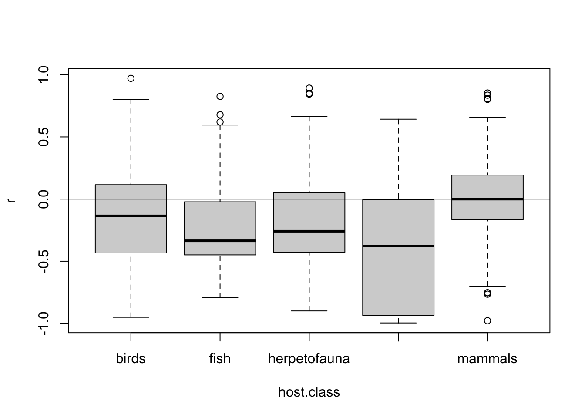

Here, we say that we want a *boxplot* that shows the effect size (r) on the y-axis, as a function of host class on the x-axis (with `~` standard in function notation in R). We tell R to draw these variables from the `urban_data` data frame. We then add a horizontal line at 0 (`h=0`). 

In `ggplot2`, this looks like:


``` r
ggplot(data = urban_data, aes(x = host.class, y = r)) +
  geom_boxplot() +
  geom_hline(yintercept = 0)
```


This produces the same plot, albeit with some differences in default formatting. However, the way we get there is really different! First, we initiate a plot with `ggplot()` and give it the data frame to use. We then give it the variables and their assignments within `aes()`, which stands for "aesthetics". We then use `+` to add plot elements: in this case, a boxplot (which draws `x` and `y` from the first line) and a horizontal line ("hline"). Although the base R code is initially more intuitive (and simpler, for simple plots like this one), the benefit of `ggplot2` is that is provides a structured approach that allows you to add elements to a single object.

A ggplot is composed to three basic components:

* **Data**: intuitively, this is the data you want to show in your plot
* **Aesthetics** (or "mapping"): the variables represented in the plot, which correspond to plot features like x- and y-axes, color, shape, etc.
* **Geometries** (or "layers"): the actual features of the plot (points, lines, boxes, etc.)

Other optional elements are **scales**, **facets**, **coordinates**, and **themes**. We will get to these in our lesson on presentation-ready graphics.

## Layering up a ggplot

First, define the data:


``` r
ggplot(data = urban_data) 
```


This just produces a blank plot with no axes or data on it - because we haven't defined those yet. We can do that next:


``` r
ggplot(data = urban_data, aes(x = host.class, y = r)) 
```


This results in a blank plot with axes, because we haven't added any geometries yet. Then, we add geometries:


``` r
ggplot(data = urban_data, aes(x = host.class, y = r)) +
  geom_boxplot() +
  geom_hline(yintercept = 0)
```

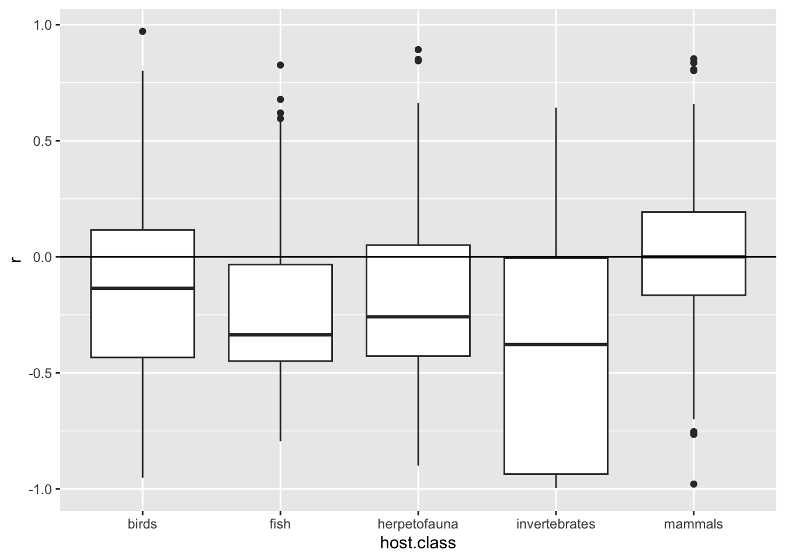

If you look at the help file for `geom_boxplot`, you’ll see that the first two arguments are `mapping` and `data`. These are the same as the ones we specified in `ggplot`. We didn't need to specify them again in `geom_boxplot` because the ones provided in the first line (`ggplot()`) are global plot settings that will be implicitly assumed for every layer downstream.  

Other common `geom_*` functions include `geom_point()`, `geom_line()`, `geom_bar()`, and `geom_col()`. As you continue making more plots, you will become familiar with more of these.

## Exploring data with plots

What can we say from this first plot? Well, it looks like there might be a stronger negative effect of urbanization on health in invertebrates than in other taxa, and/or a smaller effect in mammals. What other variables might influence this relationship? How about the type of health metric used?


``` r
ggplot(data = urban_data, aes(x = health, y = r)) +
  geom_boxplot() +
  geom_hline(yintercept = 0)
```

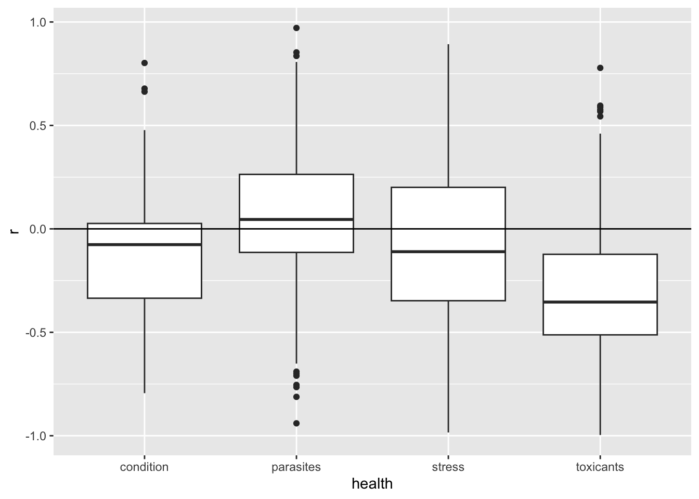

Can you think of a way we might display both of these together? Think about using other types of aesthetics, the number of plots, etc.

Here's one way:


``` r
urban_data %>%
  mutate(health_class = str_c(health, host.class, sep = "/")) %>%
  ggplot(aes(x = health_class, y = r)) +
  geom_boxplot() +
  geom_hline(yintercept = 0)
```


This doesn't really work, but it does highlight one way of combining ggplots with data manipulation. Here, I added a new column `health_class`, which combines the health and host.class variables. I then piped the data into the ggplot (notice that the `data=` argument is missing, because by default the piped data goes into the first argument of the receiving function).

Another way:


``` r
ggplot(urban_data, aes(x = host.class, y = r, color = health)) +
  geom_boxplot() +
  geom_hline(yintercept = 0)
```


``` r
ggplot(urban_data, aes(x = host.class, y = r)) +
  geom_boxplot() +
  geom_point(aes(color = health)) +
  geom_hline(yintercept = 0)
```

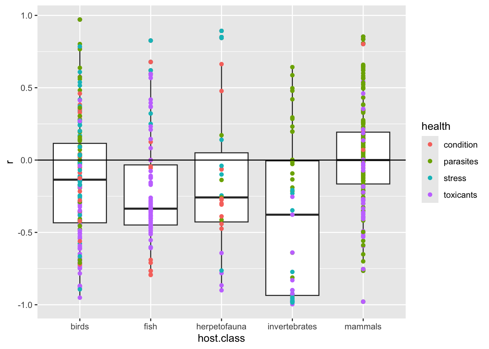

It looks to me like there might be a stronger negative effect of toxicants across groups, and intertebrates might have more toxicant studies, which is why their average is lower.

Notice that in the second plot, I added an additional `aes()` argument within `geom_point()`. This is because I wanted to color the points, but not the boxplots, by health metric. You can always re-specify `data` and `mapping` within geometries, but be careful doing so with `data` as you might not always be showing what is expected.

## Other plot types

### Scatterplots

Scatterplots are probably the most common type of plot you see, and are useful for visualizing relationships between continuous variables. For example, we might want to see if effect sizes depend on urbanization gradients:


``` r
ggplot(urban_data, aes(x = udiff_1000, y = r)) +
  geom_point()
```

```
## Warning: Removed 61 rows containing missing values or values outside the scale range
## (`geom_point()`).
```

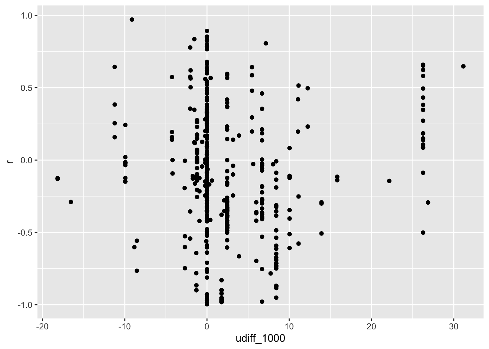

We can also include error bars using `geom_pointrange()`:


``` r
ggplot(urban_data, aes(x = udiff_1000, y = r)) +
  geom_pointrange(aes(ymin = rlower, ymax = rupper))
```

```
## Warning: Removed 61 rows containing missing values or values outside the scale range
## (`geom_pointrange()`).
```

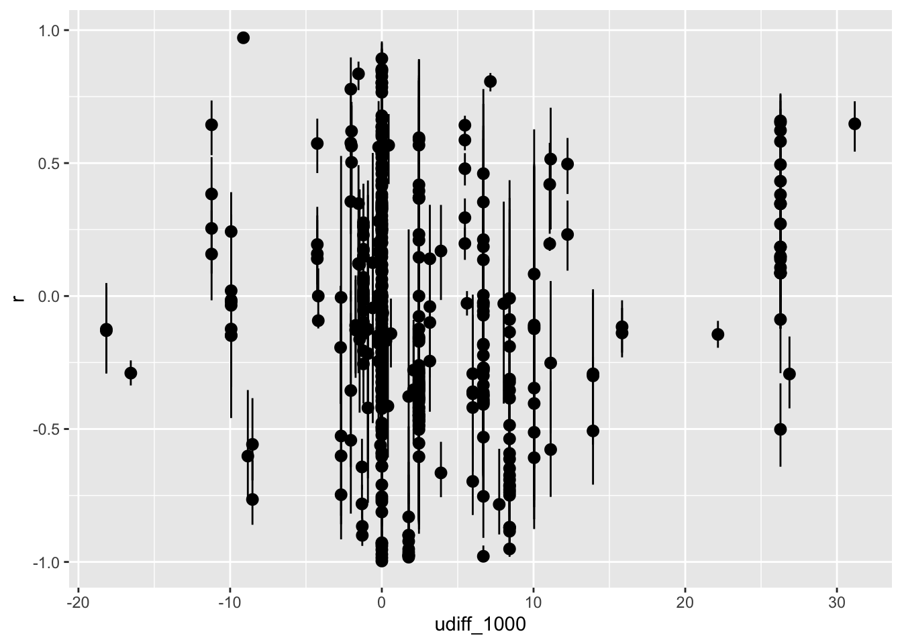

### Histograms

Histograms are useful for visualizing distributions of data. They take only an x variable, because the y-axis is always the count in a given bin.


``` r
ggplot(urban_data, aes(x = r)) +
  geom_histogram()
```

```
## `stat_bin()` using `bins = 30`. Pick better value with `binwidth`.
```

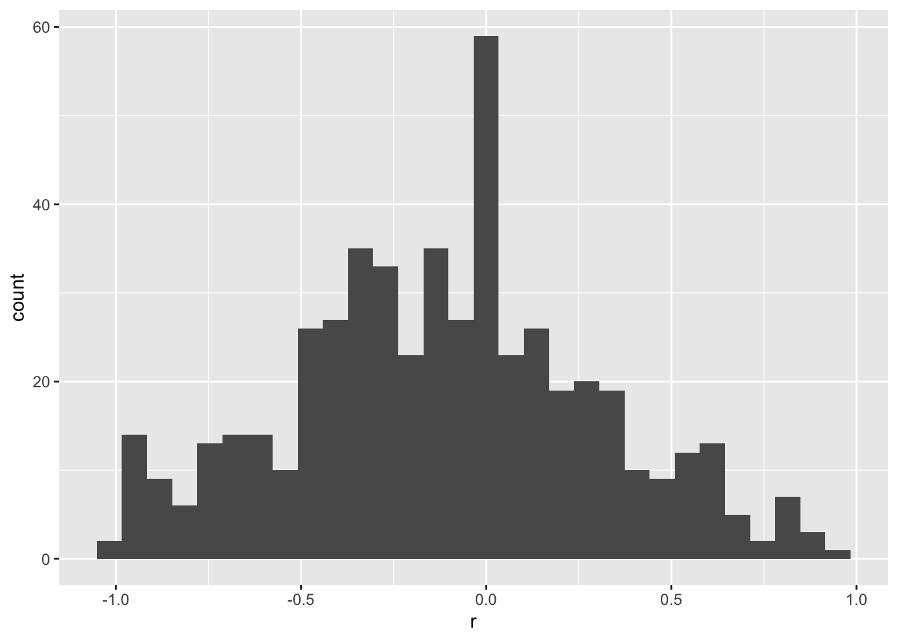

We can also specify the number of bins or bin width:


``` r
ggplot(urban_data, aes(x = r)) +
  geom_histogram(binwidth = 0.2)
```


### Bar and column plots

Like boxplots, bar and column plots are useful for visualizing the relationship between a categorical varible and a continuous (usually count) variable.

If you, like, me, think a bar plot and a column plot are the same thing, think again! Though the appearance of these two plots is very similar, `ggplot2` defines a column plot as having a y-axis and a bar plot as having only an x-axis (so the y-axis is implicitly a sample size). 


``` r
ggplot(urban_data, aes(x = host.class)) +
  geom_bar()
```

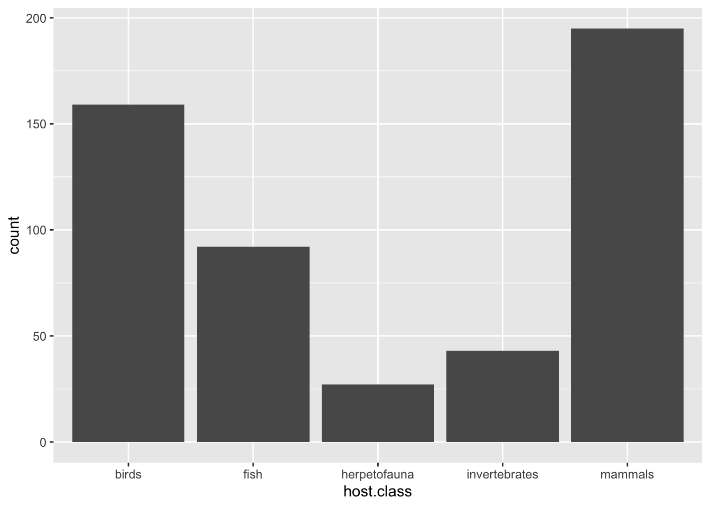

``` r
urban_data %>%
  group_by(host.class) %>%
  summarize(n_countries = n_distinct(COUNTRY)) %>%
  ggplot(aes(x = host.class, y = n_countries)) +
  geom_col()
```


If you are displaying non-count data (for example, a mean effect size across groups), you are usually better off with a scatterplot or boxplot. For example, `ggplot2` will make this bar chart for you:


``` r
ggplot(urban_data, aes(x = host.class, y = r)) +
  geom_col()
```

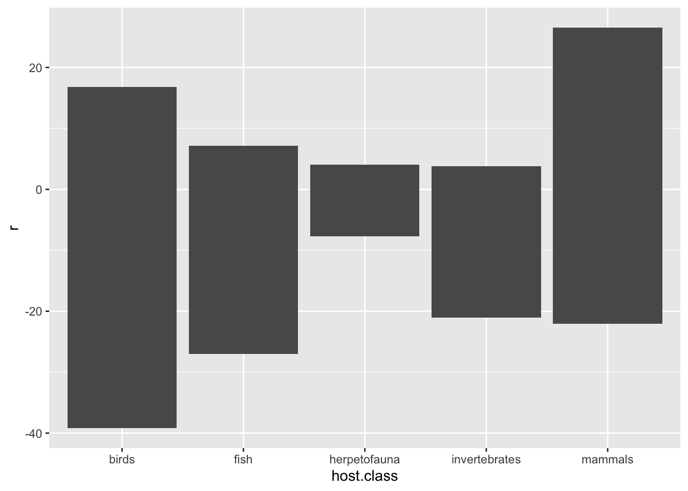

What you are essentially getting is the sum of all positive and negative effect sizes for each host class, which might look nice but doesn't mean much.

## Basic visual statistical summaries: `geom_smooth()` and `stat_summary()`

Sometimes, we have too much data, or too much overlapping data, to effectively visualize. `ggplot2` provides some ways to summarize data and produce a plot, all in one step. However, note that these are doing stats under the hood! They are good for data exploration but if you want to present them you need to make sure you know what the underlying model is.

One way to summarize trends in time or relationships between variables is with `geom_smooth()`. Under the hood, this function models nonlinear relationships between variables. 


``` r
ggplot(urban_data, aes(x = YEAR, y = r)) +
  geom_point() +
  geom_smooth()
```

```
## `geom_smooth()` using method = 'loess' and formula = 'y ~ x'
```


``` r
ggplot(urban_data, aes(x = host.class, y = r)) +
  stat_summary() 
```

```
## No summary function supplied, defaulting to `mean_se()`
```

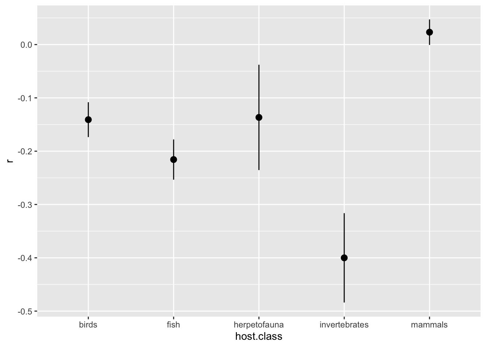

Wait, what is that `stat_` thing? It's not a `geom_` but produces elements of a plot. Under the hood, `geom`s use `stat`s. In most cases, `stat="identity"`, so `ggplot` is just plotting the raw values. But, for example, in a bar plot, the stat is "count" by default:

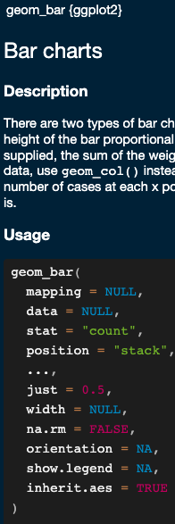

This is just one example of customization options in `ggplot2`.

## Groups and symbology

You can also specify other symbology for your plots to represent variables. All of these parameters can also be specified as fixed (for example, to change all points to a given color). You can do this by defining the parameter outside of `aes()`.


``` r
ggplot(urban_data, aes(x = host.class, y = r)) +
  geom_boxplot(color = "red")
```

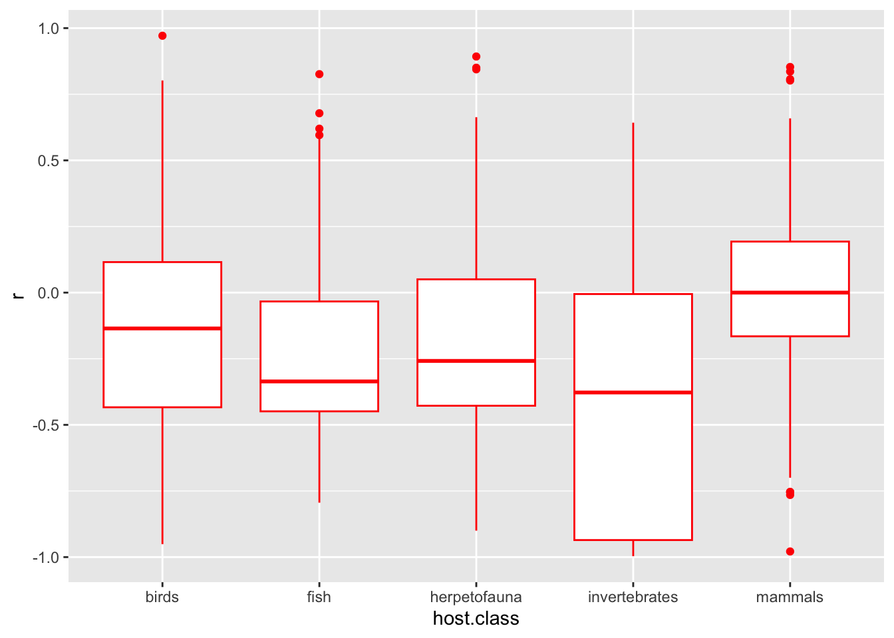

### Color

Color is usually the first step to visualize groups or variables in plots, especially for exploratory data visualization. We will get more into color scales and schemes in the next lesson.


``` r
urban_data %>%
  filter(udiff_10000 != 0) %>%
  ggplot(aes(x = udiff_10000, y = r, color = host.class)) +
  geom_point() 
```

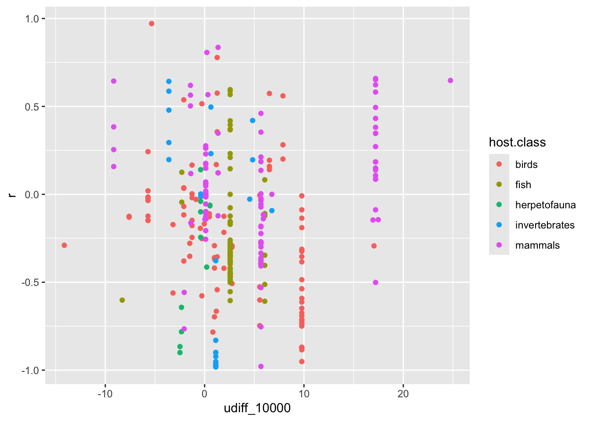

For barplots, boxplots, and other plot types with polygons, `ggplot` distinguishes between the `fill` and the `color`:


``` r
ggplot(urban_data, aes(x = host.class, y = r)) +
  geom_boxplot(aes(fill = aqterr))
```

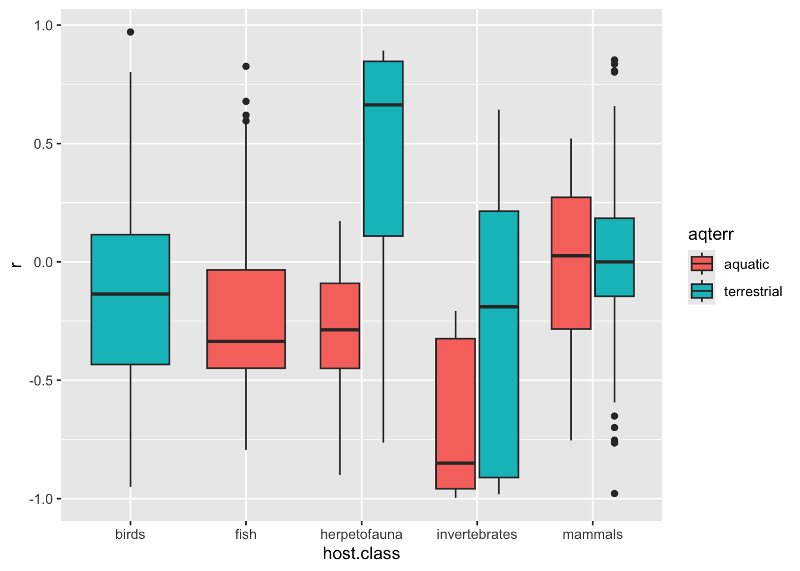

``` r
ggplot(urban_data, aes(x = host.class, y = r)) +
  geom_boxplot(aes(color = aqterr))
```

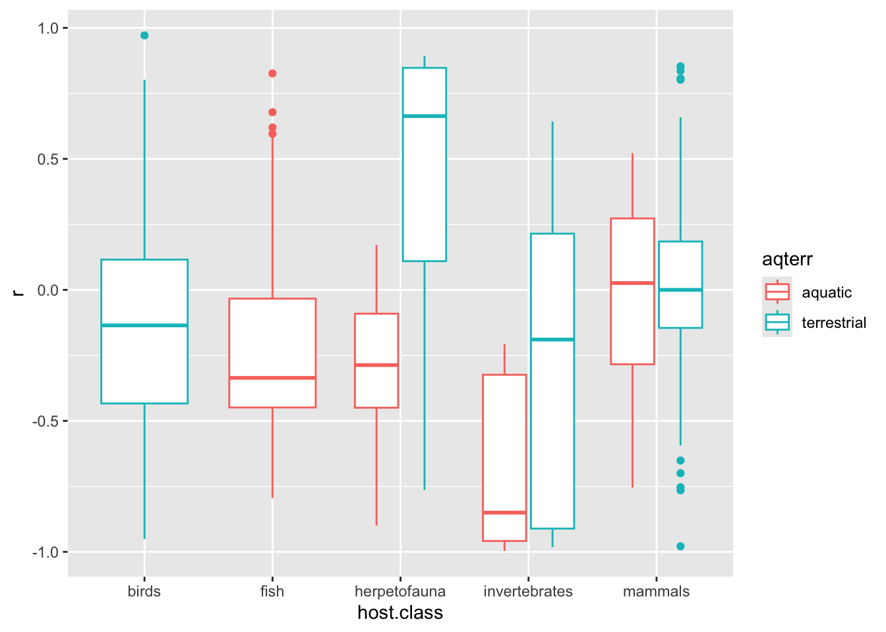

### Shape

Shape is a little harder to see than color for most people, but can serve as a helpful secondary indicator. It can be useful to pair shape with color. Shape should generally be only used for categorical variables and shouldn't be used with >6 levels, as the shapes become very difficult to distinguish.


``` r
urban_data %>%
  filter(udiff_10000 != 0) %>%
  ggplot(aes(x = udiff_10000, y = r, shape = host.class)) +
  geom_point() 
```


``` r
urban_data %>%
  group_by(YEAR, host.class) %>%
  summarize(r = mean(r)) %>%
  ggplot(aes(x = YEAR, y = r, linetype = host.class)) +
  geom_line() 
```

```
## `summarise()` has grouped output by 'YEAR'. You can override using the
## `.groups` argument.
```


### Size

Size is usually best used for continuous (or at least number-related) variables. By default, the size of a point in `ggplot` is based on its dimensions, e.g., radius for a round point. This is important to note, because a point with twice the radius of another point has four times the area. Size is therefore not ideal for representing variables where inferring the value is important, but can help emphasize general patterns or draw attention to some data points over others.


``` r
ggplot(urban_data, aes(x = YEAR, y = r, size = log10(SAMPLE_SIZE))) +
  geom_point() 
```


### Transparency

Transparency is indicated with the `alpha` parameter. Transparency is most intuitively used to symbolize importance, for example sample size:


``` r
ggplot(urban_data, aes(x = YEAR, y = r, alpha = log10(SAMPLE_SIZE))) +
  geom_point() 
```


But it can also be convenient to use transparency to show densities of overlapping data, or to plot models over data.

### Groups

Some geoms benefit from specification of groups, which tell `ggplot` which data points to link together. For example, the boxplots we made above were grouped by the `host.class` variable (with no group, we would have just had one boxplot of all the data). By default, `ggplot` will usually take your other aesthetics and combine them to make groups - in the cases above, those were `x` and `color`. However, sometimes this doesn't work by default, or we want to specify groups that aren't linked to symbology.

For example, this line chart without groups:


``` r
urban_data %>%
  group_by(YEAR, host.class) %>%
  summarize(r = mean(r)) %>%
  ggplot(aes(x = YEAR, y = r)) +
  geom_line() 
```

```
## `summarise()` has grouped output by 'YEAR'. You can override using the
## `.groups` argument.
```


And with groups:


``` r
urban_data %>%
  group_by(YEAR, host.class) %>%
  summarize(r = mean(r)) %>%
  ggplot(aes(x = YEAR, y = r, group = host.class)) +
  geom_line() 
```

```
## `summarise()` has grouped output by 'YEAR'. You can override using the
## `.groups` argument.
```

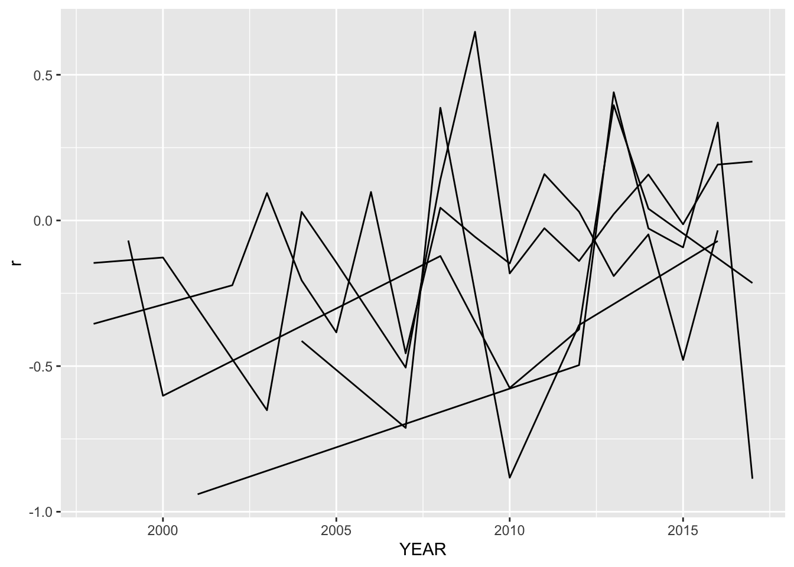


## Additional reference

Data visualization with ggplot2 :: Cheat Sheet. Available: https://rstudio.github.io/cheatsheets/html/data-visualization.html
