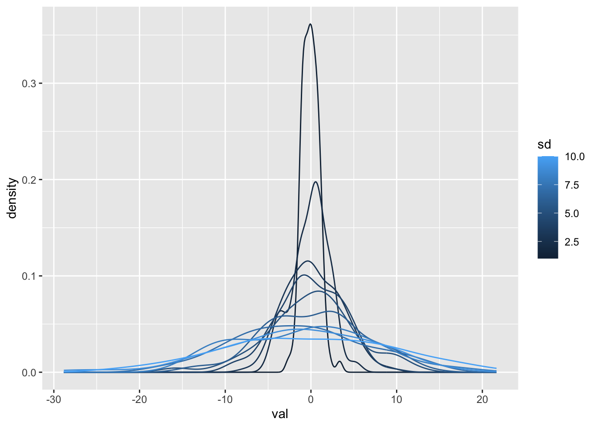

# Iterating and Conditioning: `for` Loops and `if` Statements {#for-if}

## Objectives

* Apply loops to automate repeating tasks
* Use conditional statements within loops
* Understand when to use `for`, `while`, and `if` statements

## Additional reading

Hadley Wickham, Mine Çetinkaya-Rundel, and Garrett Grolemund. R for Data Science (2e). Chapter 27: A field guide to base R; Section 27.5: `for` loops. Available: https://r4ds.hadley.nz/base-R.html#for-loops


## Motivation

We are now in the "Advanced R" section of the course. Although the concepts we're learning here might require a little more practice to get right, they are also the main *power* of programming. For the most part, the operations we have learned so far might not have been as easily *reproducible* if done in Excel, but they would have been possible. For example, pivot tables can group and summarize data. In this lesson, we will use R to automate repeating a task using what is called a `for` loop, as well as working with some other programming tools that work well with a `for` loop.

## What is a loop?

A loop allows you to iterate a task, telling R to do the same thing over and over again. For-loops keep code clean and avoid unnecessary repetition of a code block. Loops are especially useful when you want to edit that task later, since you only need to edit the operation once instead of each time it was applied.

## Using loops

Loops are easiest to understand with an example. The basic syntax for a `for` loop is:

```
for(variable in sequence){
  do something
}
```

For example:


``` r
vals <- c(1, 10, 100, 1000, 10000, 100000)
for(x in vals){
  print(log10(x))
}
```

```
## [1] 0
## [1] 1
## [1] 2
## [1] 3
## [1] 4
## [1] 5
```

Here, I have *looped over* the values in the object called `vals`. Each time R goes through the loop, it assigns the next value in `vals` to `x`. I have then asked it to take the logarithm of `x` and print that to the screen.

This is not a good application of a loop because the function `log10()` can take a vector as its argument, so we would get the same result with `print(log10(vals))`. 

Loops become useful when (a) a function can't operate on a vector, and (b) when we want to include conditional statements (more on that below).

For example, to sample 100 values from from a normal distribution with a mean of 0 and a standard deviation of 2, we use `rnorm(n = 100, mean = 0, sd = 2)`. But what if we wanted to look at these distributions with standard deviations ranging from 1 to 10? `rnorm()` can only take a single number for `sd`, so we would want to use a loop.


``` r
# Define the vector of standard deviations
sd_vals <- c(1:10)
# Loop over SDs
for(x in sd_vals){
  # For each SD (x), get 100 values from a normal distribution with mean=0 and sd=x
  rnorm(n = 100, mean = 0, sd = x)
}
```

**Wait, did that work? There's no output!** This is one finicky aspect of loops that takes some getting used to. Because the operation is happening inside the loop, it doesn't print to the screen by default. We can fix that by explicitly including `print()` (but I won't show the output here because it would be 10 sets of 100 values):


``` r
# Loop over SDs
for(x in sd_vals){
  # For each SD (x), get 100 values from a normal distribution with mean=0 and sd=x
  print(rnorm(n = 100, mean = 0, sd = x))
}
```

It also takes some practice to assign new objects in loops, because if we did this:


``` r
# Define the vector of standard deviations
sd_vals <- c(1:10) 
# Loop over SDs
for(x in sd_vals){
  # For each SD (x), get 100 values from a normal distribution with mean=0 and sd=x
  norm_dist <- rnorm(n = 100, mean = 0, sd = x)
}
```

We would end up with only the last iteration saved in `norm_dist`. To solve this problem, think about the type of object you would like to get out of the loop. Here's let's say we want a long-form data frame with two columns: one stating the standard deviation and one with the 100 values for each distribution. We can initiate this data frame before the loop starts, then add to it as it goes:


``` r
# Define the vector of standard deviations
sd_vals <- c(1:10)
# Create an empty data frame in which to save data
results <- tibble()
# Loop over SDs
for(x in sd_vals){
  # For each SD (x), get 100 values from a normal distribution with mean=0 and sd=x
  norm_vals <- rnorm(n = 100, mean = 0, sd = x)
  # Create a two-column data frame with a column saving the SD (x) and a column with all simulated values
  norm_vals_tib <- bind_cols(sd = x, val = norm_vals)
  # Add these to the results data frame
  results <- bind_rows(results, norm_vals_tib)
}
```

Now, we have all our results saved:


``` r
dim(results)
```

```
## [1] 1000    2
```

``` r
names(results)
```

```
## [1] "sd"  "val"
```

``` r
ggplot(results, aes(x = val, color = sd, group = sd)) +
  geom_density() 
```



`for` loops are more aligned with a "base R" way of programming than with `tidyverse`, but you will encounter them often if using other code. They also form the conceptual base of some `tidyverse` functions, so understanding them can help you later. Because `for` loops are associated with base R, it is often necessary - or at least helpful - to remember to use square brackets for indexing, because you will often be dealing with *vectors* rather than *data frames* or *tibbles*. For example, a common way to write a loop is:


``` r
vals <- c(1, 10, 100, 1000, 10000, 100000)
for(i in seq_along(vals)){
  print(log10(vals[i]))
}
```

```
## [1] 0
## [1] 1
## [1] 2
## [1] 3
## [1] 4
## [1] 5
```

Here, instead of assigning `i` to the values in `vals`, we assign it to an *index*, which tells us here in the `vals` vector we are (here, `i` counts up from 1 to 6 as we go through the loop). `seq_along(vals)` is the equivalent of `1:length(vals)`, but is safer because if a vector is of length 0, `seq_along()` returns a zero-length vector, whereas `1:length()` counts backwards (i.e, it returns 1, 0).

This practice is useful when we are looping through multiple vectors together. For example, if we have a vector of standard deviations and a vector of corresponding means, we might do something like:


``` r
set.seed(2025)
means <- sample(10) #10 random values for the mean
sds <- sample(10) #10 random ravlues for the SD
results <- tibble() #Blank data frame for output
for(i in 1:length(means)){
  #Simulate five values with the mean and SD of the current index
  values <- rnorm(n = 5, mean = means[i], sd = sds[i])
  #Combine these values with their corresponding mean and SD
  df_temp <- bind_cols(mean = means[i], sd = sds[i], val = values)
  #Combine values from all simulations
  results <- bind_rows(results, df_temp)
}
head(results, 8)
```

```
## # A tibble: 8 × 3
##    mean    sd    val
##   <int> <int>  <dbl>
## 1     4     7 -1.91 
## 2     4     7 -0.512
## 3     4     7 -3.45 
## 4     4     7  4.80 
## 5     4     7 -4.44 
## 6     1     5 -3.64 
## 7     1     5  7.56 
## 8     1     5  8.40
```

Loops do take some practice, but with these basics you should be able to practice and perfect. Remember:

1. Create an object *outside* the loop where you will save your results
2. Loops don't print to the screen by default. Add `print()` if you want to see what's happening.
3. You can loop over vectors, but also over columns or rows in a data frame. We will practice this later.
4. Troubleshooting loops can be difficult, but you can always take a look at the index where it stopped (`x` in the examples above) to see if it had a problem with one item in particular, or if there's something wrong from the get-go. 

## `if` statements

We used the `if_else()` function earlier to create new columns that are *conditional* on other columns. The `if` statement is the basic form of `if_else()`. In a similar format as a `for` loop, we ask R to do something if a condition is met, then potentially give it alternatives if not. The basic syntax of an `if` statement is:

```
if(condition){
  do something
}
```

`condition` should return a single logical value (`TRUE` or `FALSE`). This is why `if` and loops are so closely tied - `if` statements do not take vector arguments. We can also add `else` to keep going:

```
if(condition1) {
  do something
} else if(condition2) {
  do something else
} else {
  do yet another thing
}
```

Here, we ask R to evaluate `condition1`. If that returns `FALSE`, it will move on to `condition2`. If `condition2` is `FALSE` it will do "yet another thing". This differs from the first example, where if `condition` was `FALSE`, R would do *nothing*.

Let's try an example:


``` r
animal <- "squirrel"
# Evaluate the first condition
if(animal %in% c("mallard", "whimbrel", "trumpeter swan")){
  print("This is a bird.")
} else{ #If not met, do this other thing
  print("This is not a bird.")
}
```

```
## [1] "This is not a bird."
```

This is not a great use for an `if` statement because it is the same as:


``` r
if_else(animal %in% c("mallard", "whimbrel", "trumpeter swan"),
        "This is a bird.",
        "This is not a bird.")
```

```
## [1] "This is not a bird."
```

`if` statements and `for` loops are especially useful with lists, which we will cover soon.

## `while` loops

Writing a `for` loop requires that we know what sequence to loop over. However, sometimes, we want to perform a calculation until a condition is met. Here, we can use a `while` loop. A `while` loop combines the syntax of a `for` loop with the condition of an `if` statement. For example, let's say we wanted to draw numbers from a vector until the sum was greater than 10. We would do this:


``` r
# Define a vector of values to sample from
all_vals <- rnorm(100, 4, 4)
# Define empty objects to use within the loop
vect <- vector()
sum_vect <- 0
# Run the loop as long as the sum_vect obejct is less than 10
while(sum_vect <= 10){
  # Randomly sample a value from the all_vals vector
  new_val <- sample(all_vals, size = 1)
  # Add this to our vector of values
  vect <- c(vect, new_val)
  # Take the sum and assign it to summ_vect, which goes back to "while"
  sum_vect <- sum(vect)
}
print(vect)
```

```
## [1] 8.666539 5.743882
```

``` r
print(sum_vect)
```

```
## [1] 14.41042
```

`while` loops can be dangerous - there is always a chance that your condition will never be met and the loop will run forever! If you encounter this, the stop sign icon (top-right of your console) or the Session-->"Interrupt R" menu are useful.
