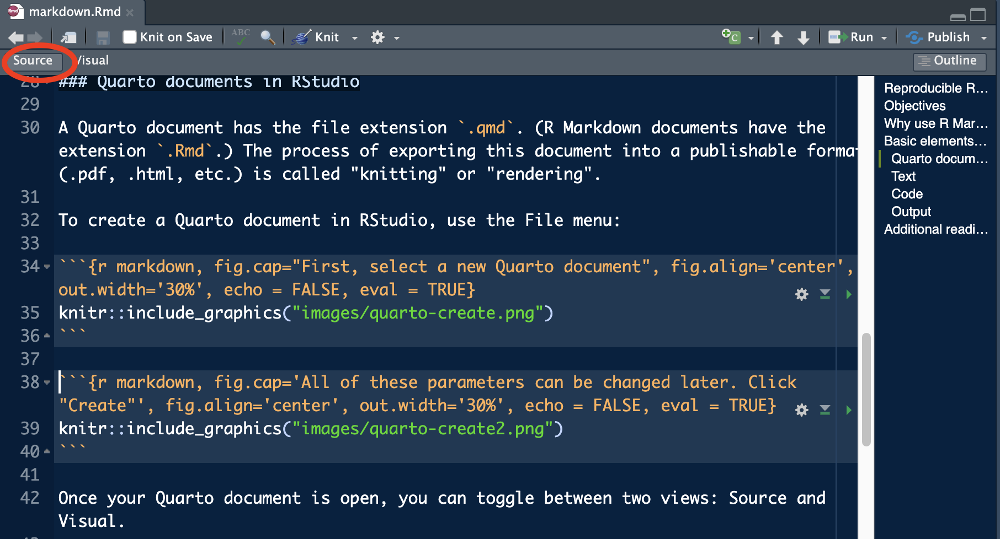
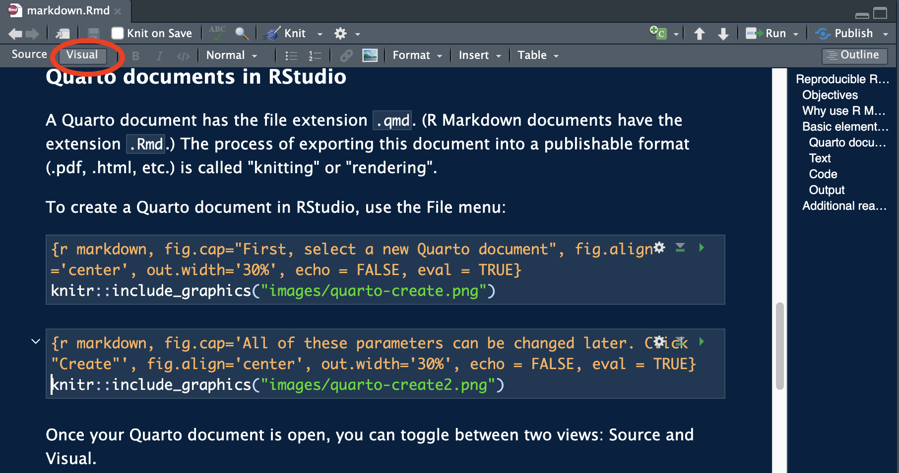
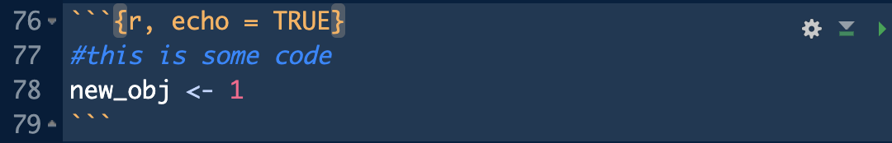
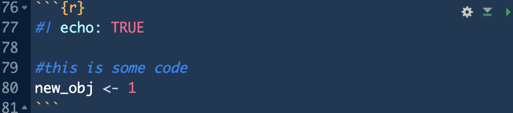

# Reproducible Reports with R Markdown and Quarto {#markdown}

<div class="figure" style="text-align: center">

<p class="caption">(\#fig:markdown)R Markdown makes music with text, code, and output. Artwork by [Allison Horst](https://allisonhorst.com/allison-horst)</p>
</div>

## Objectives

-   Integrate code, text, and output in R Markdown and Quarto documents
-   Format text in R Markdown and Quarto documents, including complex characters and code outputs
-   Customize output and display in R Markdown and Quarto documents

## Additional reading

Hadley Wickham, Mine Çetinkaya-Rundel, and Garrett Grolemund. R for Data Science (2e). Chapter 28: Quarto. Available: <https://r4ds.hadley.nz/quarto.html>

Hadley Wickham, Mine Çetinkaya-Rundel, and Garrett Grolemund. R for Data Science (1e). Chapter 27: R Markdown Available: <https://r4ds.hadley.nz/quarto.html>

Getting Started with Quarto in RStudio: <https://quarto.org/docs/get-started/hello/rstudio.html>

## Why use R Markdown/Quarto?

We have already used R Markdown in this course. Your homework assignemnts are R Markdown documents, so you probably understand the concept of integrating code, text, and output. In this lesson, we will go deeper into the many options and ways to use these documents.

A side note: I will refer to Markdown and Quarto in this lesson. These are two slightly different ways of coming up with the same type of report. Quarto is newer and will eventually supercede R Markdown; it contains all the features of R Markdown, plus a few more. Most importantly, R Markdown works only in RStudio, whereas Quarto can work in another code editor - which could be useful if you collaborate with someone who uses other software. Because Quarto is new, it does not always have as much documentation, but this is rapidly improving.

Beyond homework assignments and HTML documents, Quarto/Markdown can produce slide show presentations, Word documents, PDFs, and can be used to embed interactive features like maps. This entire book is written using Markdown! A few benefits of writing in Quarto are:

1.  It can easily be integrated with Git (version control rather than Track Changes)
2.  It is easy to share and collaborate
3.  I don't have to save plots and then manually paste them into a document
4.  Code and text are all in one place

## Basic elements of a Quarto document

### Quarto documents in RStudio

A Quarto document has the file extension `.qmd`. (R Markdown documents have the extension `.Rmd`.) The process of exporting this document into a publishable format (.pdf, .html, etc.) is called "knitting" or "rendering".

To create a Quarto document in RStudio, use the File menu:

<div class="figure" style="text-align: center">

<p class="caption">(\#fig:unnamed-chunk-1)First, select a new Quarto document</p>
</div>

<div class="figure" style="text-align: center">

<p class="caption">(\#fig:unnamed-chunk-2)All of these parameters can be changed later. Click "Create"</p>
</div>

Once your Quarto document is open, you can toggle between two views: Source and Visual. Source is more "code-like", while the visual editor includes more point-and-click formatting tools and a preview of your formatting. If you toggle between the two, you can see how formatting is translated into Markdown language.

<div class="figure" style="text-align: center">

<p class="caption">(\#fig:unnamed-chunk-3)Two views of Quarto</p>
</div>

As mentioned above, these documents fundamentally have three types of information: text, code, and output. The entire document is are also governed by a header that tells Quarto about formatting and output, for example whether the document should be HTML or PDF, whether to include a table of contents, etc.

### Text

You can type in a Quarto document just like in any other text editor. You can also add inline code using the syntax `` `r some_code_here` ``. This code will run and will be displayed as normal text. This can be helpful if you want to insert results or summary statistics within a sentence, for example. To create text that looks like code but isn't executed, just leave off the "r". For example, I do this when I mention functions and packages in the book.

You can also format text in the source editor. Toggling between the source and visual editors can help you learn these details, but some common formatting options are:

* text surrounded by asterixes (`*text*`) creates *italics*
* text surrounded by double asterixes (`**text**`) creates **bold**
* text preceded by a ">" at the beginning of a line creates a block quote

> block quote

To create a bulleted or numbered list, start a new line with "*", "-", or a number. Numbering is automatic even if your list is out of order...you can start every item with "1." and it will render as an ordered list!

Other types of text to explore include equations, other non-Latin symbols, and color formatting.

### Code and Output

Code in a Quarto documents is in units called **chunks**, which are denoted by tick marks and curly braces (`{}`), within which you can specify options. At its most basic, you need to specify the language (in our case, this will always be `r`, but you can incorporate `python` or other code into these documents):

<div class="figure" style="text-align: center">

<p class="caption">(\#fig:unnamed-chunk-4)A code chunk.</p>
</div>

You can run each code chunk by clicking the Run icon (the play button at the top-right of the chunk). You can also run each line of code individually as you would in a "normal" R script. RStudio displays the results inline with the code, but you can change this in your options if you prefer to use the Viewer pane.

You can insert a new code chunk using the Insert menu in the Visual editor (Insert –\> Executable cell –\> R), by typing ticks and brackets in the Source editor, or with the keyboard shortcut Cmd + Option + I / Ctrl + Alt + I.

Within the code chunk, you can also customize your outputs using options. For example, the option `echo` indicates whether the code itself should show up in the document (`echo=TRUE`) or if only the output should be displayed (`echo=FALSE`). There are too many options to describe here, and two ways to enter them -- either within the curly brackets (typical for Markdown) or as a line at the beginning of the code chunk preceded by `#|`.

<div class="figure" style="text-align: center">

<p class="caption">(\#fig:unnamed-chunk-5)Setting options</p>
</div>

Here's what that looks like in the actual document. Notice that the header does not show up:


``` r
#this is some code
new_obj <- 1
```

A few other common options:

-   `label`: adds a name to the code chunk, which then will show up in the menu at the bottom of the code editor.
-   `eval`: TRUE/FALSE, indicates whether the code should be executed or not. You can use this to "comment out" an entire code chunk.
-   `include`: runs the code but does not show any output. This option is helpful for data-processing steps that don't need to be displayed.

A full list of options is available here: https://yihui.org/knitr/options.

### Header

Sometimes, you will want to specify these options for the entire document instead of for each code chunk. This is where the header comes in. You will see the called the "YAML header" because it is in the "YAML" language - but don't worry, it's easily human-readable.

When you initiate a new Quarto document, a header that looks like this will appear:

```         
title: "Untitled"
format: html
```

You can add chunk options under `execute`:

```
title: "Untitled"
format: html
execute:
  echo: false
```

And can change formatting under `format`. For example, to add a table of contents:

```        
title: "Untitled"
format: 
  html:
    toc: true
execute:
  echo: false
```

Unlike in R code, where indenting is helpful but not required, YAML reads indents as subsections, so make sure you follow these conventions. The [Quarto documentation](https://quarto.org/docs/output-formats/html-basics.html) shows many more options for document formatting and output control.
