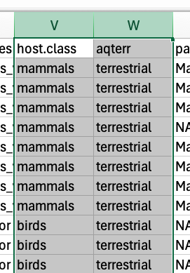

# Data Structures and Importing Data {#importexport}

Some of this lesson draws from The Carpentries' [Data Organization in Spreadsheets for Ecologists](https://datacarpentry.github.io/spreadsheet-ecology-lesson) workshop, which is published under a [CC-BY 4.0](https://datacarpentry.github.io/spreadsheet-ecology-lesson/LICENSE.html) license. It is also based on materials for [WILD 6900: Tools for Reproducible Science](https://ecorepsci.github.io/reproducible-science/), Spring 2021, Utah State University, by Dr. Simona Picardi, also published under a [CC-BY 4.0](https://creativecommons.org/licenses/by/4.0/) license.

For more detail on `tidyverse` approaches to reading data, see the "Data Import" chapter of R for Data Science: https://r4ds.had.co.nz/data-import.html

## Objectives

* Work with relative file paths to read and write data
* Bring data into R from different sources and file types
* Work with text/csv files and R data objects
* Understand how to use spreadsheets for data entry and management

## Additional reading

Hadley Wickham, Mine Çetinkaya-Rundel, and Garrett Grolemund. R for Data Science (2e). Chapter 20: Spreadsheets. Available: https://r4ds.hadley.nz/spreadsheets.html

Hadley Wickham, Mine Çetinkaya-Rundel, and Garrett Grolemund. R for Data Science (2e). Chapter 7: Data import. Available: https://r4ds.hadley.nz/data-import.html

## Recap: data structures

Objects in R can come in a number of forms:

* Numbers (R differentiates between decimals - called *double* and *integers*)
* *Characters*
* *Factors* (ordered values)
* *Logical* (True/False)

They can also be combined into more complex forms:

* *Data frames*, which consist of rows and columns. Columns must have the same data type (character, integer, etc.)
* *Lists*, which can contain multiple data types. 

## File types and their interaction with R

Your computer can store any number of file types, which are usually indicated by their extension (.docx, .pdf, .csv, .xlsx, etc.). Each file type stores data differently. Some file types are **proprietary** and can only be read by certain software. It is usually best to convert these into open formats before working with them in R or other programming languages. You are likely to receive data as Excel files (.xls, .xlsx). These used to be proprietary but are now open - however, using them with R requires a little practice to know how to import data and what information is lost in the process.

## The `here` package and working directories

In the last lesson, you practiced setting and getting your working directory and setting up an R project. If you are working in an R project, your working directory will automatically be set to the project's home directory. However, some tools complicate this rule; for example, when you *knit* R Markdown documents (which we use for exercises), the working directory is automatically set to the *script's* directory - not the project directory. This is a problem because the code you run line-by-line while working will have a different default working directory than when the document is knitted! There are two ways to solve this problem:

First, you can set the default working directory for your R Markdown file in the options at the top of the document:


``` r
knitr::opts_chunk(root.dir = "../")
```

This option would set the "root directory" (i.e., default working directory) of the document to one directory above where the script is stored. With the file organization we used, this would be the project directory.

Another option is to use the `here` package, which uses relative file paths within the project directory. Any file path enclosed within the function `here()` will start at the project directory. `here` can also take multiple directory arguments. For example, the following commands are equivalent:


``` r
here("data", "raw", "new_dataset.csv")
here("data/raw/new_dataset.csv")
```

For the rest of the lesson, we will use `here` to read and write files.

## Reading .csv files into R

More often than not, you'll create data frames by importing external files (such as .csv) into R. A few useful functions for this are:

* `read.csv` and its tidy equivalent `read_csv` from the `readr` package
* `read.table`, which can read .csv and other text files (.txt, etc.)
* `source`, which reads R code files (we will get to this later)
* `read_excel` from the `readxl` package

To practice, we will use some data from an online repository: 
Murray, M. H., Sanchez, C. A., Becker, D. J., Byers, K. A., Worsley-Tonks, K. E. L., & Craft, M. E. (2020). Data from: City sicker? a meta-analysis of wildlife health and urbanization [Data set]. Zenodo (https://zenodo.org/records/3870855). https://doi.org/10.5061/dryad.b74d971

**Navigate to the repository using the DOI to learn more about the study.**


``` r
library(tidyverse)
library(here)
```


``` r
# First, look at the arguments for read_csv
?read_csv

# read_csv can take any file location, including a URL. Download some data:
urban_data <- read_csv("https://zenodo.org/records/3870855/files/Murray%20Sanchez%20et%20al_urban%20wildlife%20May%2020%202019.csv")
```

```
## Rows: 516 Columns: 42
## ── Column specification ────────────────────────────────────────────────────────
## Delimiter: ","
## chr (14): TITLE, AUTHORS, JOURNAL, health, condition, toxtype, ptype, stress...
## dbl (28): study, YEAR, SAMPLE_SIZE, EFFECT_DIRECTION, pval, r, yi, vi, rlowe...
## 
## ℹ Use `spec()` to retrieve the full column specification for this data.
## ℹ Specify the column types or set `show_col_types = FALSE` to quiet this message.
```

``` r
class(urban_data)
```

```
## [1] "spec_tbl_df" "tbl_df"      "tbl"         "data.frame"
```

Notice that `read_csv` gives us information about how it read the file, including:

* the number of rows and columns
* the delimiter, which separates "cells" from one another (in this case, a comma)
* the assumed types of each column (here, 14 character columns and 28 "double", or numeric, columns)

When we examine the `class` of the new object, we see that it is a `data.frame`, but it also has other types. This is because we used a `tidyverse` package to read the data, so the object is a special type of data frame called a `tibble`. To learn more, check out `?tbl_df`.

## Writing data from R

Repositories like Zenodo should provide permanent ways to access data, but you should also save a local copy. To save this csv, we can use the `write_csv` function. 


``` r
write_csv(urban_data, here("data/raw/Murray-Sanchez_urban-wildlife.csv"))
```

You should now see a new file in your raw data folder.

## Working with spreadsheets, in and out of R

Many spreadsheet programs are available. The most commonly used is Excel, so we will use Excel here, but these same principles apply to Google Sheets, etc.

<div class="figure" style="text-align: center">

<p class="caption">(\#fig:unnamed-chunk-6)The temptations of spreadsheets (https://xkcd.com/2180/)</p>
</div>

### Spreadsheets for data entry

Spreadsheets are a great tool for data entry, but to be compatible with future analyses it is important to set them up properly. One common mistake is to use spreadsheets like data sheets or lab notebooks, which include notes for context or lay out data spatially. As humans, we can (usually) interpret these things, but computers don’t view information the same way, and unless we explain to the computer what every single thing means (and that can be hard!), it will not be able to see how our data fits together. 

It is also important to know (and accept) that the best formats for data entry might not be the best formats for data analysis. In the next lesson, we will learn how to use R to automatically convert from one to another, but it is also helpful to understand the principles of data formatting in spreadsheets to make this processes as streamlined as possible. 

### Formatting data in spreadsheets

<span style="color:red">**Open the Murray, Sachez, et al. data in Excel or another spreadsheet program.**</span>

Excel may ask you if you want to covert large numbers into scientific notation. You can say yes.

Examine the spreadsheet. This is easier than looking at data using `head()` or other functions in R and RStudio. That is our first good use of spreadsheets: **familiarizing yourself with data**. 

<span style="color:red">**Discuss**</span>**: what do you notice about the structure of this dataset?**

* How are missing values represented?
* Where is there duplicated information? Why do you think it is organized this way?
* Which columns are intuitive? Which are not?
* What else is confusing or interesting about this dataset?

To answer some of these questions, we need **metadata**, which (as the name implies), is data about our data. Download the README file from the Zenodo repository: https://zenodo.org/records/3870855.

### Tidy data

This data set is *mostly* in "tidy" format, meaning that it has one observation per row and one variable per column. For example, look at the `host.class` and `aqterr` columns:

<div class="figure" style="text-align: center">

<p class="caption">(\#fig:unnamed-chunk-7)Tidy data format</p>
</div>

When entering data, you might intuitively enter it as "terrestrial mammal,", "terrestrial bird," etc., but this way data can later be filtered or analyzed by a single classification only. One case where this data set does not do this is the `host.species` column:

<div class="figure" style="text-align: center">

<p class="caption">(\#fig:unnamed-chunk-8)Slightly less tidy data format</p>
</div>

We might later be interested in grouping by genus, but we can't do that with the way the data are entered right now. We will learn how to separate the genus and species in R later.

### What to avoid

Some key practices to avoid when creating spreadsheets include:

* Multiple tables in the same sheet --> instead, use multiple tabs (sheets) in the same file (workbook) or, even better, a separate file for each table.
* Using formatting to convey information: formatting like bold, highlights, etc. can be useful for using spreadsheets, but they won't load across platforms. Instead, add a new column to flag entries.

