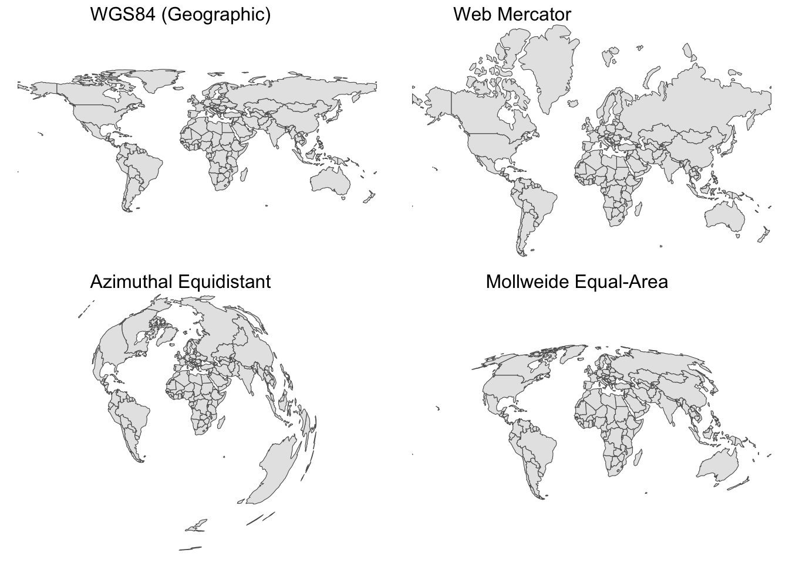
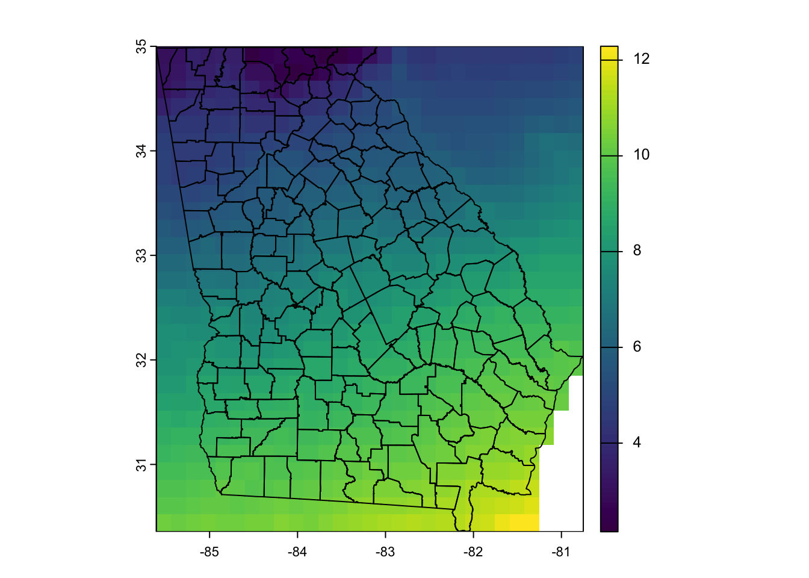
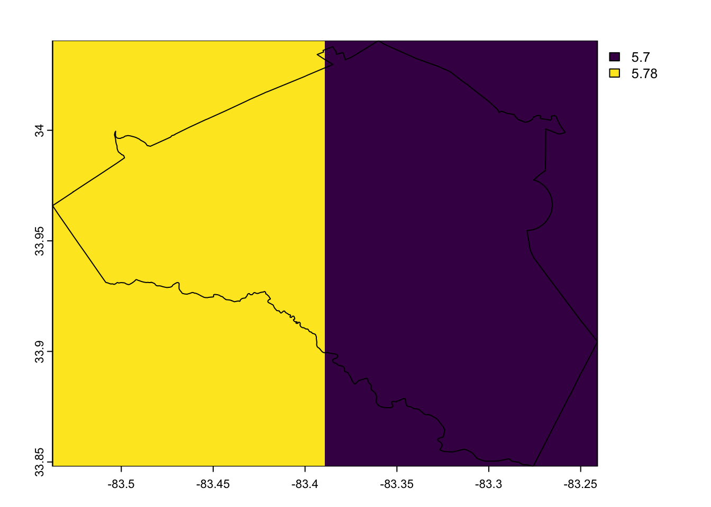

# An Introduction to Spatial Data in R {#spatial}

## Objectives

- Understand the structures of spatial data in R, including both vector (points,
lines, polygons) and raster (gridded) data
- Be familiar with the core R packages for spatial data (`sf`, `terra`)
- Plot spatial data using `ggplot2`
- Work with both geographic and projected coordinates in R

## Additional reading

Edzer Pebsma, and Roger Bivand. Spatial Data Science With Applications in R. Chapter 7.1: Package sf. Available: https://r-spatial.org/book/07-Introsf.html#sec-sfintro

Claudia Engel. Using Spatial Data with R. https://cengel.github.io/R-spatial/

## Characteristics of spatial data

For this lesson, I assume you have some working knowledge or experience working with
spatial information. You might have collected waypoints while working in the field,
plugged coordinates into Google Maps, or worked extensively with spatial data in
a GIS. This lesson will not cover spatial *analysis* -- that is a whole course
in itself. Instead, the goal of this lesson is for you to be able to read, manipulate,
and plot data that has a spatial component, focusing on points.

Data with a spatial component is simply data that has coordinates associated with
it. These data can be points (e.g., an organism's location), lines (e.g., an
animal's movement trajectory), polygons (e.g., the boundaries of a study site).
These three types of data are called **vector data** (also called feeatures). 
Here, *vector* means something different than it usually does in R; rather than 
a series of elements of the same type, it means that the data is defined by coordinate 
pairs: the pairs of coordinates that define points or vertices. Spatial data can 
also come in a **raster**, or gridded, format, in which case a region is divided 
into rectangles of the same size, each of which is associated with a value. We will 
mainly focus on vector data in this lesson.

## The `sf` package

The `sf` package is the primary R package for manipulating spatial data. "sf" stands
for "simple features," which is the structure for storing and accessing vector
data through the package. The `sf` package superceded the `sp` package, so if you
find functions on StackOverflow or other sources that use functions starting with 
`sp`, know that these are currently not recommended for use.

At its core, you can think of an `sf` object as an extension of a data frame
or tibble. It contains a column (similar to a list-column) with information about
the features (or *geometries*). Here's an example of a shapefile with points representing
centroids (center points) of Georgia counties:


``` r
library(tidyverse)
library(sf)
```


``` r
class(ga_counties_point)
```

```
## [1] "sf"         "data.frame"
```

This is an `sf` object and also a data frame. Looking at the first few rows of data:


``` r
head(ga_counties_point)
```

```
## Simple feature collection with 6 features and 2 fields
## Geometry type: POINT
## Dimension:     XY
## Bounding box:  xmin: -84.49417 ymin: 31.03786 xmax: -81.44214 ymax: 34.88169
## Geodetic CRS:  WGS 84
##     NAME10  ShapeSTAre                   geometry
## 1   Lanier  5570179459 POINT (-83.06265 31.03786)
## 2    Bryan 12687699691 POINT (-81.44214 32.01314)
## 3  Appling 14289311301 POINT (-82.28893 31.74921)
## 4    Rabun 10506079754 POINT (-83.40222 34.88169)
## 5 Bleckley  6108732241 POINT (-83.32789 32.43442)
## 6  Fayette  5555769752  POINT (-84.49417 33.4139)
```

You can see that there are columns giving us the name and area of each county, but
also a `geometry` column that contains a series of features called `POINT`,
each of which has an associated latitude and longitude. Similarly, a different object
that contains *polygons* representing county boundaries looks like this:


``` r
head(ga_counties_poly)
```

```
## Simple feature collection with 6 features and 2 fields
## Geometry type: MULTIPOLYGON
## Dimension:     XY
## Bounding box:  xmin: -84.62722 ymin: 30.84471 xmax: -81.13833 ymax: 35.00067
## Geodetic CRS:  WGS 84
##     NAME10  ShapeSTAre                       geometry
## 1   Lanier  5570179459 MULTIPOLYGON (((-83.0428 30...
## 2    Bryan 12687699691 MULTIPOLYGON (((-81.40496 3...
## 3  Appling 14289311301 MULTIPOLYGON (((-82.46585 3...
## 4    Rabun 10506079754 MULTIPOLYGON (((-83.61831 3...
## 5 Bleckley  6108732241 MULTIPOLYGON (((-83.30089 3...
## 6  Fayette  5555769752 MULTIPOLYGON (((-84.55744 3...
```

Here, each feature contains many coordinates, each of which is a vertex of the polygon.
In addition, printing the object to the screen tells us about some characteristics
of the data, including its projection (see below), the types of geometries it
contains (point, polygon, etc.), and its bounding box (the minimum and maximum
X and Y coordinates).

## Map projections and coordinate reference systems

The globe is round but we make plots and measurements in two-dimensional space. 
Doing so inevitably creates some distortion in distance, area, and/or shape. For 
example, consider common some global map projections: 



Each of these has different features, whether creating straight lines for 
navigation (Mercator), distances between points (Azimuthal), or areas of polygons
(Mollweide). Except for the geographic coordinates, whose units are degrees of
latitude and longitude, all of these projections measure X and Y in meters. Another
common projection system is the Universal Transverse Mercator (UTM), where you
will usually see coordinates labeled "northing" and "easting". UTMs are useful
because the system divides the Earth into zones, which results is less distortion
within each zone. However, this property means that UTMs are less useful for 
continental or global-scale maps, since distortion is enhanced outside the zone.
When using UTMs, you need to know not only the northing and easting, but also
which zone was used to create the coordinates.

[This report from the U.S. Geological Survey](https://doi.org/10.3133/70047422) 
provides an overview of some common projections. 

Projections are identified using their coordinate reference system (CRS), which is a
set of information defining how to locate coordinates on a map relative to their
actual location on the three-dimensional globe. We can look at these properties of
an `sf` object using the `st_crs()` function.


``` r
st_crs(ga_counties_point)
```

```
## Coordinate Reference System:
##   User input: epsg:4326 
##   wkt:
## GEOGCRS["WGS 84",
##     ENSEMBLE["World Geodetic System 1984 ensemble",
##         MEMBER["World Geodetic System 1984 (Transit)"],
##         MEMBER["World Geodetic System 1984 (G730)"],
##         MEMBER["World Geodetic System 1984 (G873)"],
##         MEMBER["World Geodetic System 1984 (G1150)"],
##         MEMBER["World Geodetic System 1984 (G1674)"],
##         MEMBER["World Geodetic System 1984 (G1762)"],
##         MEMBER["World Geodetic System 1984 (G2139)"],
##         MEMBER["World Geodetic System 1984 (G2296)"],
##         ELLIPSOID["WGS 84",6378137,298.257223563,
##             LENGTHUNIT["metre",1]],
##         ENSEMBLEACCURACY[2.0]],
##     PRIMEM["Greenwich",0,
##         ANGLEUNIT["degree",0.0174532925199433]],
##     CS[ellipsoidal,2],
##         AXIS["geodetic latitude (Lat)",north,
##             ORDER[1],
##             ANGLEUNIT["degree",0.0174532925199433]],
##         AXIS["geodetic longitude (Lon)",east,
##             ORDER[2],
##             ANGLEUNIT["degree",0.0174532925199433]],
##     USAGE[
##         SCOPE["Horizontal component of 3D system."],
##         AREA["World."],
##         BBOX[-90,-180,90,180]],
##     ID["EPSG",4326]]
```

This contains a lot of information, and you don't need to parse all of it. The last 
bit of information (`ID["EPSG",4326]]`) tells you that the code for this CRS
is EPSG:4326. The first bit of information tells us that we are using geographic
coordinates ("GEOGCRS") under the WGS 84 system, which is the most common form of 
geographic coordinates (lat/long).  If available, it can be helpful to pull out a 
subset of this information using the proj4string:


``` r
st_crs(ga_counties_point)$proj4string
```

```
## [1] "+proj=longlat +datum=WGS84 +no_defs"
```

Using `sf`, we can easily reproject data from one coordinate system to another 
using the `st_transform()` function. If you know what coordinate system you want 
to use, you can usually Google its name and "crs" to find the code. For example,
the code for the Web Mercator projection is EPSG:3857:


``` r
ga_counties_point_merc <- st_transform(ga_counties_point, crs = "EPSG:3857")
st_crs(ga_counties_point_merc)$proj4string
```

```
## [1] "+proj=merc +a=6378137 +b=6378137 +lat_ts=0 +lon_0=0 +x_0=0 +y_0=0 +k=1 +units=m +nadgrids=@null +wktext +no_defs"
```

Now, you see we are using a new coordinate system. If we look at the data itself,
you can see that the coordinates have changed from decimal degrees to meters:


``` r
head(ga_counties_point_merc)
```

```
## Simple feature collection with 6 features and 2 fields
## Geometry type: POINT
## Dimension:     XY
## Bounding box:  xmin: -9405848 ymin: 3637666 xmax: -9066098 ymax: 4147815
## Projected CRS: WGS 84 / Pseudo-Mercator
##     NAME10  ShapeSTAre                 geometry
## 1   Lanier  5570179459 POINT (-9246492 3637666)
## 2    Bryan 12687699691 POINT (-9066098 3765036)
## 3  Appling 14289311301 POINT (-9160362 3730435)
## 4    Rabun 10506079754 POINT (-9284292 4147815)
## 5 Bleckley  6108732241 POINT (-9276018 3820472)
## 6  Fayette  5555769752 POINT (-9405848 3950373)
```

Converting between projectionsis important for spatial analysis (e.g., overlaying 
two datasets in different projections) and plotting (see examples above and methods 
below).

[XKCD has also covered map projections.](https://xkcd.com/977/)

## Raster data and the `terra` package

Raster data are much more compact than vector data. Instead of storing each rectangle
as a series of vertices with associated information, rasters can store information
about the grid (its starting point, cell size, dimensions, and a projection) and 
couple that with a matrix that contains data. This avoids needing to store the 
actual location of each individual cell; in doing so, you can have a raster that 
contains thousands or millions of cells but takes up much less space than an 
equivalent feature set. A raster can have one or multiple "bands", which are 
the data layers associated with each grid cell.

The modern package for dealing with raster data is `terra`. Like `sf`, `terra` 
superceded an older package (`raster`), so be careful with StackOverflow pages 
from before 2023.

Here is an example of a raster object that contains information on mean temperature
across the globe from the [WorldClim database](https://www.worldclim.org/data/worldclim21.html):


``` r
library(terra)
```


``` r
mean_temp <- rast("data/raw/wc2.1_10m_tavg/wc2.1_10m_tavg_01.tif")
```


``` r
mean_temp
```

```
## class       : SpatRaster 
## dimensions  : 1080, 2160, 1  (nrow, ncol, nlyr)
## resolution  : 0.1666667, 0.1666667  (x, y)
## extent      : -180, 180, -90, 90  (xmin, xmax, ymin, ymax)
## coord. ref. : lon/lat WGS 84 (EPSG:4326) 
## source      : wc2.1_10m_tavg_01.tif 
## name        : wc2.1_10m_tavg_01 
## min value   :          -45.8840 
## max value   :           34.0095
```

Just this summary gives us a lot of information: the raster is a 1,080 by 2,160
grid across the globe (its extent is the full range of latitude and lontitude).
It is in the WGS84 geographic coordinate system and has a range of values between
-46 and 34 degrees. It doesn't tell us information about the units of the values,
how the data was collected, etc.; we would need to use the metadata to learn this.

A simple call to `plot()` will display the data:


``` r
plot(mean_temp)
```


Here's what this looks like across Georgia:


``` r
ga_ext <- ext(ga_counties_poly) #Get the bounding box (extent) of the GA data
plot(mean_temp, ext = ga_ext) #Plot mean temperature in this box
plot(ga_counties_poly$geometry, add = T) #Add the counties to this map
```



And across Clarke county:


``` r
clarke_poly <- ga_counties_poly %>% filter(NAME10 == "Clarke")
clarke_ext <-  ext(clarke_poly) #Get the bounding box (extent) of Clarke cty
plot(mean_temp, ext = clarke_ext) #Plot mean temperature in this box
plot(clarke_poly$geometry, add = T) #Add the counties to this map
```



This is where you start to see the grid size - Clarke county is so small that
it only contains two grid cells of this raster (at 0.17 degree resolution,
roughly 15 km). If we wanted to do an analysis or make a plot at this scale,
we would probably want to use higher-resolution raster data.

Just like with feature data, it is possible to reproject a raster, using the 
`project()` function in `terra`:


``` r
mean_temp_merc <- project(mean_temp, "EPSG:3857")
mean_temp_merc
```

```
## class       : SpatRaster 
## dimensions  : 2407, 199, 1  (nrow, ncol, nlyr)
## resolution  : 200527.4, 201540.1  (x, y)
## extent      : -20037508, 19867438, -242578415, 242528681  (xmin, xmax, ymin, ymax)
## coord. ref. : WGS 84 / Pseudo-Mercator (EPSG:3857) 
## source(s)   : memory
## name        : wc2.1_10m_tavg_01 
## min value   :         -43.92729 
## max value   :          33.00763
```

However, reprojecting rasters is a little more complicated than reprojecting
features/vectors, because we need to make assumptions about how to re-draw the grid
and how to assign new values to the new grid cells. This is why the minimum and 
maximum values of `mean_temp_merc` differ from those in `mean_temp`; the function
made some assumptions about how to combine values when cells in the new grid contained
multiple cells from the old grid.

## Reading and writing: spatial data outside of R

Vector data outside of R is usually stored as a shapefile with the extension 
`.shp`. `sf` can load spatial data with other file extensions (e.g., `.gpx`, 
`kml`, `.gpkg`). Load the data with the function `st_read()`, which will then
provide information about the object you just read:


``` r
# Read in polygon data of GA counties
ga_counties_poly <- st_read("data/raw/Georgia_Counties/Georgia_Counties.shp")
```

```
## Reading layer `Georgia_Counties' from data source 
##   `/Users/cst80488/Library/CloudStorage/OneDrive-UniversityofGeorgia/Teaching/DataMgmt/DataMgmt_book/data/raw/Georgia_Counties/Georgia_Counties.shp' 
##   using driver `ESRI Shapefile'
## Simple feature collection with 159 features and 22 fields
## Geometry type: MULTIPOLYGON
## Dimension:     XY
## Bounding box:  xmin: -373971.6 ymin: 129391.4 xmax: 1094729 ymax: 1831135
## Projected CRS: NAD83 / Georgia East (ftUS)
```

You can also create an `sf` object from data with coordinates as columns using
`st_as_sf()`:


``` r
# Our coordinate information about the `penguins` islands:
island_info <- data.frame(island_name = c("Torgersen", "Biscoe", "Dream"),
                          area_sqkm = c(0.126, 478.38, 1.678),
                          long = c(-64.0833, -65.9164, -64.2333),
                          lat = c(-64.7667, -65.7474, -64.7333))
island_info_sf <- st_as_sf(island_info, coords = c("long","lat"),
                           crs = "espg:4326")
island_info_sf
```

```
## Simple feature collection with 3 features and 2 fields
## Geometry type: POINT
## Dimension:     XY
## Bounding box:  xmin: -65.9164 ymin: -65.7474 xmax: -64.0833 ymax: -64.7333
## CRS:           NA
##   island_name area_sqkm                  geometry
## 1   Torgersen     0.126 POINT (-64.0833 -64.7667)
## 2      Biscoe   478.380 POINT (-65.9164 -65.7474)
## 3       Dream     1.678 POINT (-64.2333 -64.7333)
```

I specified the X and Y coordinates as a vector to the `coords` argument and
told the function what CRS to use, and I have an `sf` object with a `geometry`
column that replaced the columns `long` and `lat`.

**COMING SOON: RASTER DATA AND WRITING SPATIAL DATA**

## Plotting spatial data using `ggplot2`

**COMING SOON**

## Other topics

We have barely touched the surface of what you can do with spatial data in R. This
lesson ends here, but if you are a GIS whiz...know that you can do almost everything
you already know how to do in R (though it may not always be as efficient). Here
are some topics we didn't cover but might interest you:

* creating rasters and features from scratch (instead of reading them in)
* different object types in the `sf` world ()


