# Version Control with Git {#git}

<div class="figure" style="text-align: center">

<p class="caption">(\#fig:unnamed-chunk-1)Fairly accurate. (https://xkcd.com/1597/)</p>
</div>

This lesson draws from materials for [WILD 6900: Tools for Reproducible Science](https://ecorepsci.github.io/reproducible-science/), Spring 2021, Utah State University, by Dr. Simona Picardi, published under a [CC-BY 4.0](https://creativecommons.org/licenses/by/4.0/) license. Lesson elements about Git/GitHub setup the RStudio GUI are based on The Carpentries' [Version Control with Git](https://swcarpentry.github.io/git-novice) workshop, also licensed under [CC-BY 4.0](https://swcarpentry.github.io/git-novice/LICENSE.html).

## Objectives

* Understand the benefits and challenges of using Git for version control
* Modify, stage, and commit changes with Git
* Fetch and push code from/to a remote repository

## The what and why of version control

Git is a version control system. It tracks all the changes you make to your files and allows you to go back to previous versions as far back in time as you need. Git is useful for keeping yourself organized and can be combined with collaboration software (GitHub) to make sharing code and other files easy. You might have a folder that looks something like this:

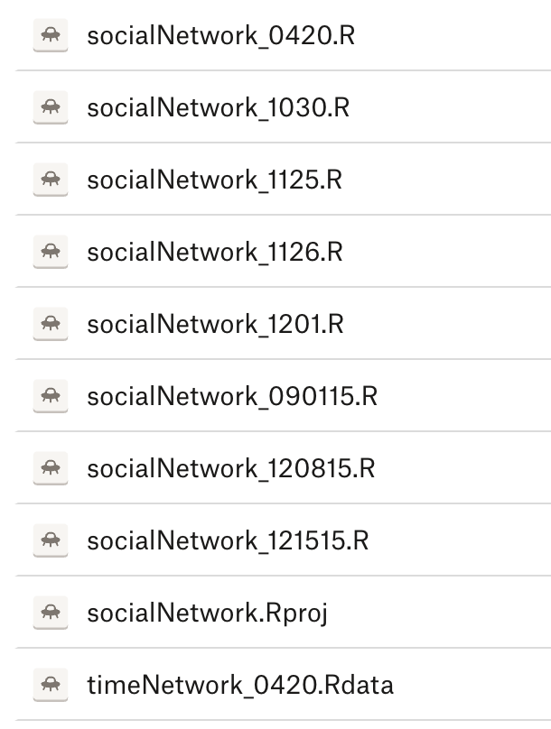

My past self obviously could have been better about using consistent formatting for dates (some of these include year and some do not), but even if I had done so there are a few drawbacks to this approach:

* Each of these files takes up space on my hard drive. Even if each is very small, they will add up.
* I don't know what changes were made between each of these versions, so it would be hard for me to go back to an old version to find deleted or modified code.
* I can't be totally sure which of these is the most recent version. Sometimes, the "date modified" doesn't line up with the date on the file. What to do then?

Git provides a solution to this problem. Instead of manually saving edits to a file in a separate copy “just in case”, and instead of having to keep track of which is the most recent version, we can put our files under version control and let Git keep track of the changes we make. Using Git, you will only have one file for each script on your computer, but you will have a log of changes, including your own notes on what you changed and why. For example:

<div class="figure" style="text-align: left">
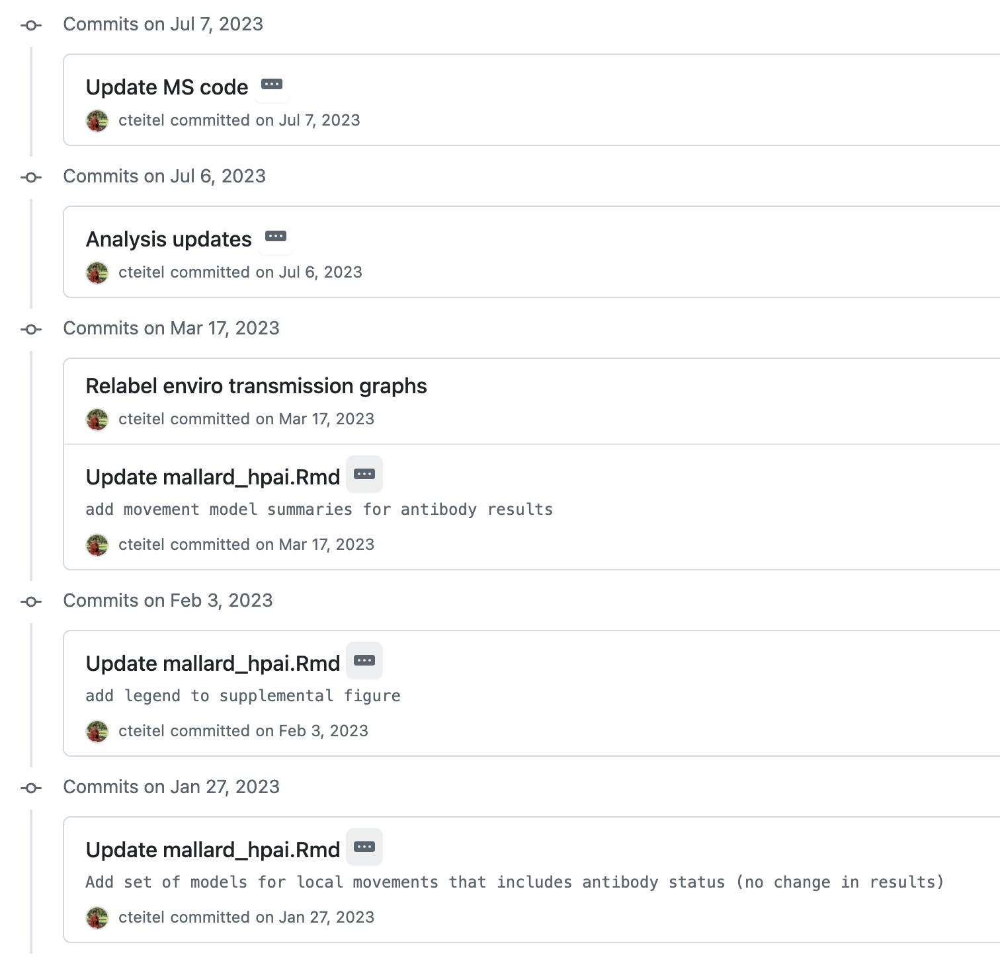
<p class="caption">(\#fig:unnamed-chunk-3)Commit message examples</p>
</div>

You can also easily see the changes made at each stage:

<div class="figure" style="text-align: left">
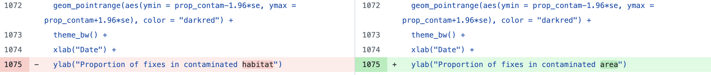
<p class="caption">(\#fig:unnamed-chunk-4)A diff example</p>
</div>

Additional reading: https://swcarpentry.github.io/git-novice/01-basics.html

## Getting started with Git and GitHub

### Git

--> [Follow these instructions to install Git.](https://git-scm.com/book/en/v2/Getting-Started-Installing-Git)

### GitHub

GitHub extends Git for collaboration (including with yourself by syncing across your devices, if applicable). Two people can have the same repository on their computers, then sync these changes to the remote repository (called fetching/pulling and pushing). During this process, you can see what changes your collaborator made and identify and conflicts, for example where you edited the same code at the same time.

To make a GitHub account:

1. Go to https://github.com and follow the “Sign up” link at the top-right of the window.
2. Follow the instructions to create an account.
3. Verify your email address with GitHub.
4. Configure multifactor authentication. You can use Duo or any other authenicator app you already have.

### GitHub Desktop

--> [Download and install GitHub Desktop](https://desktop.github.com/download/)

--> [Follow Part 1 on this page to set up GitHub Desktop.](https://docs.github.com/en/desktop/overview/getting-started-with-github-desktop)

### GUIs

As an easy on-ramp to using Git, we will use a graphical user interface (GUI). GUIs provide point-and-click interfaces. Most of the applications you use provide a GUI - you don't have to type in commands for them to work. In this lesson, we will use the GUI side-by-side with the command-line method so you can see which works best for you. The GUI is more limited in its functionality but a good place to get familiar with the principles of version control before moving on to more advanced applications.

## Basic Git structure and commands


The central processes for using Git are:

* `init`: Creates a new empty repository in your current directory
* `add`: Sends a new or changed file in your working directory to the staging area
* `commit`: Sends a staged file to the local repository

When using a remote repository on GitHub (or another platform, we add):

* `push`: Sends changes from the local repository to the remote repository
* `fetch`: Gets changes from the remote repository and compares them with the local repository (but does nothing to local files)
* `pull`: Gets changes from the remote repository and makes the corresponding changes to local files

## Using Git with GUIs

If you look up resources for using Git, you will probably find information about using it in the command line. Doing so provides more flexibility and functionality, but using a GUI streamlines the process and makes it easier to visualize, so we will start there. I find GUIs especially helpful for looking at history and working with GitHub. One GUI is even built into RStudio. Some instructions for using the command line are at the end of this chapter.

### GitHub Desktop

We will start using Git with [GitHub Desktop](https://desktop.github.com/download/), which provides the simplest interface. If you start doing more complicated operations where you are collaborating a lot, you will outgrow GitHub Desktop, but its simplicity makes it great for beginners.

### Creating a repository (one time per project)

A "repository" is essentially Git's version of a directory, and it parallels a directory on your computer. Files in this directory/repository are tracked by Git. In GitHub Desktop, we have three options for adding a new respository to the app:

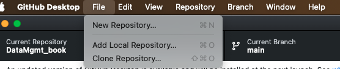

1. "New repository": Start tracking a new directory that is not yet tracked by Git.
2. "Add local repository": Add a repository to GitHub Desktop that's already on your computer (for example, if you initiated it in the command line or using a different GUI).
3. "Clone repository": Add a repository to GitHub Desktop that exists somewhere online. We will work with this later.

For now, we want Option 1. The "New repository" option will pull up a window. 

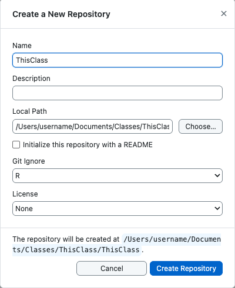

You can either create a new directory (if you have not yet started making files) or add an existing directory (if you have already started work). To add an existing directory, make sure your "Name" is the same as the folder you want to track. For example, if the folder I want to track is at `/Users/username/Documents/example_repo`, then I would use `example_repo` as the Name and `/Users/username/Documents` as the Local Path. Double-check that this worked by navigating to the directory on your computer and making sure no new folders have been added.

I suggest that you start with the "R" option for Gitignore; we'll learn about this below.

Once you complete this process, you should see the name of your repository in you GitHub Desktop menu. GitHub Desktop automatically makes your first commit, in which it adds all the files in the directory. 

### Staging and committing changes

Creating a repository enables Git to start tracking files within it, and GitHub Desktop automatically adds all the files in the directory, but once you make more changes you need to *stage* and *commit* those changes. Each commit is a snapshot of what the repository looked like at the time it was committed. When you commit a file, you save that version forever and will be able to go back to it. Remember, this is many steps beyond clicking "Save" on your script - you should commit a file when you feel you have made significant changes that you might want to go back to (or undo).

In GitHub Desktop, we have a visual of how much each file has changed since our last commit. For example, here's what this file looks like right now:

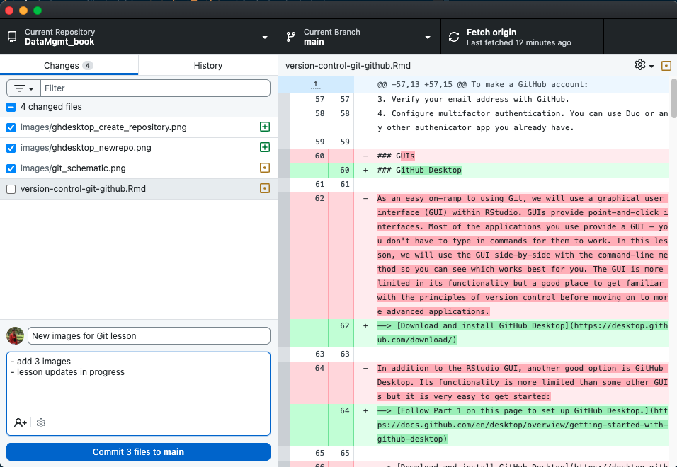

On the left side is a ilst of the four files I have changed since my last commit. Two of them are new, indicated by the green plus sign, and two are changed, indicated by the gold dot. I have selected the file `version-control-git-github.Rmd`, so the right-hand panel shows the deleted text (red) and the added text (green) since my last commit. 

*Staging* is the process of selecting which files to commit. In the left-hand menu, I have checked boxed next to three changed or added files, but I'm not ready to commit changes to the script, so I left those unchecked. 

To *commit* the changes (new files and change to one file), I need to write a note. The message should describe the changes made to the file/s since the previous commit. It is a good habit to write detailed commit messages, so that when we need to go back and recover a previous version of a file, you can read the history of commits and easily find the version we are looking for. Now that I've done that, I can click the "Commit" button. Those changes will now appear in my History tab.

### Reviewing your history

The History tab lists all the commits I have made since initializing the repository. I can click on each one to see which files were changed, read my detailed notes, and look at exactly what changed within each file.

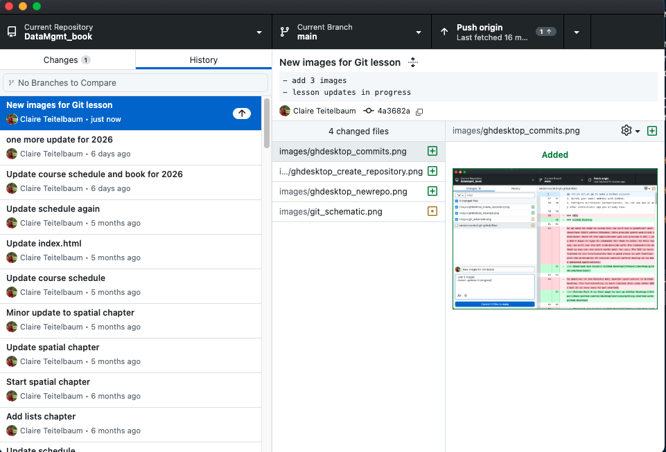

Right-clicking on a commit in my history gives me many options; most of these are more advanced than what we will use today, but for the most recent commit, you might want to use the "Amend" and "Undo" options. Be careful, though - if you have made changes since you committed, you can create conflicts when trying to undo or *revert* commits.

### Ingoring files (.gitignore)

Git is optimized to work with plain text files (for example .txt or R scripts), and it doesn't really understand binary files (which is how Word files and PDFs are stored, for example). Also, some files typically do not need to be version controlled, such as images; in fact, because they are large files, version controlling images can end up clogging your workflow. Make sure you are always aware of what exactly you're adding. When in doubt, add files one by one. We can set up some rules to exclude types of files or individual files that we don't want to track. Some rules of thumb:

* File encoding (plain-text vs. binary): Git cannot track changes within binary files, so, even though you **can** store these files under version control, you won't be able to use Git to compare different versions, so you often want to avoid tracking these;
* Code-generated: anything that can be reproduced by running code does not need to be version-controlled;
* Size: files that are too big will slow down the functioning of Git. As a benchmark, you can keep in mind the maximum size limit enforced by GitHub, which is 100 MB -- but if you follow the two criteria above, you will rarely end up with this problem because 100 MB's worth of plain-text files is a whole lot of plain text. 

A text file called ".gitignore" in a repository stores information about what types of files to ignore when finding changes. You can create this when initializing the repository or just create a text file using your text editor (Notepad for Windows, TextEdit for MacOS, etc). The name must be exactly ".gitignore" for Git to recognize it. The file must have no extension (i.e., .txt) so go ahead and delete that (don't worry about any warnings). You may not see the .gitignore file in your directory, but it is there; to view it, make sure you can see hidden files (Cmd+Shift+. on Mac; View>Show>Hidden items on Windows).

Once .gitignore is created, we can start adding rules. Nothing prevents us from listing files in .gitignore one by one, but this approach is not efficient. Instead, we can use pattern matching. What all these files have in common is they are all either .jpg's or .docx's. We can use the wildcard '*' to signify "any character" before the file extension:

```
\*.jpg  
\*.docx  
```

This will exclude any .jpg or .docx file from being tracked by Git in this repository. Since the images are conveniently located all together in one folder, we can also just do this:

```
figures/
```

We should also add the following rules to ignore the user-specific R project files:

```
\*.Rhistory   
/.Rproj.user/  
```

### RStudio

RStudio's GUI is similar to GitHub Desktop and can be nice if you mainly use Git for R code, because it is built into the same app. The main difference is that RStudio integrates Git with R projects, so it will not work if your scripts are not part of a project; GitHub Desktop doesn't require you to have an R project established and works outside RStudio, which can be helpful if you are working with files outside of R and don't want to open RStudio just to use Git. Luckily, we already created a project for this class. If you followed the instructions above, when you open that project, you will probably already see a "Git" tab in your "Environment" panel in RStudio. If you don't (or want to go another route for your next project), you can initiate version control in the project options: 


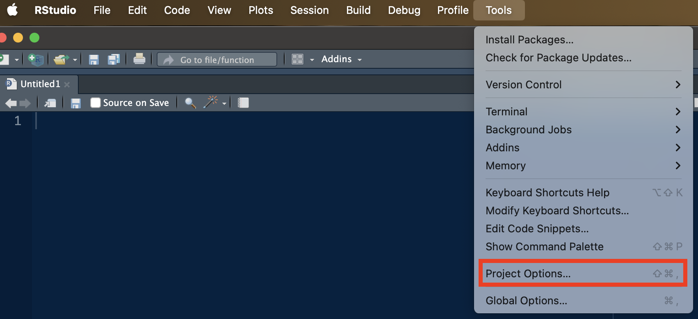

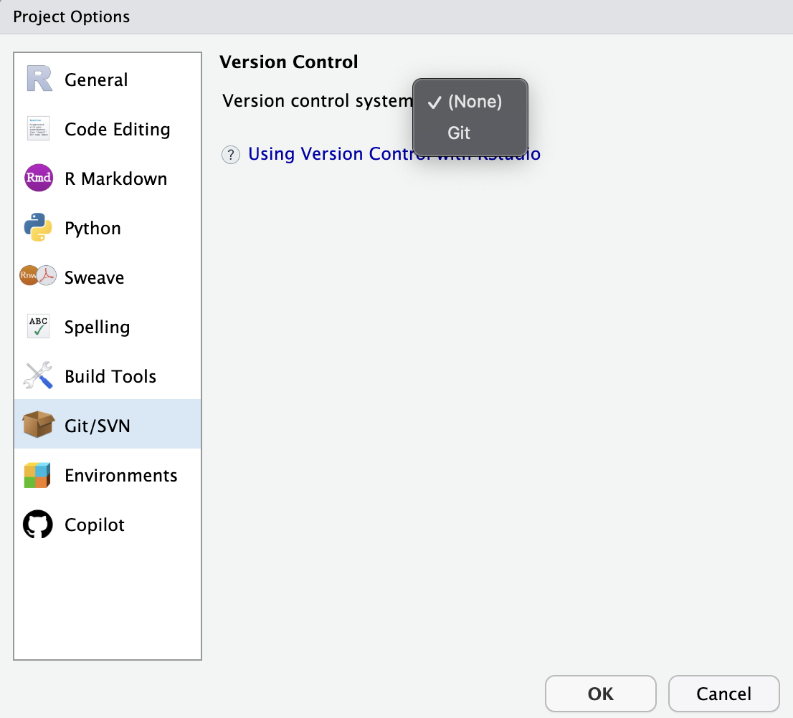

Once version control is set up, you should see the "Git" menu above the Source panel and a Git tab in the Environment panel.

Using the "Commit" menu, you can easily stage changes, write commit messages, and see changes to be committed:

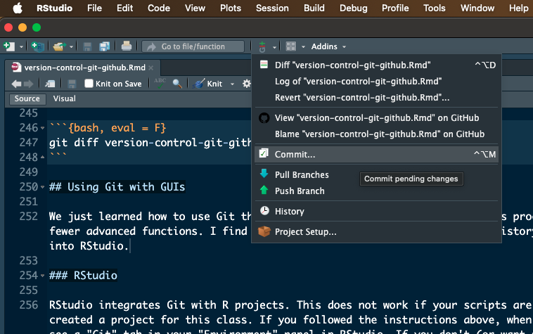

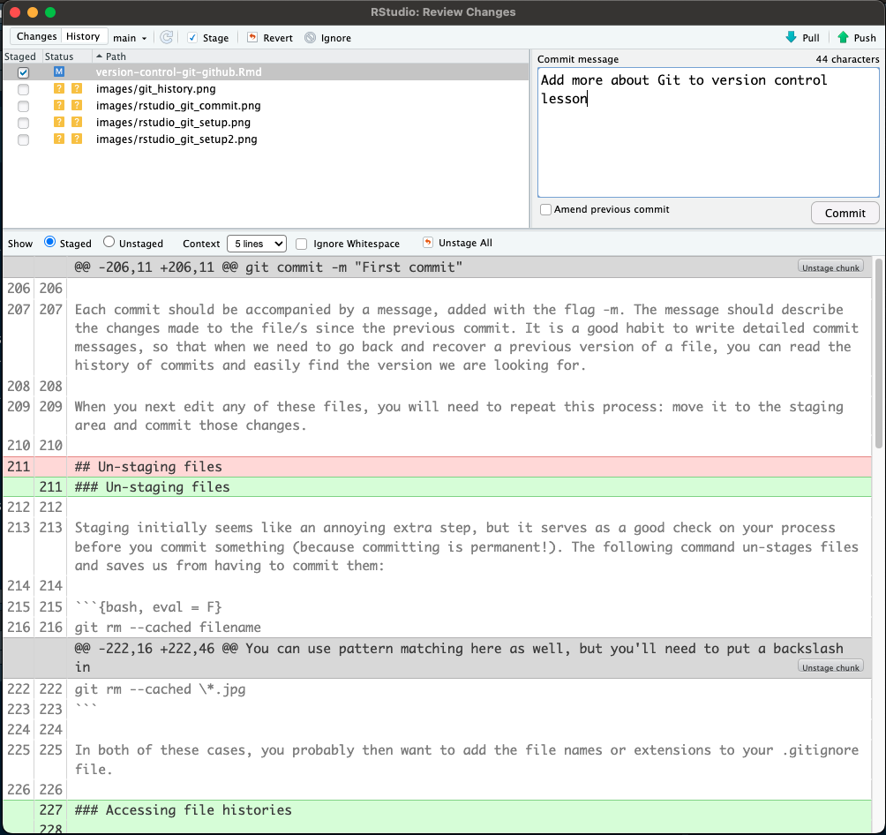

You also see the "Pull" and "Push" buttons available in the top-left corner of this menu. These will be grayed out if you haven't get set up your repository with a remote repository (e.g., on GitHub). We will set this up later.

## Using Git in the command line

*This section is mostly copied, with minimal editing, from materials for [WILD 6900: Tools for Reproducible Science](https://ecorepsci.github.io/reproducible-science/)*

### The command line

You can use Git from the command line in the computer’s terminal. The command line can be intimidating if you haven’t used it before, but using Git only requires basic familiarity with it. Commands are slightly different between operating systems (Windows vs. Mac/Linux).

When you open up the terminal (or command prompt) on your computer, you’ll see a symbol, on many computers it is a “$” or “>”, followed by a blinking cursor. That symbol is called the prompt, and it means the terminal is waiting for your input. If you copy-paste any code from this chapter into your terminal, make sure you only copy the part after the prompt (don’t copy the >). Also, if Ctrl+V does not work in the terminal, you can right-click to paste (Cmd+V should work on a Mac).

When you open the terminal, you should automatically be located in the root directory of your file system (or your home directory, if you have a computer with multiple users). On a Mac, this will usually look like

```
COMPUTER-NAME: ~username$
```

And on Windows

```
C:\Users\username>
```

To move around directories we use the command `cd`, which stands for "change directory". For example, to move to the Research subfolder in my Documents folder, I might type in:


``` bash
cd Documents/Research
```

To go up a directory, use "..". The following command would take me back up to my Documents folder:


``` bash
cd ..
```

### Configuring Git (one time only)

On a command line, Git commands are written as `git` `verb` `options`, where `verb` is what we actually want to do and `options` is additional optional information which may be needed for the verb. To set up Git for the first time:


``` bash
git config --global user.name "My name"
git config --global user.email "myemail@uga.edu"
```

This user name and email will be associated with your subsequent Git activity, which means that any changes pushed to GitHub, BitBucket, GitLab, etc. will include this information. The email address used should be the same as the one used when setting up your account. There are more configuration options you can personalize, but we won’t get into that. If you want to check what configuration options you have active, you can use:


``` bash
git config --list
```

### Creating a repository (one time per project)

To create a repository (in other words, to put a directory under version control), we first have to navigate to that directory. Here, we will create a repository for this class.


``` bash
cd Documents/Classes/FANR8950_Fall2025
```

> A side note: if you have spaces in any of your directory names (for example, if your directories are in OneDrive), you will need to put the path in quotes. Otherwise, the terminal thinks those spaces indicate a new argument or command.

Now we will enable Git to start tracking everything inside this folder:


``` bash
git init
```

This command initializes Git. You won't immediately notice any changes in the directory, but if you show hidden files in your file explorer you will notice there is a new subfolder called .git. That folder is where Git will store all of its version control information. You don’t have to worry about the content of that folder.

### Staging files

Creating a repository enables Git to start tracking files within it, but that does not happen automatically. We have to tell Git which files we want to track. We can check what Git is tracking so far by using:


``` bash
git status 
```

At the bottom, we'll see a list of untracked files. We need to switch on tracking on those. To begin tracking a new file, we use the verb 'add'. For example, to track a file named "exercise2.R" we would type:


``` bash
git add exercise2.R
```

This works well if we want to add a specific file. If we want to start tracking the whole content of the folder, we can do:


``` bash
git add --all
```

If you create a .gitignore file before adding all files, those listed in .gitignore will not be added.

### Committing files

Now that our files are staged, we are ready to send them to the local repository. This is called committing. Each commit is a snapshot of what the repository looked like at the time it was committed. When you commit a file, you save that version forever and will be able to go back to it. Remember, this is many steps beyond clicking "Save" on your script - you should commit a file when you feel you have made significant changes that you might want to go back to (or undo). 

For our first commit, we use the following command: 


``` bash
git commit -m "First commit"
```

Each commit should be accompanied by a message, added with the flag -m. The message should describe the changes made to the file/s since the previous commit. It is a good habit to write detailed commit messages, so that when we need to go back and recover a previous version of a file, you can read the history of commits and easily find the version we are looking for. 

When you next edit any of these files, you will need to repeat this process: move it to the staging area and commit those changes.

### Un-staging files

Staging initially seems like an annoying extra step, but it serves as a good check on your process before you commit something (because committing is permanent!). The following command un-stages files and saves us from having to commit them:


``` bash
git rm --cached filename
```

You can use pattern matching here as well, but you'll need to put a backslash in front of the wildcard:


``` bash
git rm --cached \*.jpg
```

In both of these cases, you probably then want to add the file names or extensions to your .gitignore file.

### Accessing file histories

Git will allow you to recover previous versions of any tracked file at the time it was committed. You can access the history of commits using:


``` bash
git log
```

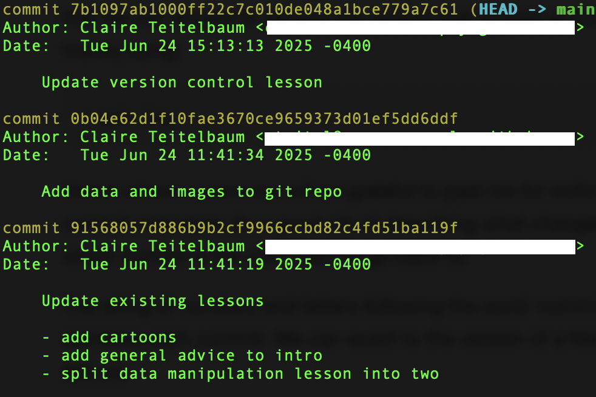

The string of numbers and letters following the word ‘commit’ in the log is called the hash and it uniquely identifies each commit. If I wanted to revert to the version of the data manipulation lesson before I split it in two, I would use:


``` bash
git checkout 91568057d886b9b2cf9966ccbd82c4fd51ba119f -- data_manipulation.Rmd
```


If my commit messages are not as helpful as I would like, or I want more detail, I can also ask for a line-by-line comparison of old and new versions of a file using `git diff`. Text I added will be preceded by a "+" and text I deleted with a "-".


``` bash
git diff version-control-git-github.Rmd
```

