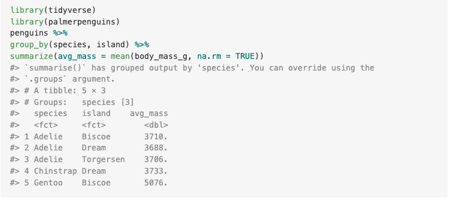

# Coding Best Practices {#style}

## Objectives

* Write code in a consistent, readable style
* Understand best practices for citing R and R packages in scientific products
* Create README files for data/code
* Create reproducible examples for code sharing and troubleshooting

## Additional reading

Hadley Wickham, Mine Çetinkaya-Rundel, and Garrett Grolemund. R for Data Science (2e). Chapter 4: Workflow: code style. Available: https://r4ds.hadley.nz/workflow-style.html

## Style

### Why is code style important?

Whether you are working in the `tidyverse` or in base R, consistent style can help make your code more readable, both by others and for yourself. Style includes practices like consistent formatting of variable names, using spaces, and using new lines within code chunks. Like punctuation in regular writing, these practices can tell a reader when to stop and consider what has come before, and can break up the monotony of lines and lines of code.

### Object names

R has the following constraints on object names:

* they cannot contain spaces;
* they must start with a letter (not a number of symbol);
* they cannot contain most mathematical symbols (+, -, =, etc.),
* but they can contain dots (.) and underscores (_).

Two common ways of naming objects are `camelCase` and `snake_case`, which separate new words in variable names with either a capital letter or an underscore. You might also see people use `dot.case`. All of these can work, but `snake_case` is generally considered preferable because it avoids issues related to capitalization (e.g., what if you wanted a variable called `ANOVA_results`? Would it be `ANOVAResults`?).

In general, it's best to strike a balance between short, fast-to-type variable names and longer, descriptive names. I personally have a bad habit of bringing data sets in and calling them all `dat` (for data - but `data` is an R function, so I prefer it not to be an object name). But, later in the script, how am I to know which data set is `dat` and which is `dat1`?

### Spaces and new lines

Spaces can help a reader identify functions and operators, many of which are small and easy to miss. It is therefore recommended that you put a space on both sides of mathematical and assignment operators (`+`, `-`, `<-`, etc.). It is also nice to put spaces after commas, like you would in normal English writing. Avoid putting spaces before or after the parentheses that define functions; this makes it harder to tell where the function arguments start and end. 

R is already written in a monospaced font (meaning that every character is the same width), so you can also use spaces to help you align your code:

```{r, eval = F}
dat %>%
  mutate(tigers       = ifelse(str_detect(species, "tiger"), "yes", "no"),
         mammals      = species != "turtle",
         count_hourly = count / 24)
```

In that code chunk above, you can also see that I added a new line after the pipe and after each variable I wanted to add in `mutate`. Especially when you call functions within functions (e.g., the `ifelse` above), new lines help delineate where a new variable, row, or column comes into play.

### Comments!

You've probably already noticed that you can denote code as a comment using `#`. This means that R will not try to execute the code:

```{r}
# You can tell that this is a comment
# because it has spaces and R didn't get mad.
# Also, it's italicized and preceded by #
```

Good commenting takes practice. Like with variable names, it's a balance between the convenience of coding without comments and the benefit of having each line of code explained - which then creates a lot of clutter.

For example:

```{r, eval = F}
# Load data
dat <- read_csv("data/surveys.csv")
# Remove the "species" column
dat <- select(dat, -species)
# Multiply counts by 24
dat <- mutate(dat, count = count * 24)
```

These comments aren't particularly useful: for example, the single line of code that loads data probably doesn't need explanation. Instead, useful comments might be more like this:

```{r, eval = F}
# Raw survey data from 2015
dat <- read_csv("data/surveys.csv")
# Species column is redundant with taxon column
dat <- select(dat, -species)
# Convert hourly counts to daily equivalent
dat <- mutate(dat, count = count * 24)
```

Now, we are explaining why each line exists instead of what it is doing; what it is doing is already contained in the code itself!

RStudio will also recognize some comments as section breaks, which then appear on the bottom-left corner of your script and allow you to navigate across the document. These look like this:

```{r}
# Header 1 -----------
# Header 2 -----------
```

Any line that starts with a `#` and ends with at least three dashes or `#`s will automatically become a header.

### RStudio settings that can help

RStudio provides a few features that can help with code style:

* Autofill for both object names and functions
* Bracket highlighting
* Alignment lines

There is also the RStudio add-in called [styler](https://styler.r-lib.org/), which formats your code automatically. By default, it follows the `tidyverse` style (see Additional Reading above) but you can also customize it to your preferred style.

## Writing a README

A readme file provides information about data or software (or generically, a set of files). A README helps other users interpret your files when sharing or publishing data, code, or software. At its most basic, a README is a simple text file that provides general information about a project, such as its title and authorship. Other common and useful components are:

* Sharing/access information (e.g., licenses)
* Data/file overview (file list)
* Methodological information (how were data generated?)
* Instructions for use (e.g., software installation)

Resources, including templates:

* https://www.makeareadme.com/
* https://docs.github.com/en/get-started/writing-on-github/getting-started-with-writing-and-formatting-on-github/basic-writing-and-formatting-syntax
* https://data.research.cornell.edu/data-management/sharing/readme/

## Citing packages and software

https://cran.r-project.org/web/packages/report/vignettes/cite_packages.html

Citing R packages is an important step in reproducibility and also important for crediting the authors of those packages, just like you would do for using data or information from any other source. However, guidelines vary: some sources would suggest you cite *every* package you use, while others suggest you cite just the most important packages. Current practice in ecology is usually to cite packages that produce results (e.g., statistical packages, simulation, etc.) but not packages used for data processing and manipulation (e.g., tidyverse). It is also important to cite R itself. Remember at this point that it is R that is doing the work under the hood; RStudio is just the way you are accessing R. A typical citation might look something like this:

> All analyses were conducted in R version 4.1.1 (R Core Team 2024). The packages lme4 and vegan (Bates et al. 2015; Oksanen et al. 2025) were used for linear models and community composition analysis, respectively.

You can get citation information for packages using the `citation("packagename")` function and your R version using `R.Version()`:

```{r}
citation("tidyverse")
R.Version()
```

It is also best practice to present information of *all* packages in appendices of a report or manuscript. Why? This is especially important for package versions of analysis software - sometimes under-the-hood methods change, which can change results. Proper documentation is therefore crucial!

A note of caution: remember to include version numbers in all citations. Reference managers like Zotero will often leave these out of reference lists, so be sure to double check.

Another helpful tool for citations is the `report` package, which will conveniently output a list of all the packages you have loaded in your script!

```{r}
library(report)
cite_packages()
```

## Reproducible examples

We mentioned reproducible examples in our [troubleshooting lesson](#troubleshooting). With the advent of chatbots to help with troubleshooting, you might be less likely to need such an example for posting on Stack Overflow, but these examples can still be helpful for asking these chatbots for advice, for sharing code with colleagues, and eventually for teaching. For example, you might be working with a very large data set, or with private data that you can't share, but you want to share a piece of code and show how it works. They can also help you clarify the problem by stripping out unnecessary complexity. At its base, a reproducible example includes:

1. A **minimal dataset** that can demonstrate the problem (or concept)
2. The **minimal code** that uses this data to reproduce the problem (or concept)
3. All necessary information on the packages and system (R version, OS, and maybe the output of `sessionInfo()`) that could affect the code, as well as the random seed for anything with a random process

### 1. The minimal dataset

There are two main approaches to a minimal data set: a built-in dataset and an example dataset. Sometimes, the problem can be reproduced using one of the datasets built into base R (which you can access using `data()`). Other times, you need to create a data set that is more like the one you are working with - for example, if it needs to include a factor variable with the same number of levels, or a variable that is in a date format.

### 2. The minimal code

Your script probably contains much more than the line of code that produced the error (or result). To make a *mimimal* code example, you want to remove any parts of the code that are not necessary. Some common code components to leave out include:

* Data processing (e.g., converting types), unless these are the steps that produce an error (or result). Instead, your minimal data should already be in this format.
* Lines of code beyond the error or result (e.g., visualizations). 

### 3. Other necessary information

Sometimes, different versions of R packages and R itself give different results because of updates that create or fix bugs, or changes to programs that alter data processing. It is therefore helpful to include information about package versions, your operating system, and the version of R you were using in your reproducible example. You can access all this information in one go using:

```{r}
sessionInfo()
```

### An example

Here is an example of a simple error and how you might go about creating a reproducible example for it:

```{r, error = T}
library(tidyverse)
library(palmerpenguins)

penguins %>%
  group_by(species, island) %>%
  summarize(avg_mass = mean(bodyweight_g, na.rm = TRUE))
```

Let's say we can't figure out why this error was produced (can you?). We first want to isolate the problem and make it reproducible. To do so, we:

* Reduce the dataset to only the relevant columns
* Create a small subset (fewer rows)
* Simplify the code, if possible

```{r, error = T}
# Minimal dataset and code for reproducible example
library(tidyverse)

# Create a small tibble with just the relevant structure
mini_data <- tibble(
  species = c("Adelie", "Chinstrap", "Gentoo"),
  island = c("Torgersen", "Dream", "Biscoe"),
  body_mass_g = c(3750, 3800, 5000)
)

# This code produces the same error
mini_data %>%
  group_by(species, island) %>%
  summarize(avg_mass = mean(bodyweight_g, na.rm = TRUE))
```

Now that the code is simplifed, it is a little easier to spot the problem: we are using a different variable name for body mass in the summary (`bodyweight_g`) than is in the original data (`body_mass_g`). Now, we can fix the error:

```{r}
penguins %>%
  group_by(species, island) %>%
  summarize(avg_mass = mean(body_mass_g, na.rm = TRUE))
```

### The `reprex` package

The [`reprex` package](https://reprex.tidyverse.org/) is designed to help you create reproducible examples. You can paste your code into the `reprex()` function and it will output what your code looks like in a clean environment (i.e., without all your packages and data already loaded). This way, you can make sure that your minimal data and code will work for someone else.

```{r, eval = F}
library(reprex)
reprex({
  library(tidyverse)
  library(palmerpenguins)
  penguins %>%
  group_by(species, island) %>%
  summarize(avg_mass = mean(body_mass_g, na.rm = TRUE))
})
```


```{r, fig.cap="The output of reprex in your RStudio viewer pane", fig.align='center', out.width='80%', echo = FALSE, eval = TRUE}

```
