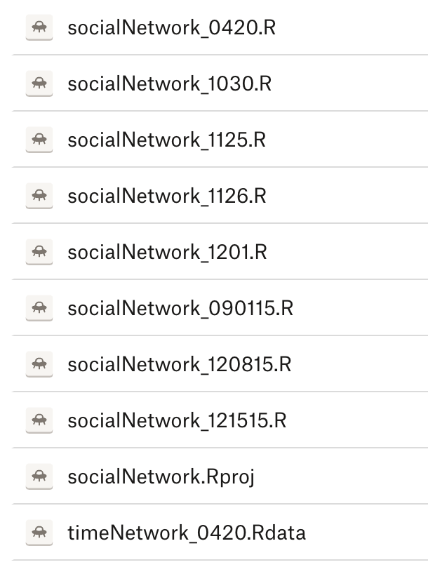
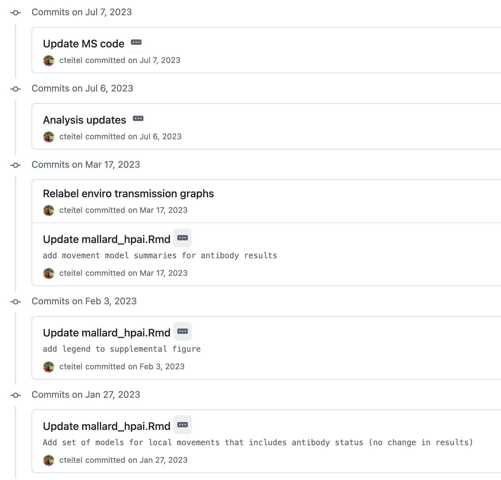
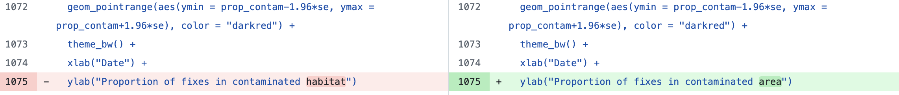
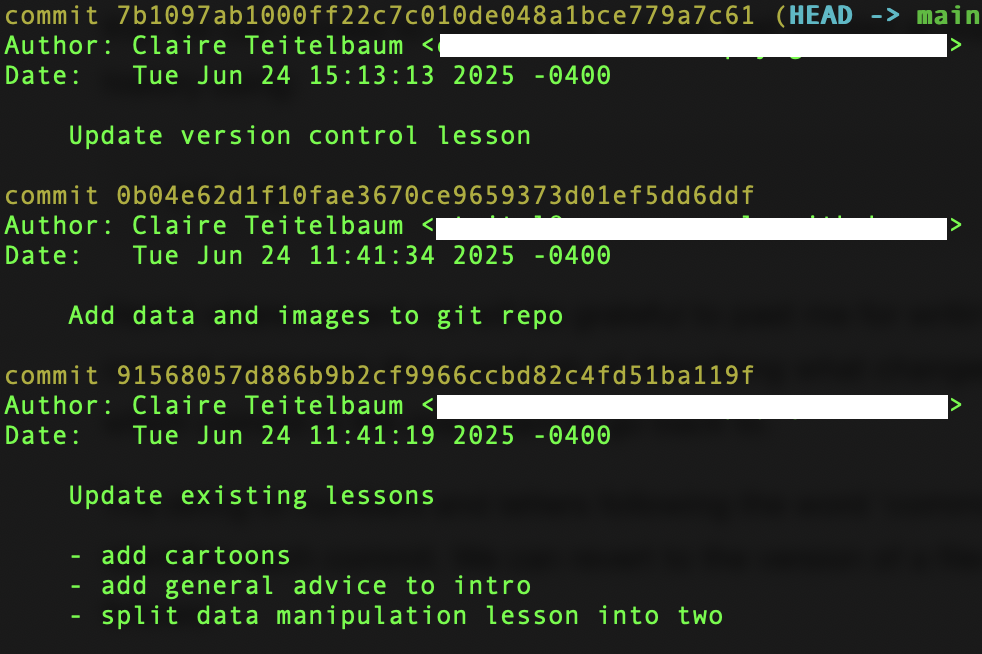
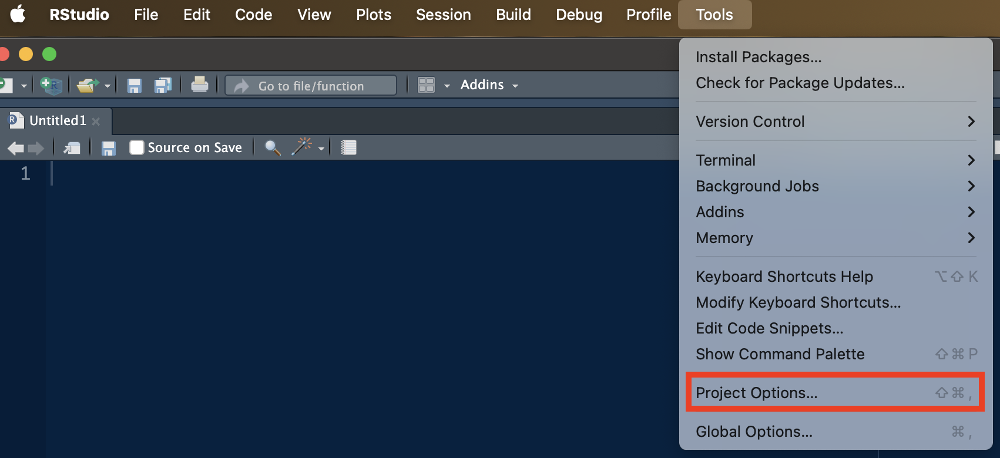
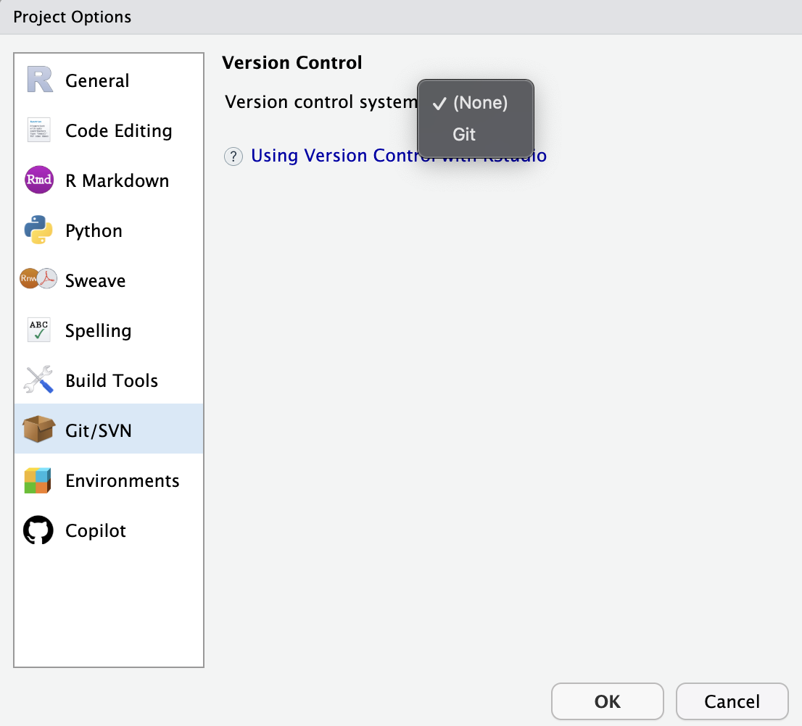
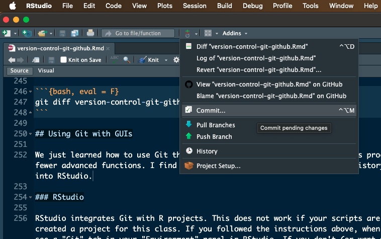
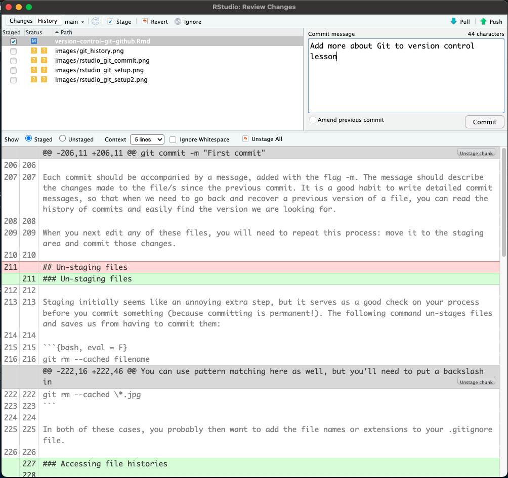

# Version Control with Git and GitHub {#git}

```{r, fig.cap="Fairly accurate. (https://xkcd.com/1597/)", fig.align='center', out.width='50%', echo = FALSE, eval = TRUE}
knitr::include_graphics("https://imgs.xkcd.com/comics/git.png")
```

https://swcarpentry.github.io/git-novice
https://ecorepsci.github.io/reproducible-science/version-control-git.html 

## Objectives

* Understand the benefits and challenges of using Git for version control
* Modify, stage, and commit changes with Git
* Fetch and push code from/to a remote repository

## The what and why of version control

Git is a version control system. It tracks all the changes you make to your files and allows you to go back to previous versions as far back in time as you need. Git is useful for keeping yourself organized and can be combined with collaboration software (GitHub) to make sharing code and other files easy. You might have a folder that looks something like this:



My past self obviously could have been better about using consistent formatting for dates (some of these include year and some do not), but even if I had done so there are a few drawbacks to this approach:

* Each of these files takes up space on my hard drive. Even if each is very small, they will add up.
* I don't know what changes were made between each of these versions, so it would be hard for me to go back to an old version to find deleted or modified code.
* I can't be totally sure which of these is the most recent version. Sometimes, the "date modified" doesn't line up with the date on the file. What to do then?

Git provides a solution to this problem. Using Git, you will only have one file for each script on your computer, but you will have a log of changes, including your own notes on what you changed and why. For example:



You can also easily see the changes made at each stage:



Additional reading: https://swcarpentry.github.io/git-novice/01-basics.html

## Getting started with Git and GitHub

### Git

--> [Follow these instructions to install Git.](https://carpentries.github.io/workshop-template/install_instructions/#git)

### GitHub

GitHub extends Git for collaboration (including with yourself by syncing across your devices, if applicable). Two people can have the same repository on their computers, then sync these changes to the remote repository (called fetching/pulling and pushing). During this process, you can see what changes your collaborator made and identify and conflicts, for example where you edited the same code at the same time.

To make a GitHub account:

1. Go to https://github.com and follow the “Sign up” link at the top-right of the window.
2. Follow the instructions to create an account.
3. Verify your email address with GitHub.
4. Configure multifactor authentication. You can use Duo or any other authenicator app you already have.

### GUIs

As an easy on-ramp to using Git, we will use a graphical user interface (GUI) within RStudio. GUIs provide point-and-click interfaces. Most of the applications you use provide a GUI - you don't have to type in commands for them to work. In this lesson, we will use the GUI side-by-side with the command-line method so you can see which works best for you. The GUI is more limited in its functionality but a good place to get familiar with the principles of version control before moving on to more advanced applications.

In addition to the RStudio GUI, another good option is GitHub Desktop. Its functionality is more limited than some other GUIs but it is very easy to get started:

--> [Download and install GitHub Desktop](https://desktop.github.com/download/)

## Basic Git structure and commands


The central commands for using Git are:

* `git init`: Creates a new empty repository in your current directory
* `git add`: Sends a new or changed file in your working directory to the staging area
* `git commit`: Sends a staged file to the local repository

When using a remote repository on GitHub (or another platform, we add):

* `git push`: Sends changes from the local repository to the remote repository
* `git fetch`: Gets changes from the remote repository and compares them with the local repository (but does nothing to local files)
* `git pull`: Gets changes from the remote repository and makes the corresponding changes to local files

## Using Git in the command line

### The command line

You can use Git from the command line in the computer’s terminal. The command line can be intimidating if you haven’t used it before, but using Git only requires basic familiarity with it. Commands are slightly different between operating systems (Windows vs. Mac/Linux).

When you open up the terminal (or command prompt) on your computer, you’ll see a symbol, on many computers it is a “$” or “>”, followed by a blinking cursor. That symbol is called the prompt, and it means the terminal is waiting for your input. If you copy-paste any code from this chapter into your terminal, make sure you only copy the part after the prompt (don’t copy the >). Also, if Ctrl+V does not work in the terminal, you can right-click to paste (Cmd+V should work on a Mac).

When you open the terminal, you should automatically be located in the root directory of your file system (or your home directory, if you have a computer with multiple users). On a Mac, this will usually look like

```
COMPUTER-NAME: ~username$
```

And on Windows

```
C:\Users\username>
```

To move around directories we use the command `cd`, which stands for "change directory". For example, to move to the Research subfolder in my Documents folder, I might type in:

```{bash, eval = F}
cd Documents/Research
```

To go up a directory, use "..". The following command would take me back up to my Documents folder:

```{bash, eval = F}
cd ..
```

### Configuring Git (one time only)

On a command line, Git commands are written as `git` `verb` `options`, where `verb` is what we actually want to do and `options` is additional optional information which may be needed for the verb. To set up Git for the first time:

```{bash, eval = F}
git config --global user.name "My name"
git config --global user.email "myemail@uga.edu"
```

This user name and email will be associated with your subsequent Git activity, which means that any changes pushed to GitHub, BitBucket, GitLab, etc. will include this information. The email address used should be the same as the one used when setting up your account. There are more configuration options you can personalize, but we won’t get into that. If you want to check what configuration options you have active, you can use:

```{bash, eval = F}
git config --list
```

### Creating a repository (one time per project)

To create a repository (in other words, to put a directory under version control), we first have to navigate to that directory. Here, we will create a repository for this class.

```{bash, eval = F}
cd Documents/Classes/FANR8950_Fall2025
```

> A side note: if you have spaces in any of your directory names (for example, if your directories are in OneDrive), you will need to put the path in quotes. Otherwise, the terminal thinks those spaces indicate a new argument or command.

Now we will enable Git to start tracking everything inside this folder:

```{bash, eval = F}
git init
```

This command initializes Git. You won't immediately notice any changes in the directory, but if you show hidden files in your file explorer you will notice there is a new subfolder called .git. That folder is where Git will store all of its version control information. You don’t have to worry about the content of that folder.

### Staging files

Creating a repository enables Git to start tracking files within it, but that does not happen automatically. We have to tell Git which files we want to track. We can check what Git is tracking so far by using:

```{bash, eval = F}
git status 
```

At the bottom, we'll see a list of untracked files. We need to switch on tracking on those. To begin tracking a new file, we use the verb 'add'. For example, to track a file named "exercise2.R" we would type:

```{bash, eval = F}
git add exercise2.R
```

This works well if we want to add a specific file. If we want to start tracking the whole content of the folder, we can do:

```{bash, eval = F}
git add --all
```

### Ignoring files

Git is optimized to work with plain text files (for example .txt or R scripts), and it doesn't really understand binary files (which is how Word files and PDFs are stored, for example). Also, some files typically do not need to be version controlled, such as images; in fact, because they are large files, version controlling images can end up clogging your workflow. Make sure you are always aware of what exactly you're adding when you use 'git add --all'. When in doubt, add files one by one. We can set up some rules to exclude types of files or individual files that we don't want to track. Some rules of thumb:

* File encoding (plain-text vs. binary): Git cannot track changes within binary files, so, even though you **can** store these files under version control, you won't be able to use Git to compare different version, so there's really no point in tracking these;
* Code-generated: anything that can be reproduced by running code does not need to be version-controlled;
* Size: files that are too big will slow down the functioning of Git. As a benchmark, you can keep in mind the maximum size limit enforced by GitHub, which is 100 MB -- but if you follow the two criteria above, you will rarely end up with this problem because 100 MB's worth of plain-text files is a whole lot of plain text. 

You can create a text file called ".gitignore" in our repository by using your default text editor (Notepad for Windows, TextEdit for MacOS, etc). The name must be exactly ".gitignore" for Git to recognize it. The file must have no extension (i.e., .txt) so go ahead and delete that (don't worry about any warnings). 

Once .gitignore is created, we can start adding rules. Nothing prevents us from listing files in .gitignore one by one, but this approach is not efficient. Instead, we can use pattern matching to kill many birds with one stone. What all these files have in common is they are all either .jpg's or .docx's. We can use the wildcard '*' to signify "any character" before the file extension:

```
\*.jpg  
\*.docx  
```

This will exclude any .jpg or .docx file from being tracked by Git in this repository. Since the images are conveniently located all together in one folder, we can also just do this:

```
figures/
```

We should also add the following rules to ignore the user-specific R project files:

```
\*.Rhistory   
/.Rproj.user/  
```
We can add as many rules as we like, then save the .gitignore text file when we're done. Now, if we didn't forget to include anything that needed to be ignored, we can safely add all our files in one go:

```{bash, eval = F}
git add --all
```

### Committing files

Now that our files are staged, we are ready to send them to the local repository. This is called committing. Each commit is a snapshot of what the repository looked like at the time it was committed. When you commit a file, you save that version forever and will be able to go back to it. Remember, this is many steps beyond clicking "Save" on your script - you should commit a file when you feel you have made significant changes that you might want to go back to (or undo). 

For our first commit, we use the following command: 

```{bash, eval = F}
git commit -m "First commit"
```

Each commit should be accompanied by a message, added with the flag -m. The message should describe the changes made to the file/s since the previous commit. It is a good habit to write detailed commit messages, so that when we need to go back and recover a previous version of a file, you can read the history of commits and easily find the version we are looking for. 

When you next edit any of these files, you will need to repeat this process: move it to the staging area and commit those changes.

### Un-staging files

Staging initially seems like an annoying extra step, but it serves as a good check on your process before you commit something (because committing is permanent!). The following command un-stages files and saves us from having to commit them:

```{bash, eval = F}
git rm --cached filename
```

You can use pattern matching here as well, but you'll need to put a backslash in front of the wildcard:

```{bash, eval = F}
git rm --cached \*.jpg
```

In both of these cases, you probably then want to add the file names or extensions to your .gitignore file.

### Accessing file histories

Git will allow you to recover previous versions of any tracked file at the time it was committed. You can access the history of commits using:

```{bash, eval = F}
git log
```



The string of numbers and letters following the word ‘commit’ in the log is called the hash and it uniquely identifies each commit. If I wanted to revert to the version of the data manipulation lesson before I split it in two, I would use:

```{bash, eval = F}
git checkout 91568057d886b9b2cf9966ccbd82c4fd51ba119f -- data_manipulation.Rmd
```


If my commit messages are not as helpful as I would like, or I want more detail, I can also ask for a line-by-line comparison of old and new versions of a file using `git diff`. Text I added will be preceded by a "+" and text I deleted with a "-".

```{bash, eval = F}
git diff version-control-git-github.Rmd
```

## Using Git with GUIs

We just learned how to use Git the hard way. Two common GUIs can make this process easier to visualize, although they provide fewer advanced functions. I find GUIs especially helpful for looking at history and working with GitHub. One GUI is even built into RStudio.

### RStudio

RStudio integrates Git with R projects. This does not work if your scripts are not part of a project but luckily, we already created a project for this class. If you followed the instructions above, when you open that project, you will probably already see a "Git" tab in your "Environment" panel in RStudio. If you don't (or want to go another route for your next project), you can initiate version control in the project options: 





Once version control is set up, you should see the "Git" menu above the Source panel and a Git tab in the Environment panel.

Using the "Commit" menu, you can easily stage changes, write commit messages, and see changes to be committed:





You also see the "Pull" and "Push" buttons available in the top-left corner of this menu. These will be greyed out if you haven't get set up your repository with a remote repository (e.g., on GitHub). We will set this up later.

### Other GUIs

Many other GUIs have similar functionality to RStudio's GUI, in which you check boxes to stage, type messages in a box, and then click to commit. The main difference is that GitHub Desktop doesn't require you to have an R project established and works outside RStudio, which can be helpful if you are working with files outside of R and don't want to open RStudio just to use Git.

## Adding a remote repository (GitHub)

A remote repository is a copy of a repository that is stored elsewhere than your local copy. In most cases, when collaborating, you’ll have a copy of a repository on your machine (the local repository) and a copy on a server that is accessible to others (the remote repository). The remote repository can be hosted on GitHub.

There are two ways to set up your local and remote repositories to interact. 

1. Set up the local first and link it with a remote later. 
2. Create the remote first and “clone it” on your computer to get a local copy. 

If you’re starting a brand new repository you can go either way, but the first approach is what you would do if you wanted to link a repository that already exists on your local machine to a GitHub repository.

### Adding a remote to a local repository

Starting from an existing Git repository on your computer, you can link this to its GitHub counterpart by adding a remote URL. To set up a URL, go on the GitHub website, click on the ‘+’ sign in the top-right corner and select ‘New Repository’.


Follow the steps to create a new repository, giving it the same name as the folder on your computer (this isn't necessary, but is helpful). Make sure you do *not* add a README, .gitignore, or license file. This repository should be empty when created so that it does not conflict with any of the files in the local repository.

To connect the local and remote repositories, you can copy the URL of the remote repository and run this command in the terminal (again, after navigating to the location of your local repository):

```{bash, eval = F}
git remote add origin https://github.com/cteitel/myrepo.git
```

‘Origin’ is the conventional name given to a remote repository. You could use any other name, but since GitHub uses ‘origin’ as the default name when creating a repository from the website, using this convention will make it easier to follow help guides online. Some GUIs also allow you to do this through menus.

### Pushing to a remote repository

Now we have linked the local and remote repository, but if you look in the repository on your GitHub page, you won't see any files in it. First, we need to "push" a cope of the local files to the remote repository. The first time you push, it’s a good idea to specify which branch Git should use as the default remote for the local main branch in the future. We do this by adding the flag ‘-u’ (for upstream), followed by the name of the remote and the name of the local branch that you want to link up:

```{bash, eval = F}
git push -u origin main
```

You only have to set the upstream the first time you push a certain branch. After the upstream is set up, you will be able to just push changes to the remote repository by doing:

`git push`

You will be prompted to enter your GitHub password.

Once you push, all the files you committed are transferred and your two repositories will mirror each other. To keep the remote repository synchronized with the local, any time you commit changes to tracked files you will also need to push them. 

In the next lesson, we will expand on these skills to learn how to use GitHub to collaborate with others and to share your projects.

## Exercise
